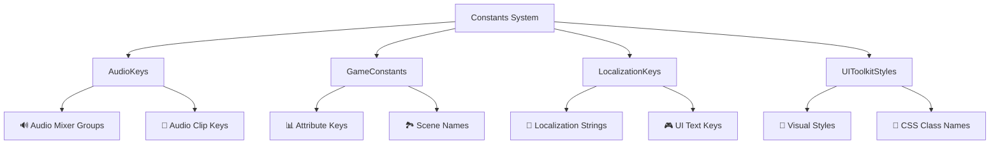
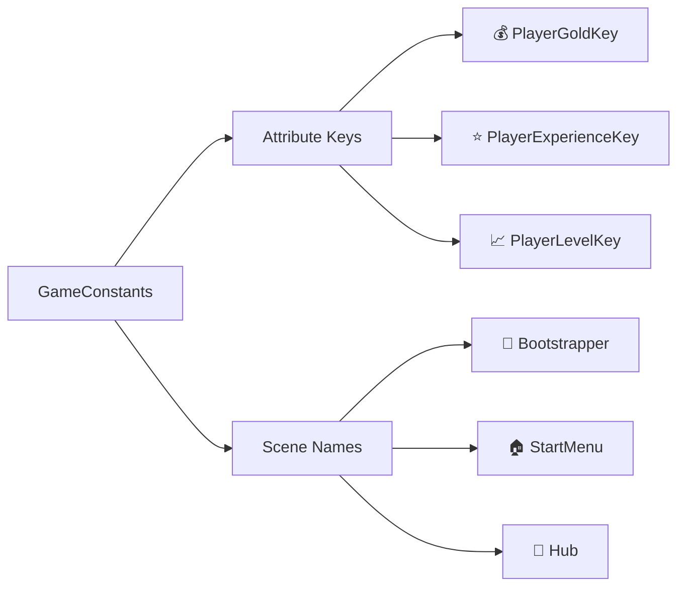
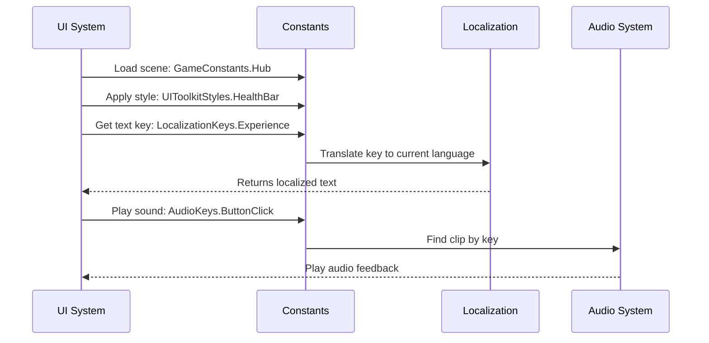

# 🔤 Game Constants System

This centralized system manages all string keys, tags, and configuration values throughout the Unity VR project. It provides type-safe references to eliminate hardcoded strings and improve maintainability.



## 🏗️ Structure Overview

The constants system is organized into four main categories:

| Category | File | Purpose | Example Count |
|----------|------|---------|---------------|
| **🔊 Audio** | `AudioKeys.cs` | Audio mixer groups and sound clip keys | ~15 constants |
| **🎮 Game** | `GameConstants.cs` | Attribute keys and scene names | ~8 constants |
| **🌍 Localization** | `LocalizationKeys.cs` | UI text localization keys | ~50 constants |
| **🎨 UI Styles** | `UIToolkitStyles.cs` | CSS class names for UI Toolkit | ~30 constants |

## 📁 Detailed Breakdown

### 1. **🔊 AudioKeys.cs**
Manages audio system identifiers and mixer routing.

```csharp
namespace Constants
{
    public class AudioKeys
    {
        // Mixer Groups
        public const string MixerMaster = "Master";
        public const string MixerMusic = "Music";
        public const string MixerSfx = "SFX";
        
        // Audio Clips
        public const string MainMusic = "mainmusic";
        public const string Pop = "pop";
        public const string ButtonClick = "button_click";
    }
}
```

**Usage Examples:**
- `AudioMixer.SetFloat(AudioKeys.MixerMaster, volume);`
- `audioSource.Play(AudioKeys.ButtonClick);`

### 2. **🎮 GameConstants.cs**
Core game configuration and persistent data keys.



**Key Groups:**
- **📊 Attribute Keys**: Save data identifiers for player progression
- **🏞️ Scene Names**: Scene loading references (no magic strings)

### 3. **🌍 LocalizationKeys.cs**
All UI text localization keys for multilingual support.

| Category | Example Keys | Purpose |
|----------|--------------|---------|
| **🎮 Game Actions** | `Play`, `Resume`, `Quit` | Main menu and game flow |
| **⚙️ Settings** | `Audio`, `Video`, `Language` | Settings panel tabs |
| **📊 Stats** | `Level`, `Experience`, `Gold` | Player progression display |
| **🎚️ Quality** | `Low`, `Medium`, `High`, `Ultra` | Graphics quality options |

**Total:** ~50 localization keys covering all in-game text.

### 4. **🎨 UIToolkitStyles.cs**
CSS class names for UI Toolkit styling.

| Style Type | Example Classes | Usage |
|------------|----------------|-------|
| **📦 Containers** | `container`, `panel-body`, `view-box` | Layout and grouping |
| **🎛️ Components** | `menu-button`, `settings-slider`, `tab` | Specific UI elements |
| **📊 Specialized** | `health-bar-fill`, `language-row` | Custom VR components |
| **📐 Layout** | `button-container`, `control-box` | Positioning helpers |

**VR Considerations:**
- 🎯 Large, readable class names for VR headsets
- 🎨 Consistent theming via CSS custom properties
- 📱 Scalable for different display resolutions

## 🔄 Integration Example



## ✅ Benefits & Best Practices

| Benefit | Implementation | Impact |
|---------|----------------|--------|
| **🚫 No Typos** | Compile-time checking | Eliminates runtime string errors |
| **🔍 Easy Refactoring** | Single source of truth | Change values in one place |
| **📖 Self-Documenting** | Clear naming conventions | Understand usage from name |
| **🌍 Localization Ready** | Separate keys from text | Easy multi-language support |

### ⚡ Best Practices:
1. **Always use constants** instead of literal strings
2. **Group related constants** in logical categories
3. **Use descriptive names** that indicate purpose
4. **Add XML comments** for complex constants
5. **Consider splitting** if a category grows beyond 50 items

## 🚀 Extension Guide

| When to Add | Where to Add | Example |
|-------------|--------------|---------|
| **New audio clip** | `AudioKeys.cs` | `public const string SpellCast = "spell_cast";` |
| **New UI text** | `LocalizationKeys.cs` | `public const string Inventory = "inventory";` |
| **New CSS class** | `UIToolkitStyles.cs` | `public const string SpellSlot = "spell-slot";` |
| **New save data** | `GameConstants.cs` | `public const string PlayerManaKey = "PlayerMana";` |

---

> 💡 **Pro Tip**: Use the `Constants.` prefix when referencing (e.g., `Constants.AudioKeys.MixerMaster`) to make it clear you're using a centralized constant, not a local variable.