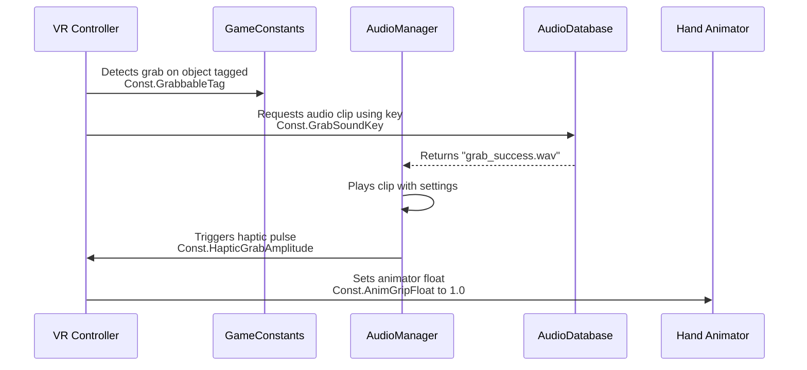

# 🔤 Game Constants System

This document explains the centralized `GameConstants` system used to manage string keys, tags, and configuration values throughout the Unity VR project. It provides type-safe references to eliminate hardcoded strings and improve maintainability.

## 🎯 Purpose

The system prevents scattered, error-prone strings like `"player_health"` across your codebase. Instead, you reference `GameConstants.PlayerHealthKey` for compile-time safety and single-point updates.

## 🏗️ Structure & Organization

Constants are logically grouped into regions for easy navigation:

```csharp
namespace Constants
{
    public static class GameConstants
    {
        #region Data Keys
        public const string MainMusicKey = "main_music";
        #endregion
        
        #region VR Layers & Physics
        public const string InteractableLayer = "Interactable";
        #endregion
        
        #region Tags
        public const string PlayerTag = "Player";
        #endregion
        
        #region Animation Parameters
        public const string AnimGrabTrigger = "Grab";
        #endregion
    }
}
```

For large projects, constants can be split into separate files (e.g., `AudioConstants.cs`, `VRLayerConstants.cs`) that all reside in the `Constants` namespace.

## 🔑 Primary Use Cases in VR

### 1. **Database Lookups**
Constants provide the keys to retrieve assets from the ScriptableObject databases.

*   **Audio System**: `AudioManager.Play(GameConstants.GrabSuccessKey);`
*   **UI System**: `sprite = GameDatabases.UiDatabase.TryGet(GameConstants.CrosshairKey);`
*   **Localization**: `string text = LocalizationDatabase.Get(GameConstants.MenuPlayKey);`

### 2. **VR Interaction & Physics**
VR games rely heavily on layers and tags for mechanics like grabbing, climbing, and UI interaction.

*   **Layer Masks for Raycasting**:
    ```csharp
    // Raycast only against interactable objects
    int layerMask = 1 << LayerMask.NameToLayer(GameConstants.InteractableLayer);
    Physics.Raycast(controller.position, direction, out hit, maxDistance, layerMask);
    ```
*   **Object Identification**:
    ```csharp
    if (other.CompareTag(GameConstants.TeleportAnchorTag)) {
        // Handle teleport logic
    }
    ```

### 3. **Animation State Management**
Smooth, synchronized animations for hands and objects are crucial for immersion.

*   **Hand Animation Parameters**:
    ```csharp
    handAnimator.SetTrigger(GameConstants.AnimPointTrigger);
    // or
    handAnimator.SetFloat(GameConstants.AnimGripFloat, gripValue);
    ```
*   **Object State Changes**:
    ```csharp
    objectAnimator.SetBool(GameConstants.AnimIsGrabbedBool, isGrabbed);
    ```

### 4. **Game State & Configuration**
Manage game rules, settings, and save data with consistent keys.

*   **PlayerPrefs / Save System**:
    ```csharp
    float savedVolume = PlayerPrefs.GetFloat(GameConstants.PrefsMasterVolumeKey, 0.8f);
    ```
*   **Difficulty Settings**:
    ```csharp
    if (currentDifficulty == GameConstants.DifficultyHardKey) {
        enemyHealth *= 1.5f;
    }
    ```

## 💡 Example: A Complete VR Interaction Flow

Here’s how constants integrate into a typical VR grab action:



## ✅ Benefits

*   **🚫 No Typos**: Compiler catches `GameConstants.MainMuiscKey`.
*   **🔍 Easy Refactoring**: Change a key value in one place.
*   **📖 Self-Documenting**: Constant names describe their use.
*   **🧪 Easier Testing**: Mock constants for unit tests.

## ⚠️ Best Practices

1.  **Use `const` over `static readonly`** for true compile-time constants where possible.
2.  **Name keys descriptively**: `GrabSuccessKey` not `Sound1Key`.
3.  **Group related constants** within `#region` blocks.
4.  **Consider splitting** into multiple classes if one file grows too large (>200 constants).
5.  **Don't store mutable configuration** here—use ScriptableObjects for that.

This system ensures your VR project remains scalable and maintainable as you add hundreds of audio clips, UI assets, animation states, and interaction layers.