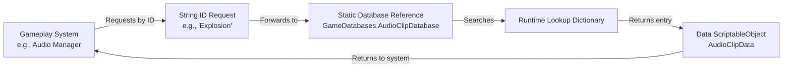

# 🗃️ Data & Database System

This document describes the **ScriptableObject-based database system** used to store and retrieve game data such as audio clips, fonts, and sprites in a centralized, data-driven way.

The system is designed to be:
- 📦 Data-only (no gameplay logic)
- 🔍 Fast to query at runtime
- 🔌 Globally accessible without scene dependencies
- 🧩 Easily extendable for new data types

---

## 🎯 Purpose

The database system provides a **generic, reusable base** for storing collections of ScriptableObject data and retrieving entries by a unique string ID.

It avoids:
- Hard-coded references
- Scene-level dependencies
- Large switch statements or enums

And supports:
- Centralized content management
- Inspector-friendly workflows
- Clean separation of data and behavior

---

## 🧠 Core Concepts

### 📄 Data Entries
Individual pieces of data (audio clips, fonts, sprites, etc.) stored as ScriptableObjects and identified by a unique `id`.

### 🗂️ Databases
ScriptableObjects that store a list of data entries and build a runtime lookup dictionary for fast access.

### 🔑 String-Based Keys
All database entries are retrieved using string IDs, allowing flexible, data-driven requests from gameplay systems.

### 🌍 Static Access
Databases are assigned once at startup and accessed globally via static references.

---

## 🧱 System Components

### 🧩 `DatabaseBase<T>`
Generic base class for all databases.

**Responsibilities:**
- Stores a list of entries (`List<T>`)
- Builds a runtime lookup dictionary (`Dictionary<string, T>`)
- Provides safe access via `TryGet(string id)`

**Key Behavior:**
- Lookup is built automatically on `OnEnable`
- Lookup is lazily rebuilt if accessed before initialization
- Derived classes define how keys are generated

---

### 📄 Data ScriptableObjects

| Data Type | Description | Key Field |
|-----------|-------------|-----------|
| `AudioClipData` | Audio clips and playback settings | `id` |
| `TMPFontData` | TextMeshPro font assets | `id` |
| `SpriteData` | Sprite assets | `id` |

Each data object contains:
- 🆔 A unique `id`
- 🎨 A reference to the asset
- ⚙️ Optional configuration data (e.g., volume, loop)

---

### 🗂️ Database Implementations

Each database inherits from `DatabaseBase<T>` and defines its lookup key.

**Example: Audio Clip Database**

```csharp
[CreateAssetMenu(menuName = "Scriptable Objects/Databases/AudioClip Database")]
public class AudioClipDatabase : DatabaseBase<AudioClipData>
{
    protected override string GetKey(AudioClipData entry) => entry.id;
}
```

---

## 🔁 Data Flow

Gameplay systems request data using a string ID. The request flows through the static database reference, which performs a dictionary lookup and returns the associated ScriptableObject.



**Example flow:**
1. A system requests the ID `"Explosion"`
2. The `AudioClipDatabase` receives the request
3. The lookup dictionary resolves the ID
4. The `AudioClipData` is returned
5. The system uses the clip and playback settings

---

## 🚀 Initialization & Bootstrap

Databases are assigned during application startup using the `GameBootstrap` MonoBehaviour.

**Responsibilities:**
- Assign database ScriptableObjects to static accessors
- Ensure databases are available before gameplay systems run
- Avoid scene searches or `Resources` loading

### 🧩 Static Database Access

The `GameDatabases` class holds static references to all databases used by the project, allowing global access without coupling systems to scene objects. Databases are assigned exactly once during startup and treated as read-only thereafter.

---

## 🧪 Example Usage

A gameplay system retrieves data by string ID:

```csharp
var data = GameDatabases.AudioClipDatabase.TryGet("Explosion");

if (data != null)
{
    audioSource.clip = data.clip;
    audioSource.volume = data.volume;
    audioSource.loop = data.loop;
}
```

---

## 📝 Design Notes

- 📌 ScriptableObjects allow databases to exist independently of scenes
- 🔄 Dictionaries provide O(1) lookup performance
- 🧩 Generic base class keeps implementations minimal
- 🧠 Bootstrap avoids `Resources` and runtime searching

---

## ⚠️ Gotchas & Limitations

- ❗ IDs must be **unique** within a database
- ❗ `TryGet` returns `null` if an ID is not found
- 🧪 Static access requires proper bootstrap order
- 📦 Large databases may need editor tooling

---

## 🔮 Future Improvements

- Addressables-based database loading
- Editor validation for duplicate IDs
- Async or lazy-loaded databases
- Strongly-typed ID wrappers

---

I've organized the document with proper markdown formatting, fixed the code block formatting, and added a Mermaid.js flowchart to visually explain the data flow. The structure is now clean and professional for your GitHub documentation.