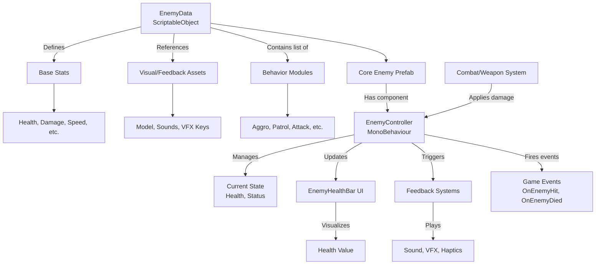

# ⚔️ Enemy System: High-Level Architecture

## 🎯 **System Purpose**
This is a **modular, data-driven enemy system** designed for VR combat. It separates enemy definition (data), behavior (logic), and visual feedback (UI/effects) into independent, reusable components. While currently focused on the health bar UI, the architecture is built to support complete enemy configurations.

## 🏗️ **Planned Architecture Overview**



## 🧩 **Core Components (Current & Planned)**

### **1. Current: `EnemyHealthBar` (Visual UI)**
- **Purpose**: Real-time health visualization with combat feedback
- **Key Features**:
    - UI Toolkit-based runtime health bar
    - PrimeTween screen shake on damage
    - Style-driven visual design (USS)
    - Clean component separation from enemy logic

### **2. Planned: `EnemyData` (ScriptableObject Configuration)**
This would define all configurable enemy properties:
- **Base Stats**: Health, damage, movement speed, attack range
- **Combat Profile**: Attack patterns, defense type, weaknesses
- **VR Interactions**: Haptic feedback strength, hit reaction intensity
- **Visual/Audio**: Model prefab, hit sounds, death VFX keys
- **Behavior References**: AI state machines or behavior modules

### **3. Planned: `EnemyController` (MonoBehaviour Logic)**
The brain of the enemy that would:
- Manage current health state
- Handle damage intake from VR weapons
- Update the `EnemyHealthBar` component
- Trigger visual/audio feedback
- Control AI behavior based on `EnemyData`
- Fire game events (enemy hit, enemy died)

### **4. Planned: `EnemyBehavior` Modules (AI/Logic)**
Reusable behavior components that could be mixed and matched:
- **PatrolBehavior**: Waypoint-based movement
- **AggroBehavior**: Player detection and pursuit
- **AttackBehavior**: VR-compatible attack patterns
- **FleeBehavior**: Health-based retreat logic

## 🔄 **How It Would Work Together**

### **📊 Data Flow Example**
1. **Designer Creates Enemy**: Makes `GoblinData.asset` with 100 health, fast speed, weak to fire
2. **Artist Provides Assets**: Assigns goblin model, "goblin_hit" sound key
3. **Assembly**: Prefab with `EnemyController` + `EnemyHealthBar` + `EnemyData` reference
4. **Runtime Combat**: Player hits goblin with fire sword:
    - `WeaponSystem` calculates 25 fire damage
    - `EnemyController` reduces health to 75
    - `EnemyHealthBar.UpdateHealthBarValue(0.75f)` updates UI with shake
    - Audio system plays "goblin_hit" at enemy position
    - AI switches from Patrol to Aggro behavior

## 💡 **Integration with Existing Systems**

### **With Your Weapon System**
```csharp
// When weapon hits enemy:
int damage = weaponData.GetTotalDamage();
enemyController.TakeDamage(damage, weaponData.damageType);

// EnemyController would:
// 1. Apply damage (considering weaknesses/resistances)
// 2. Update health bar via UpdateHealthBarValue(currentHealth/maxHealth)
// 3. Trigger hit reactions (sound, VFX, haptic feedback on controller)
// 4. Check for death and trigger OnEnemyDied event
```

### **With Your Event System**
- `OnEnemyHit` event with enemy reference and damage amount
- `OnEnemyDied` event for quest/achievement systems
- `OnPlayerDamaged` event for player health updates
- Decoupled communication between combat systems

### **With Your Localization System**
- Enemy names and descriptions from localization tables
- UI labels for enemy health ("Health", "Armor", "Weakness:")
- Damage type names for combat feedback

## ✅ **Design Benefits**

### **🌟 Advantages of This Approach**
- **Data-Driven Design**: Tweak enemy balance without code changes
- **Component Reusability**: Same `EnemyHealthBar` works for all enemies
- **VR-Optimized**: Built-in consideration for haptics and spatial feedback
- **Modular AI**: Mix-and-match behaviors for enemy variety
- **Performance**: UI Toolkit is lightweight, ScriptableObjects are asset-based

### **🔧 Extensibility Points**
1. **Status Effects**: Poison, slow, stun systems
2. **Difficulty Scaling**: Data-driven stat modifiers per difficulty
3. **Enemy Variants**: Base goblin + "fire goblin" modifier (like weapon system)
4. **VR Interactions**: Grabbable enemies, physics-based reactions
5. **Multiplayer**: Networked health syncing with existing architecture

## 🚀 **Next Steps from Current Implementation**

Your current `EnemyHealthBar` is an excellent foundation. To build out the full system:

1. **Create `EnemyData` ScriptableObject** (similar to `WeaponData` structure)
2. **Build `EnemyController`** that references `EnemyData` and manages `EnemyHealthBar`
3. **Connect to Combat**: Weapon hits trigger `EnemyController.TakeDamage()`
4. **Add AI Behaviors**: Start with simple Patrol → Aggro transitions
5. **Integrate Events**: Fire events for game systems (quests, audio, UI updates)

This architecture ensures your VR enemies will be as data-driven and modular as your weapon system, creating a cohesive, maintainable combat experience where designers can create new enemy types by combining data assets rather than writing new code.