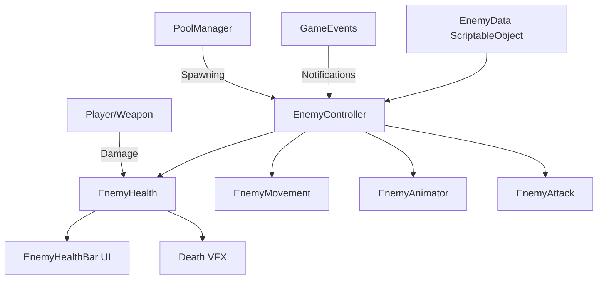
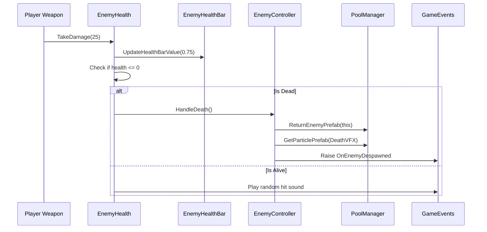

# ⚔️ Enemy System Architecture

## 🎯 **System Purpose**
A modular, data-driven enemy system for VR combat that separates configuration (data), behavior (logic), and visual feedback (UI/effects) into independent, reusable components.



## 🧩 **Core Components**

### **1. 📊 EnemyData (ScriptableObject)**
Central configuration asset for enemy types.

| Field | Type | Description |
|-------|------|-------------|
| `EnemyId` | `string` | Unique identifier for this enemy type |
| `MaxHealth` | `int` | Base health points |
| `MoveSpeed` | `float` | Movement speed |
| `Prefab` | `GameObject` | Visual model and components |
| `Weapon` | `WeaponData` | Enemy's weapon configuration |
| `AmbientSfx` | `WorldAudioData[]` | Random ambient sounds |
| `HitSfx` | `WorldAudioData[]` | Random hit sounds |
| `DeathSfx` | `WorldAudioData[]` | Random death sounds |
| `DeathVFX` | `ParticleData` | Death visual effects |

**Usage:**
```csharp
// Designer creates in Unity Editor
// ScriptableObject -> Create -> Characters -> EnemyData
// Configure stats, assign prefab, sounds, weapon
```

### **2. 🎮 EnemyController (Main Coordinator)**
The brain that manages all enemy components.

| Method | Purpose | Called By |
|--------|---------|-----------|
| `OnSpawn(EnemyData)` | Initialize enemy with data | PoolManager |
| `OnDespawn()` | Clean up for pooling | PoolManager |
| `HighPriorityUpdate()` | Critical logic (AI, combat) | EnemyManager |
| `MediumPriorityUpdate()` | Less critical updates | EnemyManager |

**Lifecycle:**
1. **Spawn**: PoolManager calls `OnSpawn()` with EnemyData
2. **Initialize**: Components get their data, events registered
3. **Update**: Manager calls priority updates
4. **Death**: Health reaches 0 → triggers despawn
5. **Despawn**: Return to pool, clean up

### **3. ❤️ EnemyHealth (HealthComponent)**
Manages health, damage, and death effects.

| Feature | Implementation | Result |
|---------|----------------|--------|
| **Damage Interface** | Implements `IDamageable` | Can be hit by any weapon |
| **Health Bar UI** | Updates `EnemyHealthBar` | Visual health feedback |
| **Death Effects** | Spawns VFX via PoolManager | Visual death feedback |
| **Sound Events** | Plays random hit/death sounds | Audio feedback |

### **4. 🚶 EnemyMovement (NavMesh Based)**
Handles navigation and physics.

| State | NavMeshAgent | Rigidbody | Purpose |
|-------|--------------|-----------|---------|
| **Active** | Enabled, pathfinding | Kinematic false | Normal movement |
| **Inactive** | Disabled, no path | Kinematic true | Pooled/pre-spawn |

### **5. 🎭 EnemyAnimator (Animation Controller)**
Manages animation states.

| Animation | Trigger | Purpose |
|-----------|---------|---------|
| **Spawn** | `SetBool(IsMoving, true)` | Idle/movement blend |
| **Despawn** | `Animator.enabled = false` | Disable when pooled |
| **Attack** | `SetTrigger(AttackHash)` | Combat animations |
| **Hit** | `SetTrigger(HitHash)` | Damage reaction |
| **Death** | `SetTrigger(DeathHash)` | Death animation |

### **6. ⚔️ EnemyAttack (Planned)**
Currently placeholder for attack logic.

| Planned Feature | Status | Notes |
|----------------|--------|-------|
| **Weapon Data** | Reference set | From EnemyData |
| **Attack Logic** | Not implemented | VR-compatible attacks needed |
| **Cooldowns** | Not implemented | Balance pacing |

## 🔄 **Data Flow**



## 📊 **Component Interaction Table**

| Component | Depends On | Provides To | Communication Method |
|-----------|------------|-------------|----------------------|
| **EnemyController** | EnemyData, all enemy components | EnemyManager, PoolManager | Direct references, events |
| **EnemyHealth** | EnemyHealthBar, PoolManager | EnemyController, weapons | Interface (IDamageable), events |
| **EnemyMovement** | NavMeshAgent, Rigidbody | EnemyController | Direct control |
| **EnemyAnimator** | Animator component | EnemyController | Animation parameters |
| **EnemyHealthBar** | UI Toolkit, EnemyHealth | Player/UI system | Method calls |

## 🎮 **Integration Points**

### **With Weapon System**
```csharp
// When player weapon hits enemy:
if (enemy.TryGetComponent<IDamageable>(out var damageable))
{
    damageable.TakeDamage(weaponDamage);
    // EnemyHealth handles the rest
}
```

### **With Pooling System**
| Method | PoolManager Action | Enemy Action |
|--------|-------------------|--------------|
| **GetEnemyPrefab()** | Instantiates or reuses | `OnSpawn(EnemyData)` |
| **ReturnEnemyPrefab()** | Returns to pool | `OnDespawn()` |

### **With Event System**
| Event | Raised When | Listeners |
|-------|-------------|-----------|
| **OnEnemySpawned** | Enemy initialized | Quest system, AI director |
| **OnEnemyDespawned** | Enemy returned to pool | Score system, spawner |
| **OnEnemyHit** (planned) | Enemy takes damage | Audio, UI, achievements |
| **OnEnemyDied** (planned) | Enemy health reaches 0 | Quest, loot, progression |

## ⚡ **Performance Considerations**

| Optimization | Implementation | Benefit |
|--------------|----------------|---------|
| **Object Pooling** | All enemies managed by PoolManager | No runtime instantiation |
| **Priority Updates** | High/Medium priority in EnemyManager | Critical logic first |
| **NavMesh Caching** | Reuse NavMeshAgent component | Avoids component lookups |
| **Event Unsubscription** | Clean up in OnDisable() | Prevents memory leaks |

## 🚀 **Current Status & Next Steps**

### **✅ Implemented**
| Feature | Status | Notes |
|---------|--------|-------|
| **Data Configuration** | Complete | EnemyData ScriptableObjects |
| **Health System** | Complete | With UI integration |
| **Movement** | Complete | NavMesh-based |
| **Animation** | Basic | Spawn/despawn states |
| **Pooling Integration** | Complete | Full lifecycle |
| **Event System** | Partial | Spawn/despawn events |

### **📋 Planned Features**
| Feature | Priority | Required For |
|---------|----------|--------------|
| **Attack System** | High | Combat gameplay |
| **AI Behaviors** | High | Enemy intelligence |
| **Status Effects** | Medium | Combat depth |
| **Loot System** | Medium | Progression |
| **VR Interaction** | High | Grab, physics reactions |

## 🔧 **Extension Guide**

### **Adding New Enemy Types:**
1. Create new `EnemyData` ScriptableObject
2. Configure stats, assign prefab
3. Add to EnemyDatabase
4. Spawn via PoolManager

### **Adding New Behaviors:**
```csharp
// Example: Add ranged attack component
public class EnemyRangedAttack : MonoBehaviour
{
    public void Attack(Transform target)
    {
        // VR-compatible projectile logic
    }
}

// Add to enemy prefab, reference in EnemyController
```

## 📈 **Statistics**

| Metric | Value | Notes |
|--------|-------|-------|
| **Components** | 7 core components | Health, Movement, Animator, etc. |
| **ScriptableObjects** | 1 (EnemyData) | Extensible to variants |
| **Interfaces** | 1 (IDamageable) | Standardized damage |
| **Dependencies** | 5 systems | Pooling, Events, UI, Audio, Weapons |

---

> 💡 **Pro Tip**: Use the `EnemyData` ScriptableObjects for all balance tweaks. Designers can adjust health, speed, and sounds without touching code. The pooling system ensures performance even with many enemies.