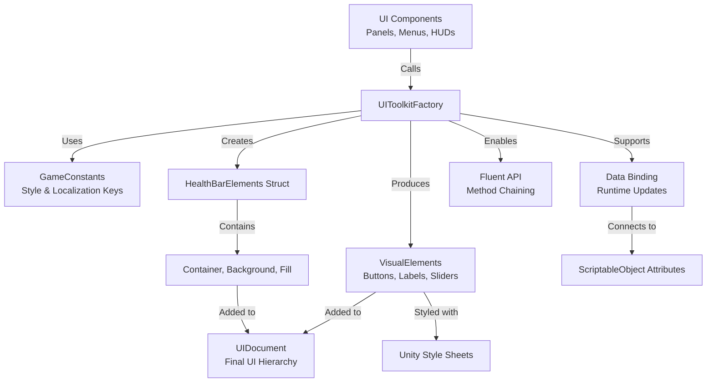

# 🏭 UI Toolkit Factory: High-Level Overview

## 🎯 **System Purpose**
This is a **centralized UI element factory** for Unity's UI Toolkit that standardizes UI creation across your entire VR project. It provides a clean, type-safe API for creating and configuring all UI elements with consistent styling, localization support, and data binding capabilities.

## 🏗️ **Architecture & Usage Flow**



## 🧩 **Core Components**

### **1. `HealthBarElements` Struct**
- **Purpose**: Encapsulates all health bar components in a single reusable structure
- **Contains**: Container, Background, and Fill `VisualElement` references
- **Benefit**: External systems can update health values without knowing internal hierarchy

### **2. Factory Methods (Categorized by UI Type)**

#### **🏗️ Core Elements**
- **`CreateElement<T>()`**: Generic foundation for any `VisualElement`
- **`CreateContainer()`**: Basic grouping/layout elements
- **`CreateGroup()`**: Horizontal/vertical arrangement

#### **🎮 Interactive Controls**
- **`CreateButton()`**: Localized buttons with click handlers
- **`CreateSlider()/CreateSliderInt()`**: Range controls with callbacks
- **`CreateToggle()`**: Checkboxes with state tracking
- **`CreateTextField()`**: Text input with multiline support
- **`CreateDropdown()`**: Selection lists with options

#### **📊 Display Elements**
- **`CreateLabel()`**: Static text with localization
- **`CreateBoundLabel()`**: **Key Feature** - Automatically updates when data changes
- **`CreateHealthBar()`**: Complete health bar hierarchy
- **`CreateProgressBar()`**: Simple progress indicator

#### **🔧 Utility Elements**
- **`CreateSpacer()`**: Flexible space filling
- **`CreateSeparator()`**: Visual dividers
- **`CreateScrollView()`**: Scrollable content areas

### **3. Fluent API Extensions**
Chainable methods for concise element configuration:
- `WithClasses()` - Add CSS classes
- `WithName()` - Set element name for querying
- `WithText()` - Set text content
- `WithMargin()/WithPadding()` - Layout control
- `WithFlexGrow()` - Flexbox control
- `WithVisibility()/WithDisplayStyle()` - Show/hide control

## 🔄 **How It Works in Practice**

### **Example 1: Creating a Localized Health Bar Panel**
```csharp
// In EnemyHealthBar.cs (simplified with factory):
HealthBarElements healthBar = UIToolkitFactory.CreateHealthBar();
healthBar.Fill.style.width = new Length(currentHealthPercent * 100, LengthUnit.Percent);
root.Add(healthBar.Container);

// Before factory: Manual element creation, class assignment, hierarchy building
// After factory: One line for complete, standardized health bar
```

### **Example 2: Creating a Bound Stat Display**
```csharp
// In BoundTextPanel.cs:
var header = UIToolkitFactory.CreateLabel(
    new LocalizedString(GameConstants.LocalTable, "health"), 
    GameConstants.HeaderStyle);

var value = UIToolkitFactory.CreateBoundLabel(
    playerHealthAttribute, 
    nameof(playerHealthAttribute.Value), 
    GameConstants.StatStyle);

// Label automatically updates when playerHealthAttribute.Value changes
// No manual event handling needed
```

### **Example 3: Creating a Settings Menu (Fluent API)**
```csharp
var settingsPanel = UIToolkitFactory.CreateContainer("settings-panel")
    .WithPadding(20)
    .WithMargin(10);

var volumeSlider = UIToolkitFactory.CreateSlider(0, 1, 0.5f, OnVolumeChanged)
    .WithClasses("slider", "volume-slider")
    .WithName("VolumeControl");

settingsPanel.Add(volumeSlider);
```

## ✅ **Key Benefits & Design Principles**

### **🌟 Advantages**
- **Consistency**: All UI follows same creation patterns
- **Localization Ready**: Built-in `LocalizedString` support
- **Data Binding**: Automatic UI updates with `CreateBoundLabel()`
- **Type Safety**: Compile-time checking for element types
- **Reduced Boilerplate**: Eliminates repetitive UI setup code
- **Maintainability**: Change UI patterns in one place (factory)

### **🔧 Integration Points**
- **With Localization System**: Uses `GameConstants` keys and `LocalizedString`
- **With ScriptableObject Attributes**: Data binding for real-time updates
- **With Style System**: Consistent CSS class naming via `GameConstants`
- **With Event System**: Clean callback integration for interactive elements

## 🚀 **Usage Patterns in Your VR Project**

### **1. Runtime UI Creation**
- **Health Bars**: `CreateHealthBar()` for enemies/players
- **HUD Elements**: `CreateBoundLabel()` for dynamic stats
- **Menus**: `CreateButton()` with localization for VR menus
- **Settings**: `CreateSlider()`/`CreateToggle()` for VR comfort options

### **2. Editor Productivity**
- **Rapid Prototyping**: Create complex UI in few lines of code
- **Live Preview**: `OnValidate()` in components shows UI in editor
- **Style Exploration**: Easy to swap style classes via constants

### **3. Performance Considerations**
- **Reusable Elements**: Factory methods optimize element creation
- **Efficient Binding**: `CreateBoundLabel()` uses Unity's property system
- **Memory Management**: Clean event unsubscription in components

## 📈 **Extensibility & Future Additions**

The factory pattern makes it easy to add new UI components:

```csharp
// Example: Adding a VR-specific thumbstick visualizer
public static VisualElement CreateThumbstickVisualizer(Vector2 input, params string[] classNames)
{
    var container = CreateContainer(classNames);
    var dot = CreateElement<VisualElement>("thumbstick-dot");
    // Position dot based on input vector
    return container;
}

// Usage in VR controller UI:
var thumbstickUI = UIToolkitFactory.CreateThumbstickVisualizer(
    controllerInput, 
    "thumbstick-ui", "controller-overlay");
```

This factory system provides a professional-grade UI foundation that aligns perfectly with your data-driven architecture, ensuring all UI across your VR project is consistent, maintainable, and seamlessly integrated with your localization and attribute systems.