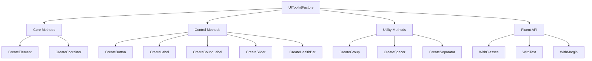
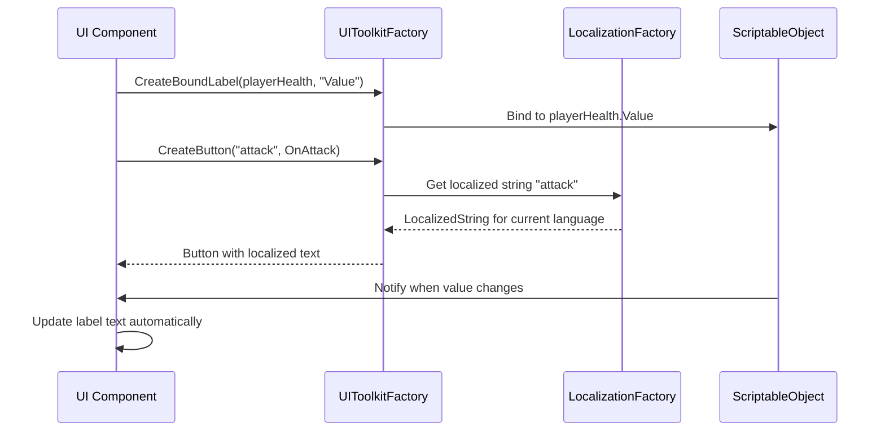

# 🏭 UI Toolkit Factory System

## 🎯 **System Purpose**
A centralized factory for creating and configuring all UI Toolkit elements with consistent styling, localization, and data binding.



## 🧩 **Core Components**

### **1. HealthBarElements Struct**
| Field | Type | Purpose |
|-------|------|---------|
| `Container` | `VisualElement` | Root element for the health bar |
| `Background` | `VisualElement` | Background/frame of health bar |
| `Fill` | `VisualElement` | Dynamic fill that shows health percentage |

**Usage:**
```csharp
HealthBarElements healthBar = UIToolkitFactory.CreateHealthBar();
healthBar.Fill.style.width = new Length(healthPercent * 100, LengthUnit.Percent);
```

### **2. Factory Method Categories**

| Category | Methods | Purpose |
|----------|---------|---------|
| **🏗️ Core** | `CreateElement<T>`, `CreateContainer` | Foundation for any UI element |
| **🎮 Interactive** | `CreateButton`, `CreateSlider`, `CreateToggle` | User input controls |
| **📊 Display** | `CreateLabel`, `CreateBoundLabel`, `CreateHealthBar` | Information display |
| **🔧 Utility** | `CreateGroup`, `CreateSpacer`, `CreateSeparator` | Layout and spacing |

### **3. Key Methods Table**

| Method | Returns | Key Features |
|--------|---------|--------------|
| `CreateButton()` | `Button` | Localization, click events, audio feedback |
| `CreateBoundLabel()` | `Label` | **Auto-updates** when data changes |
| `CreateHealthBar()` | `HealthBarElements` | Complete health bar structure |
| `CreateSlider()` | `Slider` | Range control with callbacks |

## 🔄 **Data Flow**



## 🚀 **Key Features**

### **✨ CreateBoundLabel()**
| Feature | Benefit |
|---------|---------|
| **Automatic Updates** | UI updates when ScriptableObject changes |
| **No Manual Wiring** | No need for event subscriptions |
| **Performance** | Uses Unity's property system |
| **Clean Code** | One line instead of 10+ |

**Example:**
```csharp
// Creates a label that auto-updates when playerHealth.Value changes
Label healthLabel = UIToolkitFactory.CreateBoundLabel(
    playerHealth, 
    nameof(playerHealth.Value),
    UIToolkitStyles.Stat
);
```

### **🌍 Localization Integration**
| Integration Point | How It Works |
|-------------------|-------------|
| **Buttons** | `CreateButton("play", OnPlay)` uses `LocalizationFactory` |
| **Labels** | `CreateLabel("score")` gets localized string |
| **Sliders** | `CreateSlider(labelKey: "volume")` localizes label |

### **🎨 Style Consistency**
| Style Source | Example |
|-------------|---------|
| **Constants** | `UIToolkitStyles.HealthBarContainer` |
| **Inline** | `CreateButton(classNames: "menu-button")` |
| **Fluent API** | `.WithClasses("highlight", "large-text")` |

## 📊 **Usage Patterns**

### **Pattern 1: Simple Button**
```csharp
Button playButton = UIToolkitFactory.CreateButton(
    LocalizationKeys.Play,
    OnPlayClicked,
    UIToolkitStyles.MenuButton
);
```

### **Pattern 2: Complex Panel (Fluent API)**
```csharp
VisualElement panel = UIToolkitFactory.CreateContainer()
    .WithClasses(UIToolkitStyles.PanelBody, "settings-panel")
    .WithPadding(20)
    .WithMargin(10);

panel.Add(UIToolkitFactory.CreateLabel(LocalizationKeys.Settings, UIToolkitStyles.Header));
```

### **Pattern 3: Data-Bound UI**
```csharp
// All three labels auto-update when attributes change
Label goldLabel = UIToolkitFactory.CreateBoundLabel(playerGold, "Value", UIToolkitStyles.Stat);
Label expLabel = UIToolkitFactory.CreateBoundLabel(playerExp, "Value", UIToolkitStyles.Stat);
Label levelLabel = UIToolkitFactory.CreateBoundLabel(playerLevel, "Value", UIToolkitStyles.Stat);
```

## 🔗 **Integration Points**

| System | Integration Method |
|--------|-------------------|
| **🎮 Controllers** | Events from `CreateButton()`, `CreateSlider()` |
| **📊 Attributes** | `CreateBoundLabel()` for auto-updating UI |
| **🌍 Localization** | All text methods accept localization keys |
| **🎨 Styling** | Constants-based CSS class names |
| **🔊 Audio** | Automatic audio events on interactive elements |

## ✅ **Benefits Summary**

| Benefit | Implementation | Impact |
|---------|----------------|--------|
| **Consistency** | Single factory for all UI | All UI looks/behaves the same |
| **Maintainability** | Change patterns in one place | Easy updates across entire UI |
| **Localization Ready** | Built-in `LocalizedString` support | Multi-language support |
| **Performance** | Optimized element creation | Smooth VR framerates |
| **Type Safety** | Compile-time checking | Fewer runtime errors |

## 📈 **Factory Statistics**

| Metric | Count | Notes |
|--------|-------|-------|
| **Core Methods** | 2 | `CreateElement<T>`, `CreateContainer` |
| **Control Methods** | 8 | Buttons, sliders, toggles, etc. |
| **Utility Methods** | 5 | Layout helpers |
| **Fluent Methods** | 9 | Chaining methods |
| **Total Methods** | 24 | Comprehensive coverage |

## 🎯 **When to Use Each Method**

| Use Case | Recommended Method | Example |
|----------|-------------------|---------|
| **Dynamic text** | `CreateBoundLabel()` | Player stats, health |
| **Simple button** | `CreateButton()` | Menu navigation |
| **Range input** | `CreateSlider()` | Volume, brightness |
| **Layout** | `CreateGroup()` | Horizontal/vertical arrangement |
| **Health display** | `CreateHealthBar()` | Player/enemy health |
| **Text input** | `CreateTextField()` | Name entry, chat |

---

> 💡 **Pro Tip**: Always use the factory instead of `new VisualElement()` to ensure consistency. The fluent API (`WithX()` methods) makes complex UI creation readable in a single statement.