# 🎮 Monsta Choppa - Complete Game Development Guide

A comprehensive guide for developing your modular arena fantasy VR game, written for self-taught developers who want to understand the concepts deeply.

---

## Table of Contents

1. [Game Flow Overview](#game-flow-overview)
2. [Player Levelling System](#player-levelling-system)
3. [Gold and Resource Economy](#gold-and-resource-economy)
4. [Locally Saved Data (JSON)](#locally-saved-data-json)
5. [Save Files and Options](#save-files-and-options)
6. [Online Leaderboards](#online-leaderboards)
7. [Arena Selection Portals](#arena-selection-portals)
8. [Arena Records and Statistics](#arena-records-and-statistics)
9. [Wrist UI for VR](#wrist-ui-for-vr)
10. [Pause Menus in VR](#pause-menus-in-vr)
11. [Locomotion Settings for Comfort](#locomotion-settings-for-comfort)
12. [Hub Upgrades and Purchases](#hub-upgrades-and-purchases)

---

## Game Flow Overview

### The Core Game Loop

```mermaid
graph TD
    A[🎬 Create Save Game] --> B[🚀 Start With Nothing]
    B --> C[🏠 Hub - Your Base]
    C --> D[🚪 Arena Selection Portal]
    D --> E[⚔️ Enter Arena]
    E --> F[🎯 Fight Waves]
    F --> G{Victory?}
    G -->|Yes| H[💰 Collect Rewards]
    G -->|No| I[😵 Defeated - Partial Rewards]
    H --> J[📊 Update Records/Leaderboard]
    I --> J
    J --> K[💾 Auto-Save Progress]
    K --> C
    
    C --> L[🛒 Upgrade Shop]
    L --> M[🔧 Apply Upgrades]
    M --> C
    
    C --> N[📈 View Stats/Leaderboards]
    N --> C
```



### Game Flow States

Understanding the game's flow as a state machine helps you design modular systems:

| State | Description | Data to Track | Next States |
|-------|-------------|---------------|-------------|
| **New Game** | First launch, no save data | Default values only | Hub |
| **Hub** | Player's home base | Current stats, inventory | Arena Select, Shop, Stats |
| **Arena Select** | Choosing which arena to enter | Arena completion status | Hub, Arena |
| **Arena** | Active combat gameplay | Wave progress, kills, time | Victory, Defeat |
| **Victory** | Arena completed successfully | Final score, rewards | Hub |
| **Defeat** | Player died | Partial progress | Hub |
| **Shop** | Spending gold on upgrades | Available upgrades, prices | Hub |

### Implementing Game Flow

Create a central `GameFlowManager` that handles state transitions:

```csharp
// Concept: GameFlowManager.cs
// This should be a singleton that persists across scenes

public enum GameState
{
    MainMenu,
    Loading,
    Hub,
    ArenaSelect,
    Arena,
    Victory,
    Defeat,
    Paused
}

// Key design principles:
// 1. Use ScriptableObject event channels for state changes
// 2. Each scene handles its own initialization
// 3. GameFlowManager coordinates, doesn't control everything
// 4. Save data is updated on significant state transitions

// Event channels you'll need:
// - OnGameStateChanged (GameState newState)
// - OnArenaEntered (ArenaData arenaData)
// - OnArenaCompleted (ArenaResultData result)
// - OnPlayerDied ()
// - OnSaveRequested ()
```

---

## Player Levelling System

### Understanding Experience and Levels

Your game already has the foundation for this in `PlayerAttributes.cs`. Here's how to expand it into a full levelling system.

### Level Progression Design

**Key Decisions to Make:**
1. **Curve Type**: Linear, exponential, or custom?
2. **Level Cap**: Maximum level players can reach
3. **Rewards per Level**: What do players gain each level?

```
Common XP Curves:
- Linear:      XP = BaseXP * Level
- Polynomial:  XP = BaseXP * Level²
- Exponential: XP = BaseXP * (Multiplier^Level)

Example with BaseXP = 100, Polynomial:
Level 1 → 2: 100 XP
Level 2 → 3: 400 XP
Level 3 → 4: 900 XP
Level 4 → 5: 1600 XP
...
```

### Level Data ScriptableObject

Create a data-driven levelling system:

```csharp
// Concept: LevelData.cs
// Create one ScriptableObject per level threshold
// Store in a LevelDatabase for lookup

[CreateAssetMenu(menuName = "Scriptable Objects/Progression/Level Data")]
public class LevelData : ScriptableObject
{
    public int level;                    // Level number
    public int experienceRequired;       // Total XP needed for this level
    public int healthBonus;              // HP increase at this level
    public int damageBonus;              // Damage increase
    public float critChanceBonus;        // Crit increase
    public UnlockType[] unlocks;         // Items/abilities unlocked
}

// Use a database to look up level data:
// LevelDatabase.TryGetLevelData(currentLevel) → LevelData
```

### Experience Gain Events

Use your existing event system to award experience:

```
Current Flow (already implemented):
1. Enemy dies → EnemyHealth fires OnDeath event
2. Any subscriber can listen and reward XP
3. onExperienceChanged.Raise(xpAmount) is called
4. PlayerAttributes receives and updates XP

To Add:
1. Check if total XP >= next level threshold
2. If level up, fire onLevelChanged event
3. Apply level rewards
4. Show VR-friendly level up notification
```

### Level-Up Logic

```csharp
// Concept: Add to PlayerAttributes.cs or create PlayerProgression.cs

// Key method: CheckLevelUp()
// Call this whenever experience changes

// Pseudo-logic:
// 1. Get current level from playerLevel.Value
// 2. Look up next level's required XP from LevelDatabase
// 3. If playerExperience.Value >= requiredXP:
//    a. Increment playerLevel
//    b. Apply level rewards
//    c. Fire level up event for UI/audio
//    d. Check again (in case of multi-level-up)

// Important: Don't subtract XP when leveling!
// Total XP should always increase - levels are thresholds
```

### Displaying Progress

For VR-friendly level display:

```
UI Elements Needed:
1. Current Level (large, easily readable)
2. XP Progress Bar (fill based on % to next level)
3. XP Numbers (current / required)

Calculate progress:
- previousLevelXP = LevelDatabase.GetXPForLevel(currentLevel)
- nextLevelXP = LevelDatabase.GetXPForLevel(currentLevel + 1)
- progress = (currentXP - previousLevelXP) / (nextLevelXP - previousLevelXP)
```

---

## Gold and Resource Economy

### Economy Design Principles

```
Balance Goals:
1. Players should feel progression every session
2. Upgrades should feel meaningful, not overwhelming
3. Prices should scale with power level
4. Multiple resource types add depth

Example Economy Loop:
Arena Completion (Difficulty 1) → 50-100 Gold
Basic Upgrade Costs: 100-500 Gold
Arena Completion (Difficulty 3) → 200-400 Gold
Advanced Upgrade Costs: 1000-5000 Gold
```

### Resource Types to Consider

| Resource | Earned From | Used For | Rarity |
|----------|-------------|----------|--------|
| **Gold** | All arenas, quest completion | Basic upgrades, consumables | Common |
| **Arena Tokens** | Arena completion (1 per clear) | Unlock new arenas | Uncommon |
| **Upgrade Crystals** | Boss kills, achievements | Weapon upgrades | Rare |
| **Essence** | Nightmare difficulty | Prestige upgrades | Very Rare |

### Implementing Multiple Resources

```csharp
// Concept: Extend PlayerAttributes pattern

// Option 1: Add more IntAttribute references
// Simple but doesn't scale well

// Option 2: Create a ResourceInventory system
// More flexible, data-driven

// ResourceData ScriptableObject:
// - resourceId (string)
// - displayName (LocalizedString)
// - icon (Sprite)
// - maxStack (int, -1 for unlimited)

// ResourceInventory MonoBehaviour:
// - Dictionary<string, int> resources
// - Save/Load to ESave
// - Event channels for changes
```

---

## Locally Saved Data (JSON)

### Your Current Save System

Your project uses **ESave** for JSON persistence. Here's how it works:

```
Current Implementation:
1. SaveFileSetup component creates/loads save file
2. PlayerAttributes uses SaveFile for read/write
3. GameConstants provides consistent key strings
4. OnGameSaved event triggers saves

File Location (ESave default):
- Windows: %USERPROFILE%/AppData/LocalLow/[Company]/[Product]/
- Android: /data/data/[package]/files/
```

### What to Save

**Player Data:**
```json
{
  "PlayerGold": 1500,
  "PlayerExperience": 4200,
  "PlayerLevel": 5,
  "TotalPlayTime": 7200.5,
  "CurrentWeaponId": "sword_fire_02"
}
```

**Arena Records:**
```json
{
  "ArenaRecords": {
    "goblin_camp_day": {
      "bestTime": 245.5,
      "bestScore": 12500,
      "timesCompleted": 7,
      "highestWave": 10
    },
    "forest_night": {
      "bestTime": 310.2,
      "bestScore": 18200,
      "timesCompleted": 3,
      "highestWave": 12
    }
  }
}
```

**Settings:**
```json
{
  "Settings": {
    "masterVolume": 0.8,
    "musicVolume": 0.6,
    "sfxVolume": 1.0,
    "locomotionType": "teleport",
    "snapTurnAngle": 45,
    "vignetteEnabled": true
  }
}
```

### Save Data Manager Pattern

```csharp
// Concept: Centralized save data handling

// SaveDataManager responsibilities:
// 1. Single point of access for all save/load
// 2. Manages multiple save profiles
// 3. Handles save corruption gracefully
// 4. Provides auto-save functionality

// Key methods to implement:
// - CreateNewSave(string profileName)
// - LoadSave(string profileName)
// - DeleteSave(string profileName)
// - GetAllSaveProfiles() → List<SaveProfile>
// - AutoSave() - called on timers and state changes
// - ExportSave() / ImportSave() - backup/restore

// Auto-save triggers:
// - Arena completion (victory or defeat)
// - Returning to hub
// - Purchasing upgrades
// - Every 5 minutes during gameplay
// - On application pause (VR headset removed)
```

### Data Validation

Always validate loaded data:

```csharp
// Concept: Validate save data on load

// Check for:
// 1. Missing keys (use defaults)
// 2. Invalid values (clamp to valid range)
// 3. Version mismatch (migrate old saves)
// 4. Corruption (reset to defaults, warn user)

// Example validation:
// if (loadedGold < 0) loadedGold = 0;
// if (loadedLevel < 1) loadedLevel = 1;
// if (loadedLevel > MAX_LEVEL) loadedLevel = MAX_LEVEL;
```

---

## Save Files and Options

### Save Profiles System

Allow multiple save profiles for different playthroughs:

```csharp
// Concept: SaveProfile ScriptableObject or class

public class SaveProfile
{
    public string profileName;
    public string profileId;           // GUID for uniqueness
    public DateTime createdAt;
    public DateTime lastPlayedAt;
    public int playerLevel;            // For display only
    public float totalPlayTime;
    public string currentArena;        // Last arena visited
}

// UI should show:
// - Profile name
// - "Level 5 - 2h 30m played"
// - Last played: "2 days ago"
// - Delete button with confirmation
```

### Options That Need Saving

Create a dedicated settings save file separate from game progress:

| Category | Setting | Type | Default |
|----------|---------|------|---------|
| **Audio** | Master Volume | float | 1.0 |
| | Music Volume | float | 0.8 |
| | SFX Volume | float | 1.0 |
| | Ambience Volume | float | 0.7 |
| | UI Volume | float | 1.0 |
| **Video** | Quality Level | int | 2 (Medium) |
| | Brightness | float | 1.0 |
| **VR Comfort** | Locomotion Type | enum | Teleport |
| | Turn Type | enum | Snap |
| | Snap Angle | float | 45 |
| | Vignette Enabled | bool | true |
| | Vignette Intensity | float | 0.5 |
| | Seated Mode | bool | false |
| **Gameplay** | Difficulty | enum | Normal |
| | Damage Numbers | bool | true |
| | Auto-aim Assist | float | 0.3 |
| **Accessibility** | Subtitle Size | int | 2 (Medium) |
| | High Contrast | bool | false |
| | One-Handed Mode | bool | false |

### Settings Persistence

```csharp
// Concept: Settings should persist differently from game saves

// Reasons:
// 1. Settings apply to all save profiles
// 2. Settings should load before main menu
// 3. New game shouldn't reset settings

// Implementation:
// - Separate SaveFile for settings
// - Load during bootstrap/initialization
// - Apply immediately when changed
// - Save on any change (auto-save)
```

---

## Online Leaderboards

### Free Leaderboard Services

For a free solution, consider these options:

| Service | Free Tier | Pros | Cons |
|---------|-----------|------|------|
| **PlayFab** | 100K users/month | Microsoft-backed, robust | Complex setup |
| **LootLocker** | 50K MAU | Game-focused, easy SDK | Newer service |
| **Firebase** | Generous free tier | Google-backed, real-time | Not game-specific |
| **Nakama** | Self-hosted free | Full control | Need to host yourself |

### Leaderboard Data Structure

```csharp
// Concept: What to store per leaderboard entry

public class LeaderboardEntry
{
    public string playerId;        // Unique player identifier
    public string displayName;     // Shown on leaderboard
    public int score;              // Primary ranking value
    public float time;             // Secondary ranking (for ties)
    public int wave;               // Wave reached
    public DateTime submittedAt;   // When submitted
    public string arenaId;         // Which arena
    public string metadata;        // JSON for extra data
}

// Leaderboard types per arena:
// 1. Highest Score (all time)
// 2. Fastest Completion
// 3. Highest Wave (for endless mode)
// 4. Weekly/Monthly resets
```

### Implementing Leaderboards

```csharp
// Concept: LeaderboardManager with async operations

// Key methods:
// - SubmitScore(arenaId, score, time, wave) → async Task<bool>
// - GetTopScores(arenaId, count) → async Task<List<LeaderboardEntry>>
// - GetPlayerRank(arenaId, playerId) → async Task<int>
// - GetNearbyScores(arenaId, playerId, range) → async Task<List<LeaderboardEntry>>

// VR Considerations:
// - Show loading indicator during fetch
// - Cache results to reduce network calls
// - Handle offline gracefully
// - Don't block gameplay for leaderboard updates
```

### Offline/Online Sync

```csharp
// Concept: Handle offline play

// 1. Always save scores locally first
// 2. Queue scores for upload when offline
// 3. Sync queue when connection restored
// 4. Handle conflicts (server score vs local score)

// Local-first approach:
// - Game never waits for network
// - Background sync happens when possible
// - UI shows "Syncing..." indicator
// - Old scores cached for quick display
```

### Anti-Cheat Considerations

For a hobby project, basic validation is sufficient:

```
Basic Validation:
1. Server validates score is possible
   - Max score per wave is capped
   - Time must be positive and reasonable
   - Wave number must exist in arena data

2. Rate limiting
   - Max 1 submission per minute per player
   - Max 100 submissions per day

3. Anomaly detection
   - Flag scores significantly above average
   - Manual review for top 10
```

---

## Arena Selection Portals

### Portal System Design

Portals are physical objects in the hub that transport players to arenas:

```
Portal Components:
1. Visual representation (archway, magic portal, door)
2. Arena preview (show arena name, difficulty, preview image)
3. Interaction trigger (step into or grab to activate)
4. Lock/unlock state (visual padlock, grayed out)
5. Completion indicator (stars, checkmark)
```

### Arena Database

```csharp
// Concept: ArenaData ScriptableObject (expand existing)

[CreateAssetMenu(menuName = "Scriptable Objects/Arena/Arena Data")]
public class ArenaData : ScriptableObject
{
    [Header("Identity")]
    public string arenaId;
    public string displayName;       // Localized
    public string description;       // Localized
    public Sprite previewImage;
    
    [Header("Requirements")]
    public int requiredPlayerLevel;
    public string[] requiredArenaCompletions; // arenaIds
    public int unlockCost;           // Gold or tokens
    
    [Header("Difficulty")]
    public ArenaDifficulty difficulty;
    public int recommendedLevel;
    public int waveCount;
    public bool hasEndlessMod;
    
    [Header("Rewards")]
    public int baseGoldReward;
    public int experienceReward;
    public float bonusMultiplierPerWave;
    
    [Header("Scene")]
    public string sceneName;         // Scene to load
    public ArenaModule gameplayModule;
}
```

### Portal Interaction

```csharp
// Concept: ArenaPortal MonoBehaviour

// Components:
// - XR Interactable (for grab or poke interaction)
// - UI panel showing arena info
// - Particle effects for locked/unlocked state
// - Audio for activation

// Interaction flow:
// 1. Player approaches portal
// 2. Portal shows arena preview UI
// 3. If locked, show requirements
// 4. If unlocked, show "Enter" prompt
// 5. Player confirms (button press or step into)
// 6. Fade to black, load arena scene

// Unlock check:
// bool CanEnter(ArenaData arena)
// {
//     if (playerLevel < arena.requiredPlayerLevel) return false;
//     foreach (var req in arena.requiredArenaCompletions)
//         if (!IsArenaCompleted(req)) return false;
//     return true;
// }
```

### Visual States

```
Portal Visual States:
1. Locked (Gray, particles off, padlock visible)
   - Show what's needed to unlock
   - "Requires Level 5" or "Complete Forest Arena first"

2. Unlocked (Colored, particles active)
   - Show arena preview
   - Show difficulty and rewards

3. Completed (Gold trim, star rating visible)
   - Show best score/time
   - Show star rating (1-3 stars)

4. Mastered (Special effect, all stars)
   - Extra visual flair
   - Show leaderboard rank if applicable
```

---

## Arena Records and Statistics

### Local Records

Track personal bests for each arena:

```csharp
// Concept: ArenaRecord class (saved locally)

public class ArenaRecord
{
    public string arenaId;
    public int timesAttempted;
    public int timesCompleted;
    public int bestScore;
    public float bestTime;           // Fastest completion
    public int highestWave;          // For endless mode
    public int totalKills;
    public int totalDeaths;
    public DateTime firstCompletion;
    public DateTime lastPlayed;
    
    // Calculated properties
    public float CompletionRate => (float)timesCompleted / timesAttempted;
    public int StarRating => CalculateStars();
}
```

### Star Rating System

Create clear, achievable goals:

```
3-Star System:
★☆☆ - Complete the arena (any time/score)
★★☆ - Complete under par time OR above score threshold
★★★ - Complete under par time AND above score threshold

Alternative (individual challenges):
★ - Complete the arena
★ - No deaths
★ - Under par time
★ - High score
★ - Special challenge (e.g., melee only)

Store as flags, display as earned/unearned
```

### Statistics Dashboard

What stats to show players:

```
Global Statistics:
- Total Play Time
- Total Enemies Defeated
- Total Gold Earned (lifetime)
- Total Deaths
- Favorite Weapon (most kills with)
- Favorite Arena (most played)
- Current Win Streak
- Best Win Streak

Per-Arena Statistics:
- Times Played
- Times Won
- Best Score
- Best Time
- Average Score
- Kill/Death Ratio
- Favorite Strategy (weapon used most)
```

### Displaying Statistics in VR

```
VR-Friendly Stat Display:
1. Large, readable numbers
2. Progress bars for comparisons
3. Avoid walls of text
4. Use icons where possible
5. Group related stats visually
6. Allow drilling down for details

Example Layout:
┌─────────────────────────────────┐
│  🏆 GOBLIN CAMP - DAY           │
│  ★★★ Mastered                   │
├─────────────────────────────────┤
│  Best Score: 12,500             │
│  Best Time:  4:05               │
│  Plays: 12  │  Wins: 10  (83%)  │
│  ═══════════════════════        │
│       Your Record #3            │
└─────────────────────────────────┘
```

---

## Wrist UI for VR

### Why Wrist UI?

In VR, UI attached to the player's wrist is:
- Always accessible (glance at watch-like display)
- Non-intrusive (doesn't block view)
- Natural interaction (like checking a smartwatch)
- Keeps hands free for gameplay

### Wrist UI Architecture

```csharp
// Concept: WristUI system

// Components needed:
// 1. WristUIAnchor - Attached to controller/hand
// 2. WristUIPanel - The actual UI content
// 3. WristUIController - Logic and state management

// Visibility logic:
// - Track wrist rotation relative to head
// - Show UI when palm faces player's face
// - Hide UI when wrist turns away
// - Smooth fade in/out transition

// Detection:
// Vector3 palmDirection = wristTransform.up; // Adjust based on hand model
// Vector3 toHead = head.position - wrist.position;
// float dot = Vector3.Dot(palmDirection, toHead.normalized);
// bool isLookingAtWrist = dot > 0.5f; // Threshold
```

### Wrist UI Content

```
Quick-Access Information:
┌─────────────────┐
│  ❤️ 80/100      │  Health
│  💰 1,234       │  Gold
│  ⭐ Level 5     │  Current Level
│  🌊 Wave 3/10   │  Arena Progress
│  ⏱️ 2:45       │  Time (arena)
├─────────────────┤
│  [Pause] [Map]  │  Quick Actions
└─────────────────┘

Alternative: Minimal Display (during combat)
┌─────────────────┐
│  ❤️ ████████░░  │  Health bar only
│  Wave 3         │
└─────────────────┘
```

### Implementation Steps

```
1. Create Wrist Anchor:
   - Child of hand/controller transform
   - Positioned on inner wrist
   - Scaled appropriately (small but readable)

2. Create UI Panel:
   - Use UI Toolkit with UIDocument
   - World-space canvas
   - Small scale (0.001 or similar)
   - Simple, high-contrast design

3. Visibility Controller:
   - Track wrist orientation
   - Fade in when looking at wrist
   - Fade out when looking away
   - Don't show during combat actions

4. Content Updates:
   - Subscribe to relevant event channels
   - Update bound labels automatically
   - Minimize update frequency (every 0.1s is fine)
```

### VR-Specific Considerations

```
Wrist UI Best Practices:
- Keep text large (16pt+ equivalent)
- Use high contrast colors
- Limit to 5-7 items max
- Icons > text where possible
- No scrolling (fixed content)
- Test on actual VR headset

Common Mistakes:
- UI too small to read
- UI too far from wrist
- Jittery tracking (filter position)
- Always visible (distracting)
- Too much information
```

---

## Pause Menus in VR

### VR Pause Challenges

VR pause menus have unique challenges:

```
Issues to Solve:
1. Can't just freeze time (disorienting)
2. Controllers still tracked
3. Game world still visible
4. Audio continues
5. Physical player might move
```

### Pause Menu Design

```csharp
// Concept: VRPauseSystem

// Pause States:
// 1. Full Pause - Arena stops, options available
// 2. Quick Pause - Just player stops, world continues
// 3. Menu Pause - Full menu with settings access

// Implementation:
// - Dim/blur game world (not black out)
// - Slow down or freeze game time
// - Keep tracking active
// - Position menu in comfortable viewing zone
// - Allow resume with same button as pause
```

### Pause Menu UI

```
Pause Menu Layout:
┌────────────────────────────────────┐
│           ⏸️ PAUSED                │
├────────────────────────────────────┤
│                                    │
│    [ ▶️ Resume ]                   │
│                                    │
│    [ ⚙️ Settings ]                 │
│                                    │
│    [ 🔁 Restart Arena ]            │
│                                    │
│    [ 🏠 Return to Hub ]            │
│                                    │
│    [ ❌ Quit Game ]                │
│                                    │
├────────────────────────────────────┤
│  Current Score: 5,420              │
│  Wave: 4/10                        │
│  Time: 3:22                        │
└────────────────────────────────────┘
```

### Time Management in VR

```csharp
// Concept: VR-safe time management

// DON'T: Set Time.timeScale = 0
// - Breaks physics for player hands
// - Tracking becomes laggy
// - Animation blending issues

// DO: Use custom time tracking
// - enemyDeltaTime = isPaused ? 0 : Time.deltaTime
// - Player systems always use real Time.deltaTime
// - Only pause enemy AI, not player input

// Alternative: Slow-mo pause
// - Time.timeScale = 0.01f (very slow)
// - Everything still works, just slow
// - Feels dramatic and intentional
```

### Pause Trigger Options

```
How to Trigger Pause:
1. Menu button on controller (standard)
2. Both grips held + menu button (accidental press prevention)
3. Wrist button (virtual button on wrist UI)
4. Voice command ("pause game")

How to Resume:
- Same button that paused
- "Resume" button in menu
- Gesture (throw hands up?)
```

---

## Locomotion Settings for Comfort

### VR Comfort Fundamentals

Motion sickness varies greatly between players. Always provide options:

```
Comfort Level Spectrum:
Most Comfortable ←───────────────────→ Most Immersive
Teleport         Dash/Blink        Smooth + Vignette      Smooth

Most players want: Smooth with vignette
New VR users: Teleport
VR veterans: Full smooth, no comfort aids
```

### Locomotion Types

```csharp
// Concept: LocomotionType enum and data

public enum LocomotionType
{
    Teleport,          // Point and teleport
    Dash,              // Quick dash to location
    SmoothWithVignette,// Continuous with tunnel vision
    SmoothFree         // Full continuous movement
}

// Settings per type:
public class LocomotionSettings
{
    public LocomotionType type;
    public float movementSpeed;       // For smooth
    public float dashSpeed;           // For dash
    public float teleportRange;       // Max teleport distance
    public bool showArc;              // Teleport arc visibility
    public TurningType turningType;   // Snap or smooth
    public float snapAngle;           // 15, 30, 45, 90
    public float smoothTurnSpeed;     // Degrees per second
    public bool vignetteEnabled;
    public float vignetteIntensity;   // 0-1
}
```

### Turning Options

```
Snap Turning:
- Instant rotation by set degrees
- No rotation animation (reduces sickness)
- Options: 15°, 30°, 45°, 90°

Smooth Turning:
- Continuous rotation
- More natural but can cause sickness
- Speed option: Slow (30°/s), Medium (60°/s), Fast (120°/s)
```

### Vignette Implementation

```csharp
// Concept: Movement vignette for comfort

// What it does:
// - Darkens peripheral vision during movement
// - Reduces motion sickness triggers
// - Fades in/out smoothly

// Implementation options:
// 1. Post-processing effect (expensive)
// 2. Sphere around camera (cheaper)
// 3. UI Toolkit overlay (simplest)

// Trigger conditions:
// - Any locomotion input
// - Fast head movement
// - Platform movement (elevators)

// Fade timing:
// - Fade in: 0.1s (quick response)
// - Fade out: 0.3s (gentle transition)
```

### Comfort Settings UI

```
Settings Panel Layout:
┌──────────────────────────────────────┐
│ 🎮 LOCOMOTION SETTINGS              │
├──────────────────────────────────────┤
│                                      │
│ Movement Type:                       │
│ [Teleport] [Dash] [Smooth]          │
│                                      │
│ Turn Type:                           │
│ [Snap] [Smooth]                     │
│                                      │
│ Snap Angle: [◀ 45° ▶]              │
│                                      │
│ Movement Speed: ────●───            │
│                                      │
│ ✓ Comfort Vignette                  │
│   Intensity: ────●───               │
│                                      │
│ ✓ Seated Mode                       │
│                                      │
│ [ Reset to Defaults ]               │
└──────────────────────────────────────┤
```

### Height and Seated Mode

```csharp
// Concept: Accommodate different play styles

// Standing:
// - Use actual floor height
// - Normal XR Rig setup

// Seated:
// - Offset camera position up
// - Reduce or disable room-scale movement
// - Might need virtual height adjustment

// Height Calibration:
// - "Look straight ahead and press A"
// - Measure eye height
// - Adjust floor offset

// Floor Recenter:
// - "Stand at floor level"
// - "Press button to set floor"
// - Update XR camera offset
```

---

## Hub Upgrades and Purchases

### Upgrade System Design

```
Upgrade Categories:
1. Player Stats (permanent increases)
2. Weapons (unlock new, upgrade existing)
3. Abilities (unlock new active skills)
4. Hub Improvements (unlock new facilities)
5. Cosmetics (visual customization)

Upgrade Progression:
Tier 1 → Tier 2 → Tier 3 → Max
Cheap    Medium   Expensive  Varies
```

### Upgrade Data Structure

```csharp
// Concept: UpgradeData ScriptableObject

[CreateAssetMenu(menuName = "Scriptable Objects/Progression/Upgrade")]
public class UpgradeData : ScriptableObject
{
    [Header("Identity")]
    public string upgradeId;
    public string displayName;       // Localized
    public string description;       // Localized
    public Sprite icon;
    public UpgradeCategory category;
    
    [Header("Requirements")]
    public int requiredLevel;
    public string[] prerequisiteUpgrades;
    public int goldCost;
    public int crystalCost;
    
    [Header("Effect")]
    public UpgradeEffect[] effects;  // What it does
    public int maxLevel;             // How many times purchasable
    public float valuePerLevel;      // Scaling per purchase
}

public class UpgradeEffect
{
    public StatType statToModify;
    public ModifierType modifierType; // Flat or Percentage
    public float value;
}
```

### Upgrade UI in Hub

```
Shop Panel Design:
┌──────────────────────────────────────────────┐
│  🛒 UPGRADES                    💰 1,234     │
├──────────────────────────────────────────────┤
│ [Stats] [Weapons] [Abilities] [Cosmetics]   │
├──────────────────────────────────────────────┤
│                                              │
│  ┌────────────────────────────────────────┐ │
│  │ ⚔️ Attack Power I → II                 │ │
│  │ +10% weapon damage                     │ │
│  │                                        │ │
│  │ Cost: 💰 500                           │ │
│  │ [ Purchase ]                           │ │
│  └────────────────────────────────────────┘ │
│                                              │
│  ┌────────────────────────────────────────┐ │
│  │ 🛡️ Health Boost I (Owned)             │ │
│  │ +20 max health                         │ │
│  │ ✓ Purchased                            │ │
│  └────────────────────────────────────────┘ │
│                                              │
│  ┌────────────────────────────────────────┐ │
│  │ 🔒 Critical Strike                     │ │
│  │ Requires: Attack Power II              │ │
│  │ 🔒 Locked                              │ │
│  └────────────────────────────────────────┘ │
└──────────────────────────────────────────────┘
```

### Purchase Flow

```csharp
// Concept: Purchase system

// Steps:
// 1. Player selects upgrade
// 2. Show confirmation dialog
// 3. Check requirements:
//    - Has enough gold/resources?
//    - Meets level requirement?
//    - Prerequisites unlocked?
// 4. If valid, deduct resources
// 5. Mark upgrade as purchased
// 6. Apply upgrade effects
// 7. Save immediately
// 8. Play purchase feedback (sound, particles)

// Important: Always save after purchase!
// Players will be upset if they lose progress
```

### Upgrade Effects Application

```csharp
// Concept: How upgrades modify gameplay

// Pattern 1: Direct stat modification
// - Store purchased upgrades in save data
// - On load, calculate total bonuses
// - Apply to player stats

// Pattern 2: Runtime calculation
// - Don't modify base stats
// - Query upgrade manager when needed
// - Example: GetDamage() checks active upgrades

// Pattern 3: Event-driven
// - Upgrades subscribe to events
// - Modify values as they pass through
// - More flexible, harder to debug

// Recommendation: Pattern 1 for simple stats
// Calculate totals on load, cache results
// Recalculate when upgrades change
```

---

## Next Steps

Now that you understand the game systems, explore these companion guides:

1. **[UI Toolkit Best Practices](UI_Toolkit_Best_Practices.md)** - Memory-safe UI patterns
2. **[Meta SpaceWarp Guide](Meta_SpaceWarp_Guide.md)** - Performance optimization for Quest
3. **[Bootstrap and Loading Guide](Bootstrap_Loading_Guide.md)** - Smooth scene transitions

---

> 💡 **Remember**: Build incrementally. Start with the core loop (Hub → Arena → Hub) and add features one at a time. Test on device frequently to catch VR-specific issues early!
