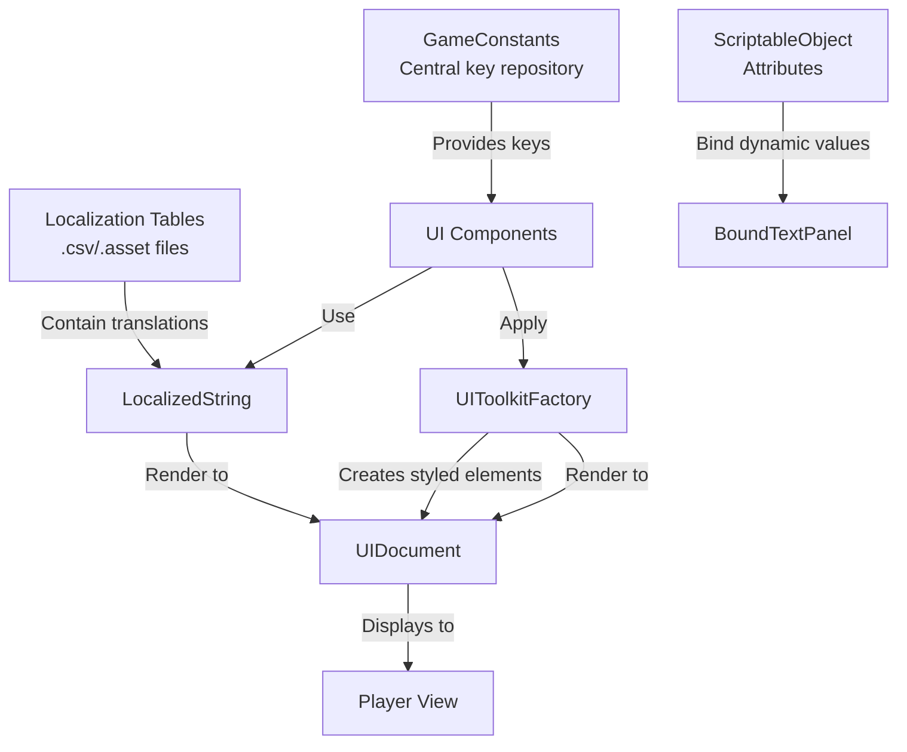

# 🌐 Localization & UI System: High-Level Overview

## 🎯 **System Purpose**
This system provides **language-agnostic UI development** using Unity's Localization package with a clean separation between UI structure, styling, and text content. It enables creating UI components that automatically display text in the player's chosen language while maintaining a consistent visual design.

## 🏗️ **Architecture & Component Flow**



## 🧩 **Core Components**

### 1. **GameConstants - Key Centralization**
- **Localisation Keys**: String constants for text lookup (`PlayKey`, `QuitKey`, `GoldKey`)
- **UI Styles**: Constants for USS style classes (`ContinueButtonStyle`, `HeaderStyle`)
- **Table Reference**: `LocalTable` constant points to main localization table

### 2. **BaseButtonPanel - Abstract Button System**
- **Purpose**: Reusable button framework with localization support
- **Key Features**:
    - Dynamically generates buttons with localized text
    - Supports multiple button types via `ButtonType` enum
    - Automatic style application based on button type
    - Clean event subscription management

### 3. **BoundTextPanel - Data-Bound Display**
- **Purpose**: Displays ScriptableObject attributes with automatic updates
- **Key Features**:
    - Binds to `IntAttribute` ScriptableObjects
    - Shows both attribute name and current value
    - Automatically updates when attribute values change

### 4. **UIToolkitFactory - UI Builder**
- **Purpose**: Centralized UI element creation with consistent styling
- **Functionality**: Creates buttons, labels, containers with proper styling and localization

## 🔄 **How It Works Together**

### **📝 Localization Flow**
1. **Content Creation**: Translations stored in Unity Localization tables
2. **Key Reference**: `GameConstants` provides consistent string keys
3. **Runtime Lookup**: `LocalizedString(GameConstants.LocalTable, GameConstants.PlayKey)` fetches correct language
4. **UI Display**: Factory creates element with localized text

### **🎨 Style Application**
1. **Style Definition**: USS files define visual appearance
2. **Style Constants**: `GameConstants` stores style class names
3. **Element Creation**: Factory applies style classes during creation
4. **Dynamic Styling**: Different button types get different style classes

## 💡 **Usage Examples**

### **Example 1: Creating a Localized Play Button**
```csharp
// In inspector:
// - Set buttonType = ButtonType.MenuSelection
// - Set buttonTextKey = "play" (matches GameConstants.PlayKey)

// At runtime:
// 1. BaseButtonPanel.Generate() runs
// 2. Creates LocalizedString with table="MainGame", key="play"
// 3. Gets translation for current language
// 4. Creates button with "menu-button" style class
// 5. Button displays "Play" (English), "Jouer" (French), etc.
```

### **Example 2: Displaying Player Gold**
```csharp
// In inspector:
// - Assign playerGold IntAttribute to BoundTextPanel

// At runtime:
// 1. BoundTextPanel.Generate() runs
// 2. Header: LocalizedString for "gold" key = "Gold" (or "Or" in French)
// 3. Stat: Binds to playerGold.Value property
// 4. When gold changes, UI automatically updates
// 5. Displays: "Gold: 150"
```

### **Example 3: Dynamic Button Panel**
```csharp
// Creating multiple buttons with different types:
// - PanelButton: "save" -> "Save Game" (Panel style)
// - MenuButton: "quit" -> "Quit to Menu" (Menu style)
// - ToggleButton: "spin" -> "Auto Spin" (Toggle style)

// All use same BaseButtonPanel with different configurations
```

## ✅ **Key Benefits**

### **🌟 Advantages**
- **Zero Hardcoded Text**: All UI text comes from localization tables
- **Designer-Friendly**: Non-programmers can update text without touching code
- **Consistent Styling**: Centralized style management via constants
- **Data Binding**: Automatic UI updates when attributes change
- **Reusable Components**: Base classes reduce duplicate code

### **⚡ Performance Considerations**
- **Efficient Lookups**: LocalizedString uses efficient table lookups
- **Event Cleanup**: Proper unsubscription prevents memory leaks
- **Editor Preview**: `OnValidate()` shows UI in editor without Play mode

## 🔧 **Implementation Notes**

### **Setup Requirements**
1. Unity Localization package installed
2. Localization tables created (MainGame table with keys)
3. USS style sheets with defined style classes
4. ScriptableObject attributes for bound data

### **Best Practices**
- **Key Consistency**: Always use `GameConstants` for string keys
- **Table Organization**: Group related keys in localization tables
- **Style Separation**: Keep styling in USS, logic in C#
- **Error Handling**: Validate required components in `OnEnable()`

This system creates a powerful, maintainable foundation for localized VR UI where changing languages or updating text requires no code changes, and UI components automatically reflect game state changes through data binding.