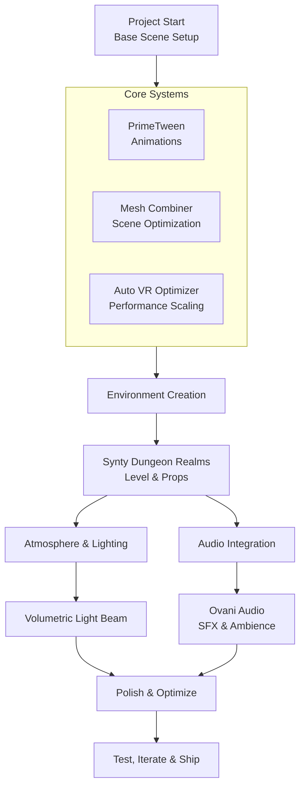

# **References**

---

### 📦 **Core Plugins & Frameworks**

| Asset Name            | Source            | Type / Description                                                                                                 | Key Use in Template                                                                                               |
| :-------------------- | :---------------- | :----------------------------------------------------------------------------------------------------------------- | :---------------------------------------------------------------------------------------------------------------- |
| **PrimeTween**        | Unity Asset Store | **High-performance, allocation-free tweening & animation library**. Supports sequences, shakes, and custom tweens. | **All UI and object animations** including menu transitions, button feedback, HUD motion, and interaction polish. |
| **Auto VR Optimizer** | Unity Asset Store | **Automated VR performance optimization tool**. Dynamically adjusts quality settings to maintain target framerate. | **Runtime performance stability** on VR platforms, especially Quest-class hardware.                               |
| **Mesh Combiner**     | Unity Asset Store | **Mesh batching and combination utility** for static and dynamic objects.                                          | **Draw call reduction** and scene optimization for complex dungeon environments.                                  |

---

### 🧱 **3D Models & Art**

| Asset Name                   | Source                                  | Type / Description                                                                        | Key Use in Template                                                                               |
| :--------------------------- | :-------------------------------------- | :---------------------------------------------------------------------------------------- | :------------------------------------------------------------------------------------------------ |
| **Synty – Dungeon Realms**   | Unity Asset Store                       | **Stylized modular dungeon environments and props** with a consistent low-poly aesthetic. | **Primary environment art set** for all levels, rooms, corridors, props, and decorative elements. |
| **Publisher: Synty Studios** | Unity Asset Store (Publisher ID: 37453) | **Consistent stylized asset ecosystem** designed for modular workflows.                   | **Visual cohesion** across all scenes and rapid level assembly.                                   |

---

### ✨ **Visual Effects & Shaders**

| Asset Name                | Source            | Type / Description                                                             | Key Use in Template                                                                           |
| :------------------------ | :---------------- | :----------------------------------------------------------------------------- | :-------------------------------------------------------------------------------------------- |
| **Volumetric Light Beam** | Unity Asset Store | **Real-time volumetric lighting shader** supporting fog, shafts, and god-rays. | **Atmospheric lighting** for dungeon torches, magical effects, portals, and dramatic reveals. |

---

### 🔊 **Audio & Sound Effects**

| Asset Name                   | Source            | Type / Description                                                             | Key Use in Template                                                                              |
| :--------------------------- | :---------------- | :----------------------------------------------------------------------------- | :----------------------------------------------------------------------------------------------- |
| **Ovanisound (Ovani Audio)** | Unity Asset Store | **Professional game audio packs** including UI sounds, ambient loops, and SFX. | **All sound design**: UI interactions, environment ambience, magic effects, and feedback sounds. |

---

### 💡 **Integration Notes**

* **Art Direction**:
  The template is visually anchored entirely around **Synty Dungeon Realms**, ensuring a cohesive, stylized dungeon aesthetic.
* **Animation Standard**:
  **PrimeTween** is the sole animation system used for UI, interactions, and environmental motion to ensure performance consistency.
* **Optimization Strategy**:
  **Mesh Combiner** handles static batching, while **Auto VR Optimizer** manages runtime performance scaling.
* **Atmosphere**:
  **Volumetric Light Beam** is used selectively to enhance mood without excessive GPU cost.
* **Audio Pipeline**:
  All audio content is sourced from **Ovani Audio**, maintaining consistent sound quality and style.

---

### 🧩 **Updated Asset Integration Flow**

---

If you want, I can next:

* Convert this into **documentation-ready Markdown**
* Create a **Unity project folder structure** based on these assets
* Write **setup steps** for PrimeTween + Synty Dungeon Realms
* Produce a **VR performance checklist** tailored to this stack
