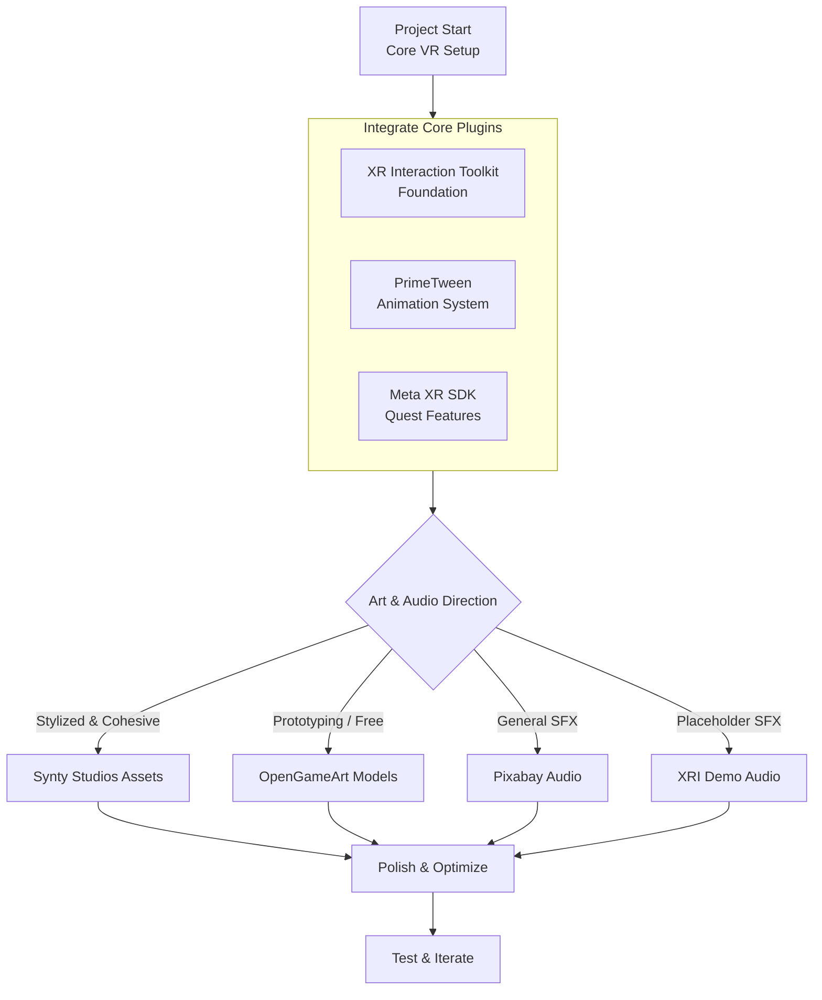

**References**
---

### 📦 **Core Plugins & Frameworks**
| Asset Name | Source | Type/Description | Key Use in Template |
| :--- | :--- | :--- | :--- |
| **PrimeTween** | Unity Asset Store | **High-performance animation library**. Allocation-free, supports sequences, shakes, and custom tweens. | **UI & object animations** for menus, HUD transitions, and interactive feedback (e.g., smooth button presses). |
| **XR Interaction Toolkit (Starter Assets)** | Unity Package Manager (via Unity Registry) | **Official VR interaction framework**. Includes input actions, prefabs (XR Origin, interactables), and scripts. | **Core VR setup** for locomotion, grabbing, UI interaction, and teleportation. |
| **Meta XR UPM Packages & Starter Samples** | Meta Developer Site / GitHub | **Platform-specific SDK and samples** for Meta Quest. Includes hand tracking, passthrough, and UI examples. | **Meta Quest optimization** and advanced features like hand models and overlay canvases. |

---

### 🧱 **3D Models & Art**
| Asset Name | Source | Type/Description | Key Use in Template |
| :--- | :--- | :--- | :--- |
| **Synty Studios Asset Packs** | Unity Asset Store | **Modular, stylized 3D environments and characters**. Highly consistent art style. | **Rapid prototyping** of environments, props, and characters for demos and testing. |
| **OpenGameArt (3D Art Section)** | OpenGameArt.org | **Community-driven, free 3D models**. Quality and style vary; check individual licenses. | **Filling specific needs** (e.g., simple props, environmental assets) where budget is limited. |
| **UI Graphics & Elements** | OpenGameArt.org | **2D sprites and textures for user interfaces**. | **Creating custom UI panels, icons, and buttons** for VR canvases. |

---

### 🔊 **Audio & Sound Effects**
| Asset Name | Source | Type/Description | Key Use in Template |
| :--- | :--- | :--- | :--- |
| **Pixabay Sound Effects** | Pixabay.com | **Royalty-free audio library**. Large collection of single effects and some packs. | **General sound effects** for UI interactions (clicks, hovers), object grabs, and environment ambiance. |
| **XR Interaction Toolkit Demo Audio** | Unity Package Manager (Starter Assets) | **Basic sound effects** included in the official XRI Starter Assets sample. | **Placeholder sounds** for interactions like grabbing, poking, and UI events during early development. |

---

### 💡 **Integration Notes**
- **Licensing**: Always verify the specific license for each asset (e.g., **CC0**, **Royalty-Free**, **Standard Unity Asset Store EULA**) before use in a commercial project.
- **Dependencies**: Some assets (like **Meta XR packages**) require specific Unity versions or other packages to function correctly.
- **Purpose**: Use **Synty assets** for a cohesive visual style, **PrimeTween** for performant animations, and **Pixabay/OpenGameArt** for cost-effective prototyping.

To help you visualize where each type of asset fits into the development process, here's a flowchart of a typical asset integration pipeline:

---