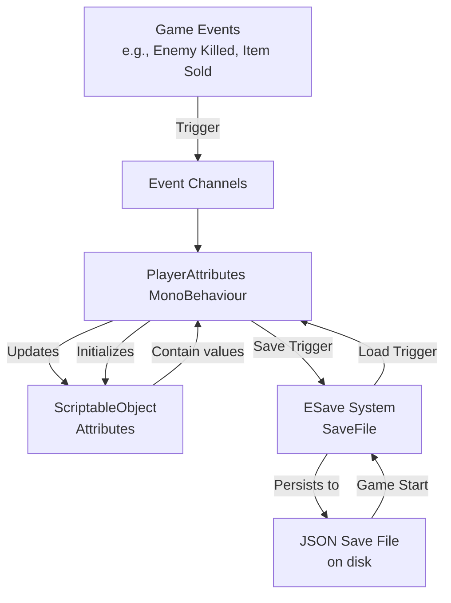

# 💾 Player Save System: High-Level Overview

## 🎯 **System Purpose**
This is an **event-driven player attribute system** that uses **Stylish Esper's ESave** JSON-based save system to persist player progress. It manages core player stats (Gold, Experience, Level) by reacting to game events, updating ScriptableObject attributes, and syncing everything with persistent save files.

## 🏗️ **Architecture & Data Flow**

## 🧩 **Core Components**

### 1. **PlayerAttributes MonoBehaviour**
The **central manager** that coordinates everything:
- **Listens** to game events (gold earned, experience gained, level up, save request)
- **Updates** ScriptableObject attributes when events occur
- **Saves/Loads** data to/from the ESave system
- **Provides** read-only properties for other systems to access

### 2. **ScriptableObject Attributes (`IntAttribute`)**
Reusable data containers that hold:
- Current value
- Base value
- Min/max constraints
- Built-in modification methods (`SetValue()`, `ModifyValue()`)

### 3. **Event Channels**
Decoupled communication system:
- `VoidEventChannel`: Simple triggers (e.g., "save game now")
- `IntEventChannel`: Value changes (e.g., "add 50 gold")

### 4. **ESave System Integration**
- **`SaveFile`**: ESave's core class for JSON read/write operations
- **`SaveFileSetup`**: Component that initializes the save file with profile/name
- Uses `GameConstants` for save key consistency

## 🔄 **Operational Workflow**

### **📥 Loading (Game Start)**
1. `Awake()`: Gets `SaveFile` from `SaveFileSetup`
2. Calls `SetDefaultValues()` for initial fallback
3. Calls `LoadAttributes()` to pull saved data from JSON
4. Subscribes to events in `OnEnable()`

### **🔄 Runtime Updates**
1. Game events fire (e.g., `onGoldChanged` with value `+50`)
2. `PlayerAttributes` event handlers receive the events
3. Corresponding attribute is updated via `ModifyValue()`
4. Value changes are immediately available via properties

### **💾 Saving Progress**
1. `onGameSaved` event is triggered (menu, auto-save, checkpoint)
2. `HandleGameSave()` calls `SaveAttributes()`
3. Each attribute's current value is written to `SaveFile` using `GameConstants` keys
4. ESave persists data to JSON file on disk

## 🗝️ **Key Design Features**

### **✅ Advantages**
- **Event-Driven**: Completely decoupled - any system can trigger stat changes
- **Data-Centric**: ScriptableObjects make attributes reusable and inspector-friendly
- **Save-Agnostic**: Core logic doesn't depend on ESave specifics
- **Safe Defaults**: Always has valid values, even with missing save files

### **⚠️ Considerations**
- **Attribute Synchronization**: ScriptableObjects maintain values between scenes; ensure proper resetting when needed
- **Event Management**: Careful subscription/unsubscription prevents memory leaks
- **Save Timing**: Consider when to trigger saves to avoid performance hits
- **Error Handling**: Current error handling for missing `SaveFileSetup` is basic
