# 🎨 UI Toolkit Best Practices for VR

A comprehensive guide to creating efficient, memory-safe UI panels using Unity's UI Toolkit in VR, based on the patterns established in this project.

---

## Table of Contents

1. [Architecture Overview](#architecture-overview)
2. [Memory Leak Prevention](#memory-leak-prevention)
3. [The Factory → View → Host → Controller Pattern](#the-factory--view--host--controller-pattern)
4. [Creating Efficient Panels](#creating-efficient-panels)
5. [Event Handling Best Practices](#event-handling-best-practices)
6. [Data Binding Patterns](#data-binding-patterns)
7. [VR-Specific UI Considerations](#vr-specific-ui-considerations)
8. [Common Pitfalls and Solutions](#common-pitfalls-and-solutions)
9. [Example: Creating a Complete Panel](#example-creating-a-complete-panel)

---

## Architecture Overview

### The Four-Layer UI Pattern

```mermaid
graph TD
    A[🎨 UIToolkitFactory] -->|Creates Elements| B[👁️ View]
    B -->|Managed By| C[🏠 Host]
    C -->|Events To| D[🎮 Controller]
    D -->|Updates| E[⚙️ Game Systems]
    
    F[📊 Attributes] -.->|Data Binding| B
    G[✨ TweenTransform] -.->|Animations| C
    H[🎨 StyleSheet] -.->|Styling| A
```



| Layer | Responsibility | Should NOT |
|-------|---------------|------------|
| **Factory** | Create and configure UI elements | Hold state, handle events |
| **View** | Define visual structure, expose elements | Contain game logic |
| **Host** | Manage lifecycle, animations, bridge events | Implement business logic |
| **Controller** | Handle user intent, coordinate systems | Create UI elements |

### Why This Pattern?

1. **Separation of Concerns**: Each layer has one job
2. **Testability**: Controllers can be tested without UI
3. **Memory Safety**: Clear ownership and cleanup paths
4. **Maintainability**: Change visuals without touching logic
5. **VR Performance**: Minimal allocations, efficient updates

---

## Memory Leak Prevention

### ⚠️ Common Memory Leak Sources in UI Toolkit

Based on analysis of the existing codebase, here are the critical areas to watch:

#### 1. **Event Handler Leaks**

The most common source of leaks. If you subscribe to an event but don't unsubscribe, the UI element keeps a reference to your handler, preventing garbage collection.

```csharp
// ❌ MEMORY LEAK: Lambda event handlers
button.clicked += () => DoSomething();
// This anonymous function cannot be unsubscribed!
// Why? Each lambda creates a NEW delegate instance. You cannot reference 
// the same instance to remove it later. The event holds a reference to 
// your lambda, which holds a reference to your class, preventing GC.

// ❌ MEMORY LEAK: RegisterValueChangedCallback without cleanup
slider.RegisterValueChangedCallback(OnValueChanged);
// If you don't UnregisterCallback, leak occurs

// ✅ CORRECT: Store callback reference
EventCallback<ChangeEvent<float>> _sliderCallback;

void Setup()
{
    _sliderCallback = evt => OnValueChanged(evt.newValue);
    slider.RegisterValueChangedCallback(_sliderCallback);
}

void Cleanup()
{
    slider.UnregisterValueChangedCallback(_sliderCallback);
}
```

#### 2. **View Disposal**

Views must be properly disposed when no longer needed:

```csharp
// ✅ CORRECT: Current pattern in BasePanelView
public virtual void Dispose()
{
    Container?.Clear();           // Clear all children
    Container?.RemoveFromHierarchy(); // Remove from parent
    Container = null;             // Release reference
}

// ❌ WRONG: Only setting to null
public void Dispose()
{
    Container = null;  // Element still in visual tree!
}
```

#### 3. **Data Binding Cleanup**

When using `CreateBoundLabel`, the binding creates a connection that must be cleaned:

```csharp
// The binding is automatically managed by UI Toolkit when:
// 1. The element is removed from the visual tree
// 2. The dataSource is set to null

// ✅ Best practice: Clear data source in Dispose
public override void Dispose()
{
    _boundLabel.dataSource = null;
    base.Dispose();
}
```

### ✅ The Cleanup Checklist

Every panel should follow this cleanup pattern:

```csharp
// In Host.Dispose() or OnDisable():
// 1. Unsubscribe from View events
// 2. Unsubscribe from external events (Event Channels)
// 3. Unregister UI callbacks
// 4. Dispose the View
// 5. Null out references
```

### Memory Leak Detection

```csharp
// Add this to help identify leaks during development
#if UNITY_EDITOR
void OnDestroy()
{
    if (_view != null)
        Debug.LogWarning($"[LEAK] {GetType().Name} destroyed with undisposed view!");
    
    if (_eventSubscriptions > 0)
        Debug.LogWarning($"[LEAK] {GetType().Name} destroyed with {_eventSubscriptions} active subscriptions!");
}
#endif
```

---

## The Factory → View → Host → Controller Pattern

### 1. UIToolkitFactory (Static Factory)

The factory creates pre-configured UI elements. It's stateless and doesn't hold references.

```csharp
// Current factory methods in UIToolkitFactory.cs:

// Core creation
CreateElement<T>(params string[] classNames)
CreateContainer(params string[] classNames)

// Controls
CreateButton(localizationKey, onClick, classNames)
CreateLabel(localizationKey, classNames)
CreateBoundLabel(dataSource, dataSourcePath, classNames)
CreateSlider(min, max, value, labelKey, onValueChanged, classNames)
CreateToggle(localizationKey, value, onValueChanged, classNames)
CreateDropdown(labelKey, choices, defaultIndex, onValueChanged, classNames)

// Layout
CreateGroup(isHorizontal, classNames)
CreateSpacer(classNames)
CreateSeparator(isVertical, classNames)

// Specialized
CreateHealthBar() → HealthBarElements struct
CreateProgressBar(progress, labelKey, classNames)
```

#### Factory Best Practices

```csharp
// ✅ DO: Use factory methods consistently
var button = UIToolkitFactory.CreateButton(
    LocalizationKeys.Play,
    null,  // Don't pass handler here if you need to unsubscribe later!
    UIToolkitStyles.MenuButton
);

// ✅ DO: Use fluent API for additional configuration
var panel = UIToolkitFactory.CreateContainer()
    .WithClasses(UIToolkitStyles.PanelBody)
    .WithPadding(20)
    .WithMargin(10);

// ❌ DON'T: Create elements manually
var button = new Button();  // Bypasses factory consistency
```

### 2. View (Visual Structure)

Views define what the UI looks like. They extend `BasePanelView` and implement `IDisposable`.

```csharp
// View responsibilities:
// ✅ Create visual hierarchy
// ✅ Expose UI elements as properties
// ✅ Apply stylesheets
// ✅ Implement Dispose()

// ❌ Don't contain game logic
// ❌ Don't subscribe to external events
// ❌ Don't reference game systems

public class ExamplePanelView : BasePanelView
{
    // Expose elements for Host to bind
    public Button ActionButton { get; private set; }
    public Label StatusLabel { get; private set; }
    
    // Events for user interaction (internal to UI)
    public event Action OnActionRequested;

    public ExamplePanelView(VisualElement root, StyleSheet styleSheet)
    {
        if (!root.styleSheets.Contains(styleSheet))
            root.styleSheets.Add(styleSheet);

        GenerateUI(root);
    }

    protected sealed override void GenerateUI(VisualElement root)
    {
        Container = UIToolkitFactory.CreateContainer(
            UIToolkitStyles.Container,
            UIToolkitStyles.PanelBody
        );

        StatusLabel = UIToolkitFactory.CreateLabel(
            LocalizationKeys.Status,
            UIToolkitStyles.PanelTitle
        );
        Container.Add(StatusLabel);

        ActionButton = UIToolkitFactory.CreateButton(
            LocalizationKeys.Action,
            classNames: UIToolkitStyles.MenuButton
        );
        // Connect button to internal event
        ActionButton.clicked += () => OnActionRequested?.Invoke();
        Container.Add(ActionButton);

        root.Add(Container);
    }

    public override void Dispose()
    {
        // Clear event subscribers
        OnActionRequested = null;
        
        base.Dispose();
    }
}
```

### 3. Host (Lifecycle Management)

Hosts manage View creation, destruction, and animation. They extend `BasePanelHost`.

```csharp
// Host responsibilities:
// ✅ Create and destroy Views
// ✅ Subscribe/unsubscribe to View events
// ✅ Forward events to Controllers
// ✅ Manage animations (Show/Hide)

// ❌ Don't implement game logic
// ❌ Don't access game systems directly

public class ExamplePanelHost : BasePanelHost
{
    // Event forwarding to Controller
    public event Action OnActionClicked;
    
    private ExamplePanelView _view;

    public override void Generate()
    {
        // Always dispose before regenerating!
        Dispose();
        
        _view = new ExamplePanelView(
            uiDocument.rootVisualElement,
            styleSheet
        );
        
        SubscribeEvents();
        Show();  // Trigger animation
    }

    private void SubscribeEvents()
    {
        UnsubscribeEvents();  // Prevent double subscription
        if (_view != null)
            _view.OnActionRequested += HandleAction;
    }

    private void UnsubscribeEvents()
    {
        if (_view != null)
            _view.OnActionRequested -= HandleAction;
    }

    private void HandleAction()
    {
        // Forward to Controller
        OnActionClicked?.Invoke();
    }

    protected override void Dispose()
    {
        UnsubscribeEvents();
        _view?.Dispose();
        _view = null;
    }

    // Lifecycle hooks
    private void OnEnable() => Generate();
    // OnDisable handled by BasePanelHost
}
```

### 4. Controller (Business Logic)

Controllers handle what happens when users interact with UI:

```csharp
// Controller responsibilities:
// ✅ Subscribe to Host events
// ✅ Implement game logic
// ✅ Coordinate between systems
// ✅ Load scenes, save data, etc.

// ❌ Don't create UI elements
// ❌ Don't modify View directly

public class ExampleController : MonoBehaviour
{
    [SerializeField] private ExamplePanelHost panelHost;
    [SerializeField] private IntEventChannel onGoldChanged;

    private void OnEnable()
    {
        panelHost.OnActionClicked += HandleActionClicked;
    }

    private void OnDisable()
    {
        panelHost.OnActionClicked -= HandleActionClicked;
    }

    private void HandleActionClicked()
    {
        // Game logic here
        onGoldChanged.Raise(100);  // Award gold
        Debug.Log("Action performed!");
    }
}
```

---

## Creating Efficient Panels

### Panel Creation Workflow

```
1. Define what data the panel needs (inputs)
2. Define what actions the panel triggers (outputs)
3. Create View class with visual structure
4. Create Host class to manage lifecycle
5. Create Controller to handle business logic
6. Wire everything together in scene/prefab
```

### Step-by-Step: Creating a Player Stats Panel

#### Step 1: Define Requirements

```
Inputs:
- Player gold (IntAttribute)
- Player level (IntAttribute)
- Player experience (IntAttribute)
- Experience for next level (calculated)

Outputs:
- None (display only)

Visual Elements:
- Gold display with icon
- Level display with icon
- XP progress bar
```

#### Step 2: Create the View

```csharp
// PlayerStatsPanelView.cs
using System;
using Constants;
using Factories;
using UnityEngine.UIElements;

namespace UI.Views
{
    public class PlayerStatsPanelView : BasePanelView
    {
        // Exposed for data binding
        public Label GoldLabel { get; private set; }
        public Label LevelLabel { get; private set; }
        public Label ExperienceLabel { get; private set; }
        public VisualElement XpProgressFill { get; private set; }

        public PlayerStatsPanelView(VisualElement root, StyleSheet styleSheet)
        {
            if (!root.styleSheets.Contains(styleSheet))
                root.styleSheets.Add(styleSheet);

            GenerateUI(root);
        }

        protected sealed override void GenerateUI(VisualElement root)
        {
            Container = UIToolkitFactory.CreateContainer(
                UIToolkitStyles.Container,
                UIToolkitStyles.PanelBody
            );

            // Gold row
            var goldRow = CreateStatRow("💰", out var goldLabel);
            GoldLabel = goldLabel;
            Container.Add(goldRow);

            // Level row
            var levelRow = CreateStatRow("⭐", out var levelLabel);
            LevelLabel = levelLabel;
            Container.Add(levelRow);

            // XP Progress
            var (xpContainer, xpFill) = UIToolkitFactory.CreateProgressBar(
                0.5f,
                LocalizationKeys.Experience
            );
            XpProgressFill = xpFill;
            Container.Add(xpContainer);

            root.Add(Container);
        }

        private VisualElement CreateStatRow(string icon, out Label valueLabel)
        {
            var row = UIToolkitFactory.CreateGroup(
                true, 
                UIToolkitStyles.StatRow
            );
            
            var iconLabel = UIToolkitFactory.CreateLabel(null)
                .WithText(icon);
            row.Add(iconLabel);
            
            valueLabel = UIToolkitFactory.CreateLabel(
                null, 
                UIToolkitStyles.StatValue
            );
            row.Add(valueLabel);
            
            return row;
        }

        public override void Dispose()
        {
            // Clear any data source bindings
            GoldLabel.dataSource = null;
            LevelLabel.dataSource = null;
            ExperienceLabel.dataSource = null;
            
            base.Dispose();
        }
    }
}
```

#### Step 3: Create the Host

```csharp
// PlayerStatsPanelHost.cs
using Attributes;
using UI.Views;
using UnityEngine;
using UnityEngine.UIElements;

namespace UI.Hosts
{
    public class PlayerStatsPanelHost : BasePanelHost
    {
        [Header("Data Sources")]
        [SerializeField] private IntAttribute playerGold;
        [SerializeField] private IntAttribute playerLevel;
        [SerializeField] private IntAttribute playerExperience;

        private PlayerStatsPanelView _view;
        
        // Store callbacks for proper cleanup
        private System.Action<int> _goldCallback;
        private System.Action<int> _levelCallback;
        private System.Action<int> _xpCallback;

        public override void Generate()
        {
            Dispose();
            
            _view = new PlayerStatsPanelView(
                uiDocument.rootVisualElement,
                styleSheet
            );
            
            BindData();
            Show();
        }

        private void BindData()
        {
            UnbindData();
            
            // Initial values
            UpdateGoldDisplay(playerGold.Value);
            UpdateLevelDisplay(playerLevel.Value);
            UpdateXpDisplay(playerExperience.Value);
            
            // Subscribe to changes
            _goldCallback = UpdateGoldDisplay;
            _levelCallback = UpdateLevelDisplay;
            _xpCallback = UpdateXpDisplay;
            
            playerGold.OnValueChanged += _goldCallback;
            playerLevel.OnValueChanged += _levelCallback;
            playerExperience.OnValueChanged += _xpCallback;
        }

        private void UnbindData()
        {
            if (playerGold != null && _goldCallback != null)
                playerGold.OnValueChanged -= _goldCallback;
            if (playerLevel != null && _levelCallback != null)
                playerLevel.OnValueChanged -= _levelCallback;
            if (playerExperience != null && _xpCallback != null)
                playerExperience.OnValueChanged -= _xpCallback;
        }

        private void UpdateGoldDisplay(int value)
        {
            if (_view?.GoldLabel != null)
                _view.GoldLabel.text = value.ToString("N0");
        }

        private void UpdateLevelDisplay(int value)
        {
            if (_view?.LevelLabel != null)
                _view.LevelLabel.text = $"Level {value}";
        }

        private void UpdateXpDisplay(int value)
        {
            if (_view?.XpProgressFill != null)
            {
                // Calculate progress to next level
                float progress = CalculateXpProgress(value);
                _view.XpProgressFill.style.width = Length.Percent(progress * 100);
            }
        }

        private float CalculateXpProgress(int currentXp)
        {
            // Example: 100 XP per level, polynomial scaling
            int level = playerLevel.Value;
            int currentLevelXp = level * level * 100;
            int nextLevelXp = (level + 1) * (level + 1) * 100;
            
            return (float)(currentXp - currentLevelXp) / (nextLevelXp - currentLevelXp);
        }

        protected override void Dispose()
        {
            UnbindData();
            _view?.Dispose();
            _view = null;
        }

        private void OnEnable() => Generate();
    }
}
```

---

## Event Handling Best Practices

### Pattern 1: Action Composition (for Unbindable Events)

Used in `AudioSettingsPanelHost.cs` - excellent pattern:

```csharp
private Action _unbindAll;

public void BindViewSliders(AudioSettingsPanelView view)
{
    // Start with empty action
    _unbindAll = () => { };

    // Each bind returns an unbind action
    _unbindAll += BindSlider(view.MasterVolume, masterVolume);
    _unbindAll += BindSlider(view.MusicVolume, musicVolume);
}

private static Action BindSlider(Slider slider, FloatAttribute attribute)
{
    if (slider == null || attribute == null) return null;

    slider.SetValueWithoutNotify(attribute.Value);

    // Store the callback reference
    EventCallback<ChangeEvent<float>> sliderCallback =
        e => attribute.Value = e.newValue;

    slider.RegisterValueChangedCallback(sliderCallback);
    attribute.OnValueChanged += slider.SetValueWithoutNotify;

    // Return unbind action
    return () =>
    {
        slider.UnregisterValueChangedCallback(sliderCallback);
        attribute.OnValueChanged -= slider.SetValueWithoutNotify;
    };
}

public void Dispose()
{
    _unbindAll?.Invoke();  // Unbinds everything!
    _unbindAll = null;
}
```

### Pattern 2: Explicit Subscribe/Unsubscribe

Used in `StartMenuPanelHost.cs`:

```csharp
public void SubscribeEvents()
{
    if(_view == null) return;
    UnsubscribeEvents();  // Prevent double subscription
    _view.OnPlayClicked += OnPlay;
    _view.OnControlsClicked += OnControls;
}

private void UnsubscribeEvents()
{
    if(_view == null) return;
    _view.OnPlayClicked -= OnPlay;
    _view.OnControlsClicked -= OnControls;
}
```

### Pattern 3: Stored Callbacks

For UI Toolkit callbacks that need explicit unregistration:

```csharp
// Store callback references
private EventCallback<ChangeEvent<float>> _volumeCallback;
private EventCallback<ClickEvent> _buttonCallback;

void Bind()
{
    _volumeCallback = evt => OnVolumeChanged(evt.newValue);
    slider.RegisterValueChangedCallback(_volumeCallback);
    
    _buttonCallback = evt => OnButtonClicked();
    button.RegisterCallback(_buttonCallback);
}

void Unbind()
{
    slider.UnregisterValueChangedCallback(_volumeCallback);
    button.UnregisterCallback(_buttonCallback);
}
```

### ⚠️ Lambda Warning

```csharp
// ❌ CANNOT UNSUBSCRIBE - Memory leak!
button.clicked += () => DoSomething();

// ✅ Use method reference instead
button.clicked += HandleButtonClick;

void HandleButtonClick() => DoSomething();

void Cleanup()
{
    button.clicked -= HandleButtonClick;
}
```

---

## Data Binding Patterns

### Automatic Binding with CreateBoundLabel

UI Toolkit's built-in binding system:

```csharp
// Creates a label that auto-updates when attribute changes
Label goldLabel = UIToolkitFactory.CreateBoundLabel(
    playerGold,                    // Data source
    nameof(playerGold.Value),      // Property path
    UIToolkitStyles.StatValue
);

// Under the hood:
// - Sets label.dataSource = playerGold
// - Creates DataBinding with bindingMode = ToTarget
// - Uses INotifyBindablePropertyChanged for updates
```

### Manual Binding (More Control)

When you need formatting or complex logic:

```csharp
// Subscribe to attribute changes
playerGold.OnValueChanged += value =>
{
    goldLabel.text = FormatGold(value);
};

string FormatGold(int value)
{
    if (value >= 1000000)
        return $"{value / 1000000f:F1}M";
    if (value >= 1000)
        return $"{value / 1000f:F1}K";
    return value.ToString("N0");
}
```

### Two-Way Binding (UI ↔ Data)

For settings panels where UI updates data:

```csharp
// Slider → Attribute (user changes slider)
slider.RegisterValueChangedCallback(evt =>
{
    attribute.Value = evt.newValue;
});

// Attribute → Slider (external changes)
attribute.OnValueChanged += value =>
{
    slider.SetValueWithoutNotify(value);  // No event trigger
};
```

---

## VR-Specific UI Considerations

### Hit Targets

```csharp
// Minimum recommended sizes for VR
// Buttons: 48x48 pixels minimum, 64x64 preferred
// Sliders: Track height 32px, handle 48x48

// In USS:
.vr-button {
    min-width: 64px;
    min-height: 64px;
    padding: 16px;
}
```

### Text Readability

```csharp
// Font sizes for VR (at typical world-space scale)
// Headers: 24-32px
// Body: 16-20px
// Labels: 14-18px
// Never smaller than 12px

// In USS:
.vr-header {
    font-size: 28px;
    -unity-font-style: bold;
}

.vr-body {
    font-size: 18px;
}
```

### World-Space UI Setup

```csharp
// UIDocument settings for VR:
// - Panel Settings: Set Reference Resolution
// - Panel Settings: Set Scale Mode to Scale With Screen Size
// - Render Mode: World Space
// - Sort Order: Consider depth

// Canvas scale (attached to UIDocument):
// Typical: 0.001 (1 pixel = 1mm in world)
// Adjust based on viewing distance
```

### Pointer/Ray Interaction

```csharp
// UI Toolkit handles XR rays automatically with:
// - XR UI Input Module
// - Event System with XR components

// Ensure your buttons have:
// - Focusable = true
// - Picking mode = Position

// For custom raycast responses:
button.RegisterCallback<PointerEnterEvent>(evt => {
    // Visual feedback
    button.AddToClassList("hovered");
});
```

---

## Common Pitfalls and Solutions

### Pitfall 1: View Regeneration Without Disposal

```csharp
// ❌ WRONG: Creates new view without disposing old
public void Refresh()
{
    _view = new MyView(root, styleSheet);  // Old view leaks!
}

// ✅ CORRECT: Always dispose first
public void Refresh()
{
    Dispose();
    _view = new MyView(root, styleSheet);
}
```

### Pitfall 2: Double Event Subscription

```csharp
// ❌ WRONG: Called multiple times = multiple subscriptions
void OnEnable()
{
    button.clicked += HandleClick;  // Adds each OnEnable!
}

// ✅ CORRECT: Unsubscribe before subscribing
void OnEnable()
{
    button.clicked -= HandleClick;  // Safe even if not subscribed
    button.clicked += HandleClick;
}
```

### Pitfall 3: Forgetting External Event Cleanup

```csharp
// ❌ WRONG: Only cleans up View
protected override void Dispose()
{
    _view?.Dispose();
}

// ✅ CORRECT: Clean up all subscriptions
protected override void Dispose()
{
    // External events
    gameEventChannel.Unsubscribe(HandleGameEvent);
    attribute.OnValueChanged -= HandleAttributeChange;
    
    // View events (if any)
    UnsubscribeViewEvents();
    
    // View itself
    _view?.Dispose();
    _view = null;
}
```

### Pitfall 4: Holding View References in Controller

```csharp
// ❌ WRONG: Controller directly references View elements
public class BadController : MonoBehaviour
{
    private Button _playButton;  // Direct View reference
    
    void Update()
    {
        _playButton.text = "...";  // Breaks encapsulation
    }
}

// ✅ CORRECT: Controller only talks to Host
public class GoodController : MonoBehaviour
{
    [SerializeField] private MyPanelHost _host;
    
    void OnEnable()
    {
        _host.OnButtonClicked += HandleClick;
    }
}
```

### Pitfall 5: Not Checking Null in Callbacks

```csharp
// ❌ WRONG: Callback fires after dispose
attribute.OnValueChanged += value =>
{
    _view.Label.text = value.ToString();  // _view might be null!
};

// ✅ CORRECT: Null check in callback
attribute.OnValueChanged += value =>
{
    if (_view?.Label != null)
        _view.Label.text = value.ToString();
};
```

---

## Example: Creating a Complete Panel

### Complete Example: Upgrade Shop Panel

This example demonstrates all the patterns together:

```csharp
// === UpgradeShopPanelView.cs ===
using System;
using System.Collections.Generic;
using Constants;
using Factories;
using UnityEngine.UIElements;

namespace UI.Views
{
    public class UpgradeShopPanelView : BasePanelView
    {
        // Events
        public event Action<string> OnUpgradeSelected;
        public event Action OnCloseRequested;
        
        // Elements
        public Label GoldDisplay { get; private set; }
        public VisualElement UpgradeListContainer { get; private set; }
        
        private readonly Dictionary<string, Button> _upgradeButtons = new();

        public UpgradeShopPanelView(VisualElement root, StyleSheet styleSheet)
        {
            if (!root.styleSheets.Contains(styleSheet))
                root.styleSheets.Add(styleSheet);
            GenerateUI(root);
        }

        protected sealed override void GenerateUI(VisualElement root)
        {
            Container = UIToolkitFactory.CreateContainer(
                UIToolkitStyles.Container,
                UIToolkitStyles.PanelBody
            );

            // Header with gold display
            var header = UIToolkitFactory.CreateGroup(true, UIToolkitStyles.PanelHeader);
            header.Add(UIToolkitFactory.CreateLabel(LocalizationKeys.Upgrades, UIToolkitStyles.PanelTitle));
            header.Add(UIToolkitFactory.CreateSpacer());
            
            var goldRow = UIToolkitFactory.CreateGroup(true);
            goldRow.Add(UIToolkitFactory.CreateLabel(null).WithText("💰"));
            GoldDisplay = UIToolkitFactory.CreateLabel(null, UIToolkitStyles.StatValue);
            goldRow.Add(GoldDisplay);
            header.Add(goldRow);
            
            Container.Add(header);

            // Scrollable upgrade list
            var scrollView = UIToolkitFactory.CreateScrollView(UIToolkitStyles.ScrollView);
            UpgradeListContainer = UIToolkitFactory.CreateContainer(UIToolkitStyles.UpgradeList);
            scrollView.Add(UpgradeListContainer);
            Container.Add(scrollView);

            // Close button
            var closeButton = UIToolkitFactory.CreateButton(
                LocalizationKeys.Close,
                classNames: UIToolkitStyles.MenuButton
            );
            closeButton.clicked += () => OnCloseRequested?.Invoke();
            Container.Add(closeButton);

            root.Add(Container);
        }

        public void AddUpgradeItem(string upgradeId, string name, string description, int cost, bool canAfford, bool isOwned)
        {
            var item = UIToolkitFactory.CreateContainer(UIToolkitStyles.UpgradeItem);
            
            var infoSection = UIToolkitFactory.CreateContainer();
            infoSection.Add(UIToolkitFactory.CreateLabel(null).WithText(name).WithClasses(UIToolkitStyles.UpgradeTitle));
            infoSection.Add(UIToolkitFactory.CreateLabel(null).WithText(description).WithClasses(UIToolkitStyles.UpgradeDesc));
            item.Add(infoSection);

            if (isOwned)
            {
                item.Add(UIToolkitFactory.CreateLabel(null).WithText("✓ Owned").WithClasses(UIToolkitStyles.OwnedLabel));
            }
            else
            {
                var buyButton = UIToolkitFactory.CreateButton(null, classNames: UIToolkitStyles.BuyButton);
                buyButton.text = $"💰 {cost}";
                buyButton.SetEnabled(canAfford);
                buyButton.clicked += () => OnUpgradeSelected?.Invoke(upgradeId);
                item.Add(buyButton);
                
                _upgradeButtons[upgradeId] = buyButton;
            }

            UpgradeListContainer.Add(item);
        }

        public void ClearUpgrades()
        {
            UpgradeListContainer.Clear();
            _upgradeButtons.Clear();
        }

        public void SetButtonEnabled(string upgradeId, bool enabled)
        {
            if (_upgradeButtons.TryGetValue(upgradeId, out var button))
                button.SetEnabled(enabled);
        }

        public override void Dispose()
        {
            OnUpgradeSelected = null;
            OnCloseRequested = null;
            _upgradeButtons.Clear();
            base.Dispose();
        }
    }
}
```

```csharp
// === UpgradeShopPanelHost.cs ===
using System;
using Attributes;
using UI.Views;
using UnityEngine;

namespace UI.Hosts
{
    public class UpgradeShopPanelHost : BasePanelHost
    {
        [Header("Data")]
        [SerializeField] private IntAttribute playerGold;
        [SerializeField] private UpgradeDatabase upgradeDatabase;

        public event Action<string> OnPurchaseRequested;
        public event Action OnClosed;

        private UpgradeShopPanelView _view;
        private Action<int> _goldCallback;

        public override void Generate()
        {
            Dispose();
            
            _view = new UpgradeShopPanelView(
                uiDocument.rootVisualElement,
                styleSheet
            );

            BindEvents();
            BindData();
            PopulateUpgrades();
            Show();
        }

        private void BindEvents()
        {
            UnbindEvents();
            if (_view != null)
            {
                _view.OnUpgradeSelected += HandleUpgradeSelected;
                _view.OnCloseRequested += HandleCloseRequested;
            }
        }

        private void UnbindEvents()
        {
            if (_view != null)
            {
                _view.OnUpgradeSelected -= HandleUpgradeSelected;
                _view.OnCloseRequested -= HandleCloseRequested;
            }
        }

        private void BindData()
        {
            UpdateGoldDisplay(playerGold.Value);
            _goldCallback = UpdateGoldDisplay;
            playerGold.OnValueChanged += _goldCallback;
        }

        private void UnbindData()
        {
            if (playerGold != null && _goldCallback != null)
                playerGold.OnValueChanged -= _goldCallback;
        }

        private void UpdateGoldDisplay(int value)
        {
            if (_view?.GoldDisplay != null)
                _view.GoldDisplay.text = value.ToString("N0");
            
            // Update affordability of all upgrades
            RefreshUpgradeAffordability();
        }

        private void PopulateUpgrades()
        {
            _view?.ClearUpgrades();
            
            // Populate from database
            // foreach (var upgrade in upgradeDatabase.GetAllUpgrades())
            // {
            //     bool canAfford = playerGold.Value >= upgrade.cost;
            //     bool isOwned = SaveDataManager.IsUpgradeOwned(upgrade.id);
            //     _view.AddUpgradeItem(upgrade.id, upgrade.name, upgrade.description, upgrade.cost, canAfford, isOwned);
            // }
        }

        private void RefreshUpgradeAffordability()
        {
            // Update all upgrade buttons based on current gold
            // foreach (var upgrade in upgradeDatabase.GetAllUpgrades())
            // {
            //     bool canAfford = playerGold.Value >= upgrade.cost;
            //     _view?.SetButtonEnabled(upgrade.id, canAfford);
            // }
        }

        private void HandleUpgradeSelected(string upgradeId)
        {
            OnPurchaseRequested?.Invoke(upgradeId);
        }

        private void HandleCloseRequested()
        {
            Hide();
            OnClosed?.Invoke();
        }

        protected override void Dispose()
        {
            UnbindEvents();
            UnbindData();
            _view?.Dispose();
            _view = null;
        }
    }
}
```

---

## Summary: The Golden Rules

1. **Always dispose Views** when done - call `Dispose()` before creating new ones
2. **Unsubscribe from everything** - use the pattern in `OnDisable` or dedicated `Unbind` methods
3. **Never use lambdas** for event handlers you need to unsubscribe from
4. **Store callback references** for UI Toolkit's `RegisterValueChangedCallback`
5. **Check null in callbacks** - the View may be disposed when the callback fires
6. **Keep Views pure** - no game logic, just visual structure
7. **Controllers don't touch Views** - they only communicate through Hosts
8. **Test on device** - VR hit targets and readability need real-world validation

---

> 💡 **Pro Tip**: When debugging memory leaks, use Unity's Profiler with "Deep Profile" enabled and search for your View class names in the retained objects. If you see Views that should have been disposed, trace back through the event subscriptions to find the leak source.
