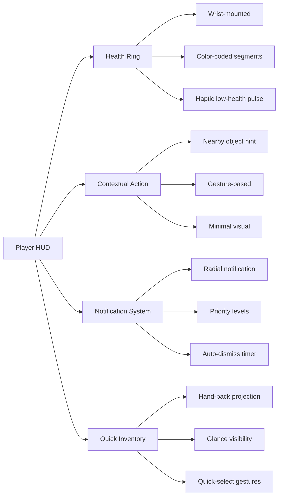
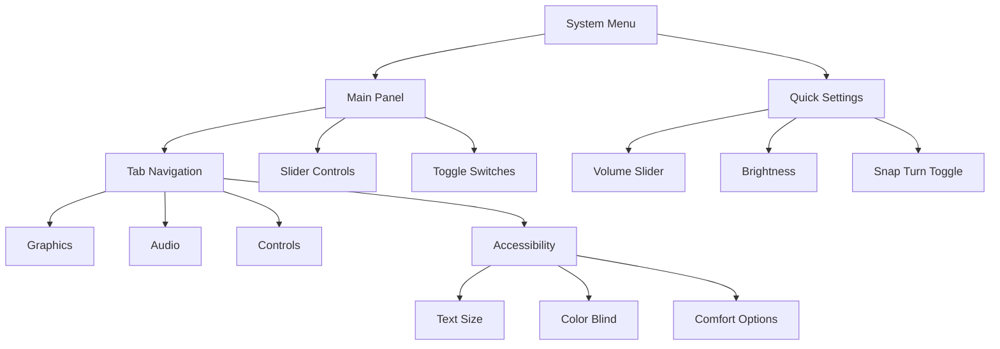

# 🖥️ VR UI System - Architecture & Functionality

---

## 🎯 **Purpose & Design Philosophy**
The VR UI System is built from the ground up for immersive spatial computing, not traditional 2D screens. It prioritizes **comfort**, **accessibility**, and **spatial awareness** while maintaining high performance in VR environments.

## ⚙️ **How It Works**

### **1. Canvas Management & Layering**
The system uses a sophisticated layer-based approach to manage multiple UI elements in 3D space without conflicts.

*   **📊 Layer System**: UI elements are categorized into distinct layers:
    *   **HUD Layer**: Always visible, attached to the player's view (damage indicators, ammo counters).
    *   **World-Space Layer**: Fixed in the game world (terminals, control panels).
    *   **Overlay Layer**: Follows the player but exists in world space (quest logs, inventory).
    *   **System Layer**: Priority UI like menus and settings.
*   **🎯 Focus Management**: Only one canvas per layer can be "focused" at a time. The `VRUIManager` automatically handles focus changes when players interact with different UI elements.
*   **🔗 Event Propagation**: Input events propagate through layers intelligently. A click on a HUD element won't accidentally trigger a world-space UI behind it, thanks to layer-based raycast sorting.

### **2. Interaction & Input Handling**
VR UI requires completely different interaction patterns than traditional mouse/keyboard interfaces.

*   **✋ Dual Interaction Methods**:
    *   **Ray Interaction**: Uses `XRRayInteractor` for distant UI interaction. The ray visually curves and provides haptic feedback when hitting interactive elements.
    *   **Direct Touch**: When players get close enough to UI, the system switches to direct hand/controller interaction for more precise control.
*   **🔄 Input Modality Detection**: The system automatically detects whether you're using hand tracking or controllers and adjusts UI interaction accordingly (larger touch targets for fingers, precise pointer for controllers).
*   **📱 Haptic & Audio Feedback**: Every UI interaction provides immediate multi-sensory feedback:
    *   **Controller**: Subtle haptic pulses on hover and click.
    *   **Hands**: Visual highlight effects and spatial audio cues.
    *   **Audio**: 3D positional audio for button presses and menu transitions.

### **3. Comfort & Accessibility Features**
Preventing VR sickness and ensuring accessibility is built into every component.

*   **👀 Dynamic Positioning**: UI elements automatically position themselves within the player's "comfort zone" (approximately 1-3 meters away, within 30-degree eye movement).
*   **🌀 Smooth Transitions**: All UI appearances, movements, and disappearances use smooth animations with easing curves to prevent jarring visual jumps.
*   **📏 Adaptive Scaling**: Text and interactive elements scale based on player height and device resolution to ensure readability across different headsets.
*   **⚡ Performance Optimization**: Uses instanced rendering, texture atlasing, and occlusion culling to maintain high frame rates even with complex UI.

### **4. Visual Feedback System**
Immediate, clear visual feedback is crucial in VR where traditional hover states don't exist.

*   **🌈 State-Based Materials**: Each UI element has material variants for Normal, Hovered, Pressed, and Disabled states using the `UIStateMaterialController`.
*   **🎯 Progressive Disclosure**: Complex UI reveals information gradually. Settings menus might show basic options first, with advanced settings appearing only when needed.
*   **📊 Data Visualization**: HUD elements use spatial data visualization techniques—health might be a 3D segmented ring around the player's wrist rather than a 2D bar.

---

## 🔧 **Expansion Examples**

### **Example 1: Player HUD System**
A HUD that provides critical game information without obstructing the view.

**Implementation Details**:
- **Wrist-mounted Health Display**: A 3D ring with segments that deplete visually and provide haptic feedback when health is low.
- **Contextual Action Prompts**: Appear only when relevant—like a "GRAB" icon that materializes near grabbable objects.
- **Notification System**: Radial notifications that appear at the edge of vision and don't require direct attention.
- **Quick Inventory**: Tilt your hand to see a projected inventory that's only visible when you're looking at it.

### **Example 2: Settings/System Menu**
A comprehensive menu that's always accessible but never intrusive.

**Implementation Details**:
- **Tab-Based Navigation**: Physical-looking tabs that can be grabbed and pulled to switch categories.
- **Haptic Sliders**: Slider controls that provide incremental haptic feedback as you adjust values.
- **Preset System**: Save/Load comfort and control presets for different play styles.
- **In-Game Preview**: Changes to graphics settings show immediate previews in a small rendered window within the menu.

---

## ⚡ **PrimeTween Integration**
When performance-critical animations are needed, the system can leverage PrimeTween for buttery-smooth transitions.

*   **🎬 Micro-Interaction Tweens**:
    *   Button press depth animations
    *   Menu card fan-out sequences
    *   Progress fill animations
*   **🚀 Performance Benefits**:
    *   Zero allocation animation system
    *   Smooth 90+ FPS even during complex UI sequences
    *   Chainable animations for complex transitions
*   **🔄 State Management**: PrimeTween animations are properly managed to prevent conflicts—if a hide animation is interrupted by a show command, the system cleanly transitions between states.

---

## 🔄 **Interaction Flow Example**
Here's how a typical UI interaction flows through the system:

1.  **👁️ Player looks at UI button** → Ray interactor detects collision
2.  **🌈 Visual feedback activates** → Button material changes to "hover" state
3.  **📳 Haptic pulse triggers** → Controller vibrates subtly (if using controllers)
4.  **✋ Player presses trigger** → Button depresses with PrimeTween animation
5.  **🔊 Audio feedback plays** → Spatial "click" sound at button location
6.  **⚡ Action executes** → Menu opens or setting changes
7.  **🔄 UI state updates** → All related UI elements update visually

---

## 🛠️ **Extension Points**
The system is designed to be extended:

1.  **Custom Widgets**: Create new UI components by extending `VRWidget` base class
2.  **Platform-Specific Overrides**: Different visual styles for Quest vs. PC VR
3.  **Voice Integration**: Add voice command support to UI navigation
4.  **Gesture Shortcuts**: Swipe gestures on certain UI elements for quick actions
5.  **Dynamic Layouts**: UI that rearranges based on player height or play space size

This architecture ensures your VR UI remains performant, comfortable, and immersive while providing all the functionality players expect from modern games.

---