# 🖥️ VR UI System - Architecture Overview

## 🎯 Core Pattern
The UI follows a **Factory → View → Host → Controller** pattern for clean separation of concerns and maintainability.

```mermaid
graph LR
    A[🎨 UIToolkitFactory] --> B[👁️ View]
    B --> C[🏠 Host]
    C --> D[🎮 Controller]
    D --> E[⚙️ Game Systems]
    
    F[📊 Attributes] -.->|Data Binding| B
    G[✨ TweenTransform] -.->|Animations| C
    H[🎨 StyleSheet] -.->|Styling| A
```

## 🧩 Component Structure

### 1. **🎨 UIToolkitFactory**
Central factory class that creates and configures UI Toolkit elements with consistent styling.

| Feature | Description | Example Method |
|---------|-------------|----------------|
| **Element Creation** | Creates common UI elements with consistent styling | `CreateButton()`, `CreateSlider()` |
| **Localization** | Built-in text localization support | `CreateLabel("key")` |
| **Data Binding** | Runtime property binding for dynamic UI | `CreateBoundLabel(dataSource, "Value")` |
| **Fluent API** | Method chaining for easy configuration | `.WithClasses("class").WithText("Hi")` |
| **Specialized UI** | Pre-built complex structures | `CreateHealthBar()` returns struct |

### 2. **👁️ Views (BasePanelView)**
Define the visual structure and layout of UI panels.

| Responsibility | Implementation | Example |
|----------------|----------------|---------|
| **UI Hierarchy** | Builds visual tree using UIToolkitFactory | `SettingsPanelView` creates tabs |
| **No Business Logic** | Pure visual structure only | ❌ No game logic here |
| **Cleanup** | Implements `IDisposable` | Removes elements on disposal |
| **Style Binding** | Applies style sheets | Adds USS classes to elements |

### 3. **🏠 Hosts (BasePanelHost)**
Manage view lifecycle and animation states.

**Key Responsibilities:**
- 🎭 **Animation Management**: Controls `ITweenable` components for show/hide
- 🔗 **Event Forwarding**: Bridges View events to Controllers
- 🧹 **Resource Management**: Cleans up Views on disable
- 👁️ **Visibility**: Handles panel show/hide logic

### 4. **🎮 Controllers**
Handle business logic and user interactions.

| Action | Method | Result |
|--------|--------|--------|
| **Play Game** | `HandlePlay()` | Loads Hub scene |
| **Open Settings** | `HandleSettings()` | Toggles settings panel |
| **Quit Game** | `HandleQuit()` | Exits application |
| **Controls Help** | `HandleControls()` | Shows control scheme |

## 🔗 Supporting Systems

### **📊 Attributes System**
ScriptableObject-based attributes for data binding:

| Attribute | Type | Range | Use Case |
|-----------|------|-------|----------|
| `IntAttribute` | Integer | Any | Health, currency, counters |
| `FloatAttribute` | Float | 0-1 (normalized) | Volume, brightness, sliders |

**Features:**
- 📡 `INotifyBindablePropertyChanged` for automatic UI updates
- 🔔 `OnValueChanged` events for custom logic
- 🎯 Built-in clamping and validation methods

### **✨ Animation System (TweenTransform)**
Scale animations for panel transitions:

| Parameter | Default | Description |
|-----------|---------|-------------|
| `displayScale` | 1.0 | Target scale when visible |
| `displayStartScale` | 0.75 | Starting scale for show animation |
| `duration` | 0.25s | Animation length in seconds |
| `ShowEase` | OutCubic | Easing function for showing |
| `HideEase` | InCubic | Easing function for hiding |

### **🎨 Style Management**
Centralized USS (Unity Style Sheet) with CSS custom properties:

| Category | Variables | Example Use |
|----------|-----------|-------------|
| **Colors** | `--hub-colour-primary`, `--background-dark` | Theming, backgrounds |
| **Dimensions** | `--button-height`, `--panel-border-radius` | Consistent sizing |
| **Transitions** | `--tween-duration` | Smooth animations |
| **Typography** | `--font-size-header`, `--font-size-button` | Readability scaling |

**VR Considerations:**
- 👁️ **Large hit targets** for finger/hand interaction
- 🎯 **High contrast** for varied lighting conditions
- 📱 **Scalable text** for different headset resolutions

## 🔄 Data Flow

```mermaid
graph TD
    User[👤 User Interaction] --> Host
    Host -->|Event| Controller[🎮 Controller]
    Controller -->|Update| Attribute[📊 Attribute]
    Attribute -->|Notify Change| View[👁️ View]
    View -->|Update UI| User
```

## ✅ Key Benefits

| Benefit | Implementation | Impact |
|---------|----------------|--------|
| **Testable** | Controllers isolated from UI | Easy unit testing |
| **Maintainable** | Clear separation of concerns | Predictable updates |
| **Performant** | USS styling, allocation-free tweens | 90+ FPS in VR |
| **Scalable** | Established pattern for new panels | Rapid UI development |
| **VR Ready** | Scalable styles, large hit targets | Comfortable interaction |

## 🚀 Extension Points

| Extension | How to Implement | Use Case |
|-----------|------------------|----------|
| **New Views** | Extend `BasePanelView` | Additional game menus |
| **Custom Widgets** | Add methods to `UIToolkitFactory` | Specialized VR controls |
| **Data Types** | Create new `Attribute` classes | Complex game stats |
| **Animations** | Implement `ITweenable` | Custom transition effects |

---

> 💡 **Pro Tip**: Always use the Factory for UI creation to ensure consistency across your VR interface. The binding system automatically updates UI when attribute values change—no manual refresh needed!