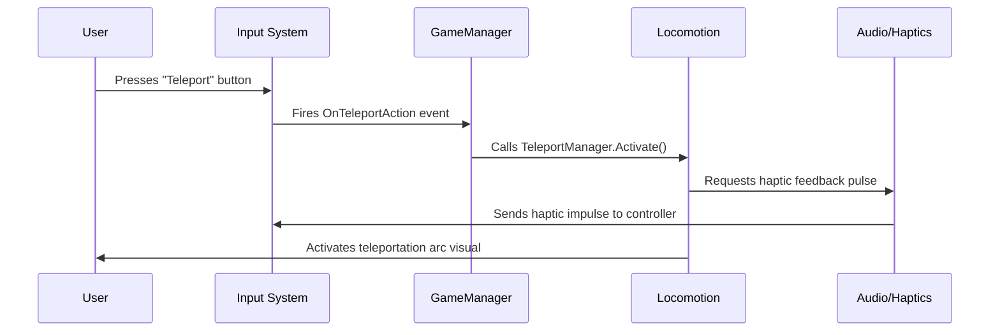

# Unity VR Template - Systems Documentation

This template implements a modular, event-driven architecture for Unity VR projects using Unity 6.3 LTS, the XR Interaction Toolkit, and OpenXR. Systems communicate through a central manager rather than direct dependencies.

---

## 🧠 Core Architecture

### 🎮 **1. Game Manager & State Control**
The `GameManager` is a persistent singleton that acts as the central nervous system for the entire VR experience.

*   **🎯 Purpose**: Coordinates all subsystems, manages global game state (Menu, Playing, Paused, GameOver), and provides a single point for system communication.
*   **⚙️ How It Works**:
    *   Uses the **Singleton pattern** to ensure only one instance exists across scene loads.
    *   Implements a **state machine** (`GameState`) to control the logical flow of the application.
    *   Employs an **event-driven architecture**. Systems don't call each other directly; instead, they fire and listen to events (e.g., `OnGameStateChanged`, `OnPauseTriggered`). This keeps systems decoupled and modular.
    *   Acts as a **service locator**. Other systems register themselves with the GameManager and can be retrieved by type, allowing any script to safely access core systems like `InputManager` or `UIManager` without needing a direct object reference.

### 👤 **2. XR Rig & Player Controller**
This system configures and manages the physical VR player in the scene, built on top of Unity's `XROrigin`.

*   **🎯 Purpose**: Handles player embodiment, camera setup, locomotion, and platform-specific adjustments.
*   **⚙️ How It Works**:
    *   **📐 Core Setup**: The `XRRigController` manages the `XROrigin` GameObject, which contains the main camera and tracked devices (controllers/hands). It configures the camera's height, floor offset, and tracking origin mode (Floor vs. Device).
    *   **📱 Platform Detection & Calibration**: At runtime, it detects the active XR device (Meta Quest, PC VR, etc.) and applies specific settings—like controller offset positions or rendering resolution—to ensure consistent interaction across platforms.
    *   **🚶 Locomotion Manager**: A key subsystem that unifies different movement methods:
        *   **📍 Teleportation**: Uses the `TeleportationProvider` and `TeleportationArea/Anchor` for point-and-move navigation.
        *   **🔄 Smooth Movement/Snap Turn**: Provides continuous analog stick movement and instantaneous turning, managed through `ActionBasedContinuousMoveProvider` and `ActionBasedSnapTurnProvider`.
        *   The manager ensures only one locomotion mode is active at a time to prevent conflict.

### ✋ **3. Input & Interaction System**
This is a layered system that translates raw XR controller/device inputs into meaningful game actions.

*   **🎯 Purpose**: Abstracts complex input handling, provides a consistent API for gameplay code, and manages VR interactors.
*   **⚙️ How It Works**:
    *   **🎛️ Input Manager**: The `VRInputHandler` creates a layer of abstraction over Unity's Input System. Gameplay scripts listen for high-level actions (e.g., "Grab", "Use", "Menu") instead of checking for specific button presses (e.g., "Grip Button"). This makes input remapping and multi-platform support much easier.
    *   **🕹️ Interaction Manager**: Controls the `XRDirectInteractor` and `XRRayInteractor` components. It manages interaction states (e.g., switching from direct grab to a UI ray when pointing at a menu) and handles haptic feedback across different controllers.
    *   **🎯 Action-Based Architecture**: Built on Unity's `ActionBasedController` and `XRInputModalityManager`, which automatically switches between hand tracking and controller input when the user puts on or takes off their controllers.

### 🧩 **4. Object Interaction & Physics**
This system governs how users can grab, manipulate, and throw objects in the virtual world.

*   **🎯 Purpose**: Provides realistic and satisfying object interaction with proper physics.
*   **⚙️ How It Works**:
    *   **✋ Grab System**: The `GrabbableObject` component uses `XRGrabInteractable` with advanced configurations:
        *   **🎯 Attachment Points**: Objects snap to predefined grab points on the controller/hand for precise control.
        *   **📏 Physics vs. Kinematic**: Small objects use kinematic movement for stability, while large/heavy objects use physics-based movement for realism.
        *   **⚡ Velocity Tracking**: Calculates and applies throw velocity upon release based on controller movement.
    *   **🤝 Two-Handed Interaction**: Special `TwoHandedGrabbable` script allows for scaled manipulation (grabbing with both hands to rotate and resize objects).

### 📊 **5. UI & Feedback Systems**
VR-optimized interfaces and user feedback mechanisms.

*   **🎯 Purpose**: Provides clear, comfortable interaction with in-game interfaces and system feedback.
*   **⚙️ How It Works**:
    *   **🖥️ VR Canvas Manager**: All UI uses world-space canvases. The `VRCanvasManager` handles:
        *   **👀 Billboarding**: UI elements automatically rotate to face the player.
        *   **✋ Laser Pointer Interaction**: `XRRayInteractor` with `XRUIInputModule` for menu selection.
        *   **📏 Comfort Settings**: Manages optimal viewing distance and scale to prevent eye strain.
    *   **🎨 Visual/ Audio Feedback**:
        *   **🟢 Highlight System**: Outline shaders or material swaps on hover.
        *   **📳 Haptic System**: Wraps `XRController.SendHapticImpulse` with standardized intensity/duration curves.
        *   **🔊 Audio Cues**: Spatial audio feedback for interactions (grab, drop, click).

### 🔧 **6. Utility & Tooling Systems**
Support systems that enhance development workflow and runtime performance.

*   **🎯 Purpose**: Provides debugging tools, performance monitoring, and quality-of-life features.
*   **⚙️ How It Works**:
    *   **🐛 VR Debug Console**: In-VR display of logs, warnings, and performance stats using a world-space canvas.
    *   **⚡ Performance Monitor**: Tracks and displays FPS, draw calls, and memory usage, with warnings for VR-critical thresholds (e.g., <72 FPS on Quest).
    *   **💾 Save System**: JSON-based persistence for player settings, game progress, and object states.

---

## 🔄 **System Communication Flow**
Here’s a typical sequence showing how these systems work together:



---

## 📁 **Project Structure**
```
Assets/
├── 📂 Scripts/
│   ├── 📂 Core/              # GameManager, Singleton, EventSystem
│   ├── 📂 Player/            # XRRigController, LocomotionManager
│   ├── 📂 Interaction/       # InputHandler, GrabSystem, Interactables
│   ├── 📂 UI/                # VRCanvasManager, RadialMenu, HUD
│   ├── 📂 Systems/           # AudioManager, SaveSystem, SceneLoader
│   └── 📂 Utilities/         # Extensions, DebugTools, Performance
├── 📂 Prefabs/
│   ├── 📂 XR/                # Complete XR Rig variants
│   ├── 📂 UI/                # VR-ready UI components
│   └── 📂 Interactables/     # Common grab-ready objects
└── 📂 Settings/
    ├── 📂 Input/             # Input Action Assets
    ├── 📂 Presets/           # Component configuration presets
    └── 📂 RenderPipeline/    # VR-optimized URP/HDRP settings
```

---

## 🚀 **Getting Started with the Code**
To extend this template:

1.  **🆕 Create a new system**: Implement the `IVRSystem` interface and register it with the `GameManager`.
2.  **🎮 Add an interactable**: Attach `GrabbableObject` to any GameObject and configure grab points.
3.  **🎛️ Create a new input action**: Add it to the `VRInputActions` asset and listen via `VRInputHandler.OnActionPerformed`.
4.  **📱 Add platform-specific behavior**: Check `XRRigController.CurrentDevice` and branch your logic.

---

## 🔧 **Key Configuration Points**
*   **Locomotion Preferences**: Set in `LocomotionManager` inspector (default movement type, turn speed, comfort options).
*   **Input Bindings**: Configure in `Assets/Settings/Input/VRInputActions.inputactions`.
*   **Rig Settings**: Per-platform offsets and camera settings in `XRRigController`.
*   **Performance Caps**: Set target FPS and warning thresholds in `PerformanceMonitor`.

This architecture ensures your VR project remains scalable, maintainable, and easy to debug as complexity grows.

---