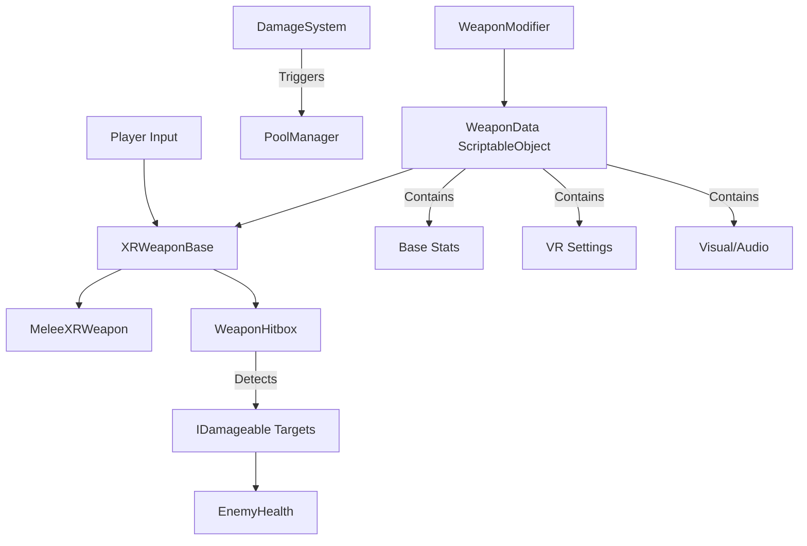
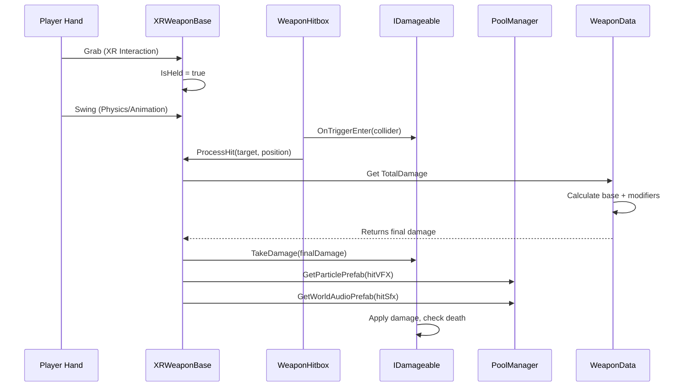

# ⚔️ Weapon System Architecture

## 🎯 **System Purpose**
A data-driven, modular weapon system for VR combat where weapons are defined by ScriptableObjects and enhanced by stackable modifiers, providing endless customization possibilities.



## 🧩 **Core Components**

### **1. 📊 WeaponData (ScriptableObject)**
The blueprint for any weapon - defines all properties and configuration.

| Category | Fields | Description |
|----------|--------|-------------|
| **🎭 Identity** | `weaponID`, `displayName`, `category`, `rarity` | Unique identification and classification |
| **📈 Base Stats** | `baseDamage`, `attackCooldown`, `range`, `staminaCost` | Core gameplay statistics |
| **🎮 VR Settings** | `gripPositionOffset`, `gripRotationOffset`, `hapticStrength` | Hand positioning and feedback |
| **🎨 Visual/Audio** | `hitSfx[]`, `hitVFX` | Sound and particle effects |
| **✨ Modifiers** | `activeModifiers` | List of applied WeaponModifiers |

**Key Properties:**
```csharp
// Calculated total damage including all modifiers
public int TotalDamage
{
    get
    {
        int total = baseDamage;
        foreach (var mod in activeModifiers)
            total += mod.damageBonus;
        return total;
    }
}
```

### **2. ✨ WeaponModifier (ScriptableObject)**
Reusable add-ons that enhance weapons with special properties.

| Field | Type | Purpose |
|-------|------|---------|
| `modifierName` | `string` | Display name |
| `addedDamageType` | `DamageType` | Additional elemental damage |
| `damageBonus` | `int` | Flat damage increase |
| `speedBonus` | `float` | Attack speed multiplier |
| `visualEffect` | `GameObject` | Custom VFX attachment |
| `trailColor` | `Color` | Weapon trail color |

**Usage Example:**
```csharp
// Create "Flaming" modifier in Unity Editor:
// - addedDamageType: DamageType.Fire
// - damageBonus: 5
// - visualEffect: Fire particle system
// - trailColor: Orange
```

### **3. ⚙️ XRWeaponBase (Base Class)**
Core MonoBehaviour that handles weapon logic in VR.

| Method | Trigger | Purpose |
|--------|---------|---------|
| `OnGrab()` | XR Grab event | Weapon is picked up |
| `OnRelease()` | XR Release event | Weapon is dropped |
| `PrimaryAction()` | Player input | Main attack/action |
| `SecondaryAction()` | Player input | Alternate action |
| `ProcessHit()` | Hitbox collision | Apply damage and effects |

**Key Features:**
- ✅ **XR Integration**: Works with Unity's XR Interaction Toolkit
- ⏱️ **Cooldown System**: `CanAttack` property prevents spamming
- 🔗 **Pool Integration**: Uses `GamePoolManager` for effects

### **4. 🗡️ MeleeXRWeapon (Implementation)**
Specific implementation for melee weapons (currently basic).

**Current Status:**
| Feature | Implemented | Notes |
|---------|------------|-------|
| **Basic Structure** | ✅ | Inherits from XRWeaponBase |
| **Physics** | ✅ | Has Rigidbody for collisions |
| **Attack Logic** | ❌ | `PrimaryAction()` empty |
| **Special Moves** | ❌ | `SecondaryAction()` empty |

### **5. 🎯 WeaponHitbox (Collision Detector)**
Detects when weapon hits a target.

| Component | Purpose | Notes |
|-----------|---------|-------|
| **Collider** | Physics detection | Should be on weapon's striking surface |
| **OnTriggerEnter** | Detects hits | Checks for IDamageable interface |
| **Weapon Reference** | Links to weapon | Gets damage and effects from WeaponData |

### **6. 📝 Enums**
Standardized classifications for the weapon system.

**WeaponCategory:**
```csharp
public enum WeaponCategory
{
    Sword,    // 🗡️
    Bow,      // 🏹
    Staff,    // 🪄
    Axe,      // 🪓
    Dagger,   // 🗡️
    Shield    // 🛡️
}
```

**WeaponRarity:**
```csharp
public enum WeaponRarity
{
    Common,     // ⚪
    Uncommon,   // 🟢
    Rare,       // 🔵
    Epic,       // 🟣
    Legendary   // 🟠
}
```

**DamageType:**
```csharp
public enum DamageType
{
    Physical,  // 💥
    Fire,      // 🔥
    Frost,     // ❄️
    Lightning, // ⚡
    Arcane     // 💫
}
```

## 🔄 **Combat Flow**



## 📊 **Weapon Creation Workflow**

### **Step 1: Create Weapon Data**
```csharp
// In Unity Editor:
// 1. Right-click → Create → Weapons → Data
// 2. Name it "IronSword"
// 3. Configure:
//    - Category: Sword
//    - Base Damage: 15
//    - Cooldown: 0.8s
//    - Grip Offsets: Position weapon in hand
//    - Hit SFX: "sword_hit_metal"
//    - Hit VFX: "spark_particles"
```

### **Step 2: Create Modifiers (Optional)**
```csharp
// Create "Flaming" modifier:
// 1. Right-click → Create → Weapons → Modifier
// 2. Name it "Modifier_Flaming"
// 3. Configure:
//    - Added Damage Type: Fire
//    - Damage Bonus: 5
//    - Trail Color: Orange
//    - Visual Effect: Fire aura prefab
```

### **Step 3: Apply Modifiers**
```csharp
// In IronSword WeaponData:
// 1. Add "Modifier_Flaming" to Active Modifiers list
// 2. Weapon becomes "Flaming Iron Sword"
// 3. Total Damage: 20 (15 base + 5 fire)
// 4. Now deals Fire damage type
```

### **Step 4: Setup Prefab**
```csharp
// Create weapon prefab:
// 1. Create empty GameObject
// 2. Add MeleeXRWeapon component
// 3. Assign WeaponData asset
// 4. Add WeaponHitbox component to striking surface
// 5. Add XRGrabInteractable for VR interaction
// 6. Add Rigidbody for physics
// 7. Drag to prefab folder
```

## 🔗 **Integration Points**

### **With Enemy System:**
```csharp
// When weapon hits enemy:
if (enemy.TryGetComponent<IDamageable>(out var target))
{
    ProcessHit(target, hitPoint, hitRotation);
    // EnemyHealth handles damage application
}
```

### **With Pooling System:**
```csharp
// Spawn effects without instantiation:
GamePoolManager.Instance.GetParticlePrefab(data.HitVFX, hitPoint, hitRotation);
GamePoolManager.Instance.GetWorldAudioPrefab(data.HitSfx, hitPoint);
```

### **With Event System:**
```csharp
// Potential future events:
// - OnWeaponEquipped(WeaponData)
// - OnWeaponHit(WeaponData, DamageAmount)
// - OnWeaponModifierApplied(WeaponModifier)
```

## ⚡ **Performance Optimizations**

| Technique | Implementation | Benefit |
|-----------|----------------|---------|
| **ScriptableObjects** | All data as assets | No runtime allocation |
| **Interface Pattern** | `IDamageable` for hits | Fast type checking |
| **Cooldown Checks** | `Time.time` comparison | Prevents frame-rate dependency |
| **Pooled Effects** | Use `GamePoolManager` | No GameObject instantiation |

## 🚀 **Extension Guide**

### **Adding New Weapon Type:**
```csharp
// 1. Add to WeaponCategory enum
public enum WeaponCategory { Sword, Bow, Staff, Mace }

// 2. Create new MonoBehaviour
public class RangedXRWeapon : XRWeaponBase
{
    public void ShootProjectile()
    {
        // VR-compatible ranged logic
    }
}
```

### **Adding New Damage Type:**
```csharp
// 1. Add to DamageType enum
public enum DamageType { Physical, Fire, Frost, Poison }

// 2. Modifiers can now use Poison type
// 3. Enemies can have resistances/weaknesses
```

### **Adding Stat Modifiers:**
```csharp
// Extend WeaponModifier with new stats:
public class AdvancedWeaponModifier : WeaponModifier
{
    public int armorPenetration;
    public float lifestealPercent;
    public bool ignoresDefense;
}
```

## 📈 **Current Status**

| Component | Status | Notes |
|-----------|--------|-------|
| **WeaponData** | ✅ Complete | Full configuration system |
| **WeaponModifier** | ✅ Complete | Stackable modifiers |
| **XRWeaponBase** | ✅ Complete | Core VR functionality |
| **MeleeXRWeapon** | ⚠️ Basic | Needs attack implementation |
| **WeaponHitbox** | ✅ Complete | Damage detection works |
| **Damage System** | ✅ Complete | Interface-based, works with enemies |

## 🎮 **VR Considerations**

| VR Feature | Implementation | Benefit |
|------------|----------------|---------|
| **Grip Positioning** | `gripPositionOffset`, `gripRotationOffset` | Natural weapon holding |
| **Haptic Feedback** | `hapticStrength`, `hapticDuration` | Tactile hit confirmation |
| **Physics Interaction** | XRGrabInteractable + Rigidbody | Realistic weapon handling |
| **Hand Presence** | Controller/model integration | Immersive VR experience |

---

> 💡 **Pro Tip**: Use the modifier system to create unique weapons by combining base stats with special effects. A "Frostfire Sword" could have both Fire and Frost modifiers applied, creating interesting gameplay combinations.