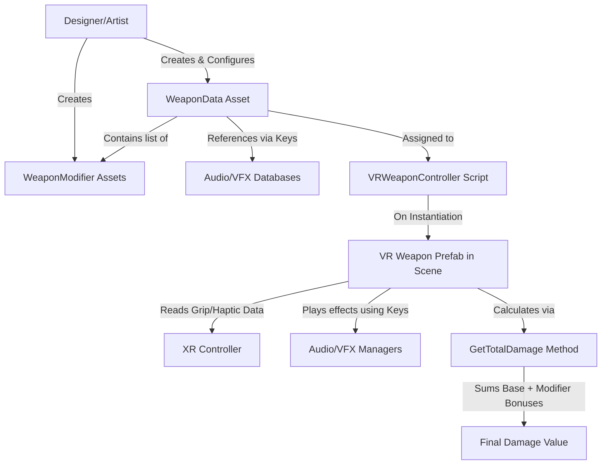

# ⚔️ Weapon System: High-Level Overview

## 🎯 **System Purpose**
This is a **data-driven, modular weapon system** designed for VR games. It uses ScriptableObjects to separate weapon *data* and *configuration* from runtime gameplay logic, making it easy to design, balance, and extend weapons without touching core game code.

## 🏗️ **Core Design Philosophy**
The system is built on three key principles:
1.  **Data-Driven Design**: All weapon properties (damage, speed, effects) are defined in editable assets, not hard-coded.
2.  **Separation of Concerns**: Weapon *data* (`WeaponData`) exists separately from the *logic* that uses it (e.g., a `VRWeaponController` script on a GameObject).
3.  **Modularity & Composability**: Base weapons can be enhanced by stacking independent `WeaponModifier` assets (like "Flaming," "Frost," "Vampiric").

## 🧩 **The Two Core Pieces**

### 1. **WeaponData (The "What")**
This ScriptableObject is the **single source of truth** for one weapon. Think of it as a weapon's complete character sheet or blueprint.
*   **Identity & Classification**: Holds the weapon's ID, name, category (Sword, Bow), and rarity.
*   **Core Gameplay Stats**: Defines base numbers like damage, attack speed, range, and stamina cost.
*   **VR-Specific Configuration**: Contains critical settings for VR, such as how the controller should grip the weapon (`gripPositionOffset`, `gripRotationOffset`) and haptic feedback strength.
*   **Asset References via Keys**: Uses string keys (like `"sword_swing_01"`) to link to audio and visual effects stored in your centralized `AudioClipDatabase` or `VFXDatabase`.
*   **Modifier Slots**: Contains a list of `WeaponModifier` assets that can be added or removed to change the weapon's properties.

### 2. **WeaponModifier (The "Add-On")**
This ScriptableObject is a **self-contained bundle of changes** you can apply to any compatible `WeaponData`.
*   **Stat Adjustments**: Can add flat damage (`damageBonus`) or increase attack speed (`speedBonus`).
*   **Elemental Effects**: Can add a secondary `DamageType` (e.g., adding `Fire` damage to a physical sword).
*   **Visual Flair**: Can define a `trailColor` or attach a `visualEffect` GameObject.
*   **Reusable & Mixable**: A single "Flaming" modifier asset can be applied to swords, axes, or daggers, allowing for endless combinations.

## 🔗 **How It All Fits Together**
Here is a visual summary of the system's architecture and typical workflow:

## 🚀 **Typical Workflow in Practice**
1.  **Designer Creates Weapons**: Uses Unity's "Create" menu to make new `WeaponData` assets (e.g., `IronSword.asset`, `Longbow.asset`), filling in stats and offsets in the Inspector.
2.  **Designer Creates Modifiers**: Creates modifier assets (e.g., `Modifier_Flaming.asset`, `Modifier_Vampiric.asset`).
3.  **Artist/Designer Links Assets**: Assigns the correct prefab to `weaponPrefab` and populates the sound/VFX keys.
4.  **Assembly**: A `WoodenSword.asset` can have the `Modifier_Flaming.asset` added to its `activeModifiers` list, turning it into a "Flaming Wooden Sword."
5.  **Runtime**: A VR player picks up the weapon. The `VRWeaponController` script on the instantiated prefab reads all data from the assigned `WeaponData`, positions it correctly in the hand, sets up haptics, and calculates its final damage when it hits an enemy.

## ✅ **Key Benefits of This Structure**
*   **Non-Programmer Friendly**: Designers can create and tweak entire weapons and modifiers without writing code.
*   **Easy Balancing**: Changing a number in one `WeaponData` asset updates that weapon everywhere it's used.
*   **Performance Efficient**: Stat calculations are simple math on cached data; complex logic isn't re-run every frame.
*   **Extensible**: New weapon categories, rarities, or damage types just require adding new entries to the existing enums.
*   **VR Ready**: Built-in support for the precise hand positioning and haptic feedback essential for good VR feel.

In short, this system provides a powerful, scalable foundation for a VR armory, where creating a new magical sword or a cursed axe is as simple as creating and combining a few assets in the Unity Editor.