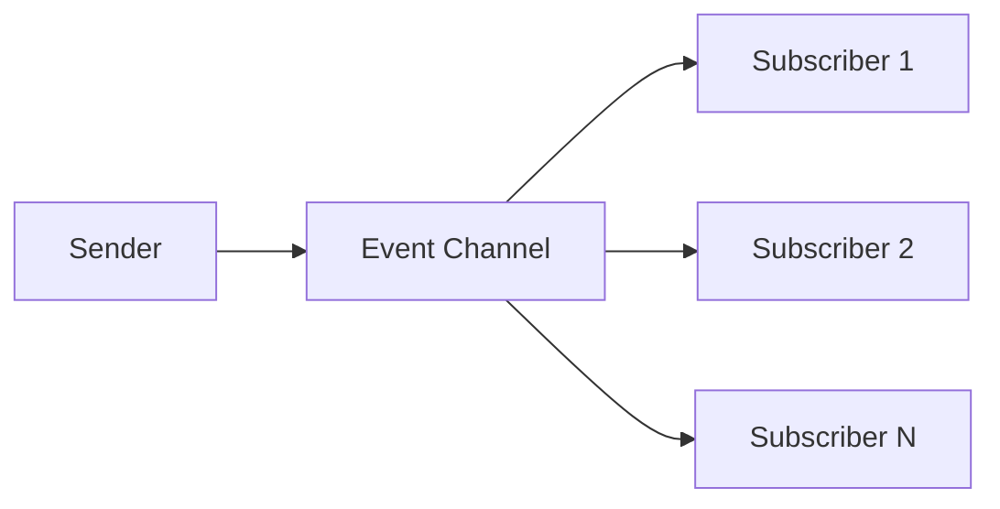

# Event System

Lightweight publish/subscribe system for decoupled communication between game systems.

> **Source**: [`Assets/Scripts/Events/`](https://github.com/SBUplakankus/monsta-choppa-vr/tree/main/Assets/Scripts/Events/)

---

## Overview

Event channels allow systems to communicate without direct references. A sender raises an event, and any number of subscribers receive it.



---

## Event Channel Classes

The project uses simple C# classes (not ScriptableObjects) for events.

> **Source**: [`EventChannel.cs`](https://github.com/SBUplakankus/monsta-choppa-vr/blob/main/Assets/Scripts/Events/Channels/EventChannel.cs)

### EventChannel<T\>

Generic event channel for typed events.

```csharp
public class EventChannel<T>
{
    private event Action<T> Handlers;
    
    public void Raise(T value) => Handlers?.Invoke(value);
    public void Subscribe(Action<T> handler) => Handlers += handler;
    public void Unsubscribe(Action<T> handler) => Handlers -= handler;
    public void Clear() => Handlers = null;
}
```

### EventChannel (Void)

For events with no payload.

```csharp
public class EventChannel
{
    private event Action Handlers;
    
    public void Raise() => Handlers?.Invoke();
    public void Subscribe(Action handler) => Handlers += handler;
    public void Unsubscribe(Action handler) => Handlers -= handler;
    public void Clear() => Handlers = null;
}
```

---

## Event Registries

Events are organized into static registry classes by category.

> **Source**: [`Assets/Scripts/Events/Registries/`](https://github.com/SBUplakankus/monsta-choppa-vr/tree/main/Assets/Scripts/Events/Registries/)

### GameplayEvents

```csharp
public static class GameplayEvents
{
    // Arena
    public static readonly EventChannel<int> PlayerDamaged = new();
    public static readonly EventChannel<int> PlayerHealed = new();
    public static readonly EventChannel<EnemyController> EnemySpawned = new();
    public static readonly EventChannel<EnemyController> EnemyDespawned = new();
    public static readonly EventChannel ArenaDefeatSequenceRequested = new();
    public static readonly EventChannel ArenaVictorySequenceRequested = new();
    
    // Stats
    public static readonly EventChannel<int> GoldChanged = new();
    public static readonly EventChannel<int> ExperienceChanged = new();
    public static readonly EventChannel<int> LevelChanged = new();
    
    // State
    public static readonly EventChannel GamePaused = new();
    public static readonly EventChannel GameResumed = new();
    public static readonly EventChannel<GameState> GameStateChanged = new();
    public static readonly EventChannel<ArenaState> ArenaStateChanged = new();
    
    public static void Clear() { /* clears all events */ }
}
```

### AudioEvents

```csharp
public static class AudioEvents
{
    public static readonly EventChannel<string> MusicRequested = new();
    public static readonly EventChannel<string> SfxRequested = new();
    public static readonly EventChannel<string> UISfxRequested = new();
    public static readonly EventChannel<string> AmbienceRequested = new();
    
    public static void Clear() { /* clears all events */ }
}
```

### SystemEvents

```csharp
public static class SystemEvents
{
    public static readonly EventChannel SettingsSaveRequested = new();
    public static readonly EventChannel SettingsLoadRequested = new();
    public static readonly EventChannel PlayerSaveRequested = new();
    public static readonly EventChannel PlayerLoadRequested = new();
    public static readonly EventChannel<Locale> LocaleChangeRequested = new();
    
    public static void Clear() { /* clears all events */ }
}
```

---

## Usage Examples

### Subscribing to Events

```csharp
public class GoldDisplay : MonoBehaviour
{
    private void OnEnable()
    {
        GameplayEvents.GoldChanged.Subscribe(UpdateDisplay);
    }
    
    private void OnDisable()
    {
        GameplayEvents.GoldChanged.Unsubscribe(UpdateDisplay);
    }
    
    private void UpdateDisplay(int newGold)
    {
        goldLabel.text = newGold.ToString();
    }
}
```

### Raising Events

```csharp
// When enemy dies
GameplayEvents.EnemyDespawned.Raise(controller);

// When gold changes
GameplayEvents.GoldChanged.Raise(newGoldAmount);
```

### Requesting Audio

```csharp
AudioEvents.SfxRequested.Raise("sword_hit");
AudioEvents.MusicRequested.Raise("combat_theme");
```

---

## Best Practices

| Rule | Reason |
|:-----|:-------|
| Always unsubscribe in OnDisable | Prevents memory leaks and null reference errors |
| Keep handlers lightweight | Long handlers block other subscribers |
| Match subscribe/unsubscribe methods | Using different method references causes leaks |

---

## Correct Pattern: Method Reference

```csharp
// Correct - same method reference for subscribe and unsubscribe
private void OnEnable() => GameplayEvents.GoldChanged.Subscribe(HandleGoldChanged);
private void OnDisable() => GameplayEvents.GoldChanged.Unsubscribe(HandleGoldChanged);
private void HandleGoldChanged(int gold) { /* ... */ }
```

### Incorrect Pattern (Memory Leak)

```csharp
// Lambda creates new delegate each time - cannot unsubscribe
private void OnEnable() => GameplayEvents.GoldChanged.Subscribe(g => UpdateUI(g));
// This will NOT work - different delegate instance
```
