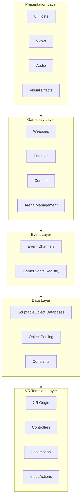

# Architecture Overview

This document describes the high-level architecture of the Monsta Choppa VR project. The system is built on Unity's XR Interaction Toolkit with custom layers for gameplay, data management, and UI.

---

## Core Design Principles

| Principle | Implementation |
|:----------|:---------------|
| Decoupled Systems | Event channels for communication, no direct references |
| Data-Driven Design | ScriptableObjects define all game content |
| VR Performance | Object pooling, priority updates, minimal allocations |
| Extensibility | Generic base classes, factory patterns |

---

## System Layers



---

## Data-Driven ScriptableObject Pattern

The project uses a consistent pattern where ScriptableObjects define configuration and MonoBehaviours handle runtime logic.

### Pattern Flow

```
ScriptableObject (Data)  →  MonoBehaviour (Controller)  →  Components (Behavior)
       ↓                            ↓                            ↓
   WeaponData              XRWeaponBase               Rigidbody, Collider
   EnemyData               EnemyController            EnemyHealth, EnemyMovement
   ParticleData            ParticleController         ParticleSystem
```

### Benefits

| Benefit | Explanation |
|:--------|:------------|
| Designer-friendly | Configure in Inspector without code changes |
| Runtime immutable | Data assets are read-only, no accidental modifications |
| Easy balancing | Tweak stats by editing assets, not code |
| Pooling compatible | Same data drives multiple pooled instances |
| Serialization ready | ScriptableObjects serialize naturally |

### Data Class Structure

All data ScriptableObjects follow this structure:

```csharp
[CreateAssetMenu(menuName = "Scriptable Objects/Category/TypeData")]
public class TypeData : ScriptableObject
{
    [Header("Identity")]
    public string id;
    public string displayName;
    
    [Header("Configuration")]
    // Type-specific fields...
    
    [Header("References")]
    public GameObject prefab;
    
    // Calculated properties
    public int CalculatedValue => baseValue + modifier;
}
```

---

## Key System Relationships

### Weapon System

```
WeaponData (ScriptableObject)
    │
    ├── WeaponDatabase (lookup)
    │
    └── XRWeaponBase (MonoBehaviour)
            │
            ├── MeleeXRWeapon / BowXRWeapon / StaffXRWeapon
            │
            ├── WeaponHitbox (damage detection)
            │
            └── WeaponModifierData[] (stackable modifiers)
```

### Enemy System

```
EnemyData (ScriptableObject)
    │
    ├── EnemyDatabase (lookup)
    │
    └── EnemyController (MonoBehaviour coordinator)
            │
            ├── EnemyHealth (IDamageable, health bar)
            ├── EnemyMovement (NavMesh navigation)
            ├── EnemyAnimator (state machine)
            └── EnemyAttack (WeaponData reference)
```

### Object Pooling

```
GamePoolManager (Singleton)
    │
    ├── Enemy Pools (keyed by EnemyData)
    ├── Weapon Pools (keyed by WeaponData)
    ├── Particle Pools (keyed by ParticleData)
    └── Audio Pools (keyed by WorldAudioData)
```

**Usage:**
```csharp
// Spawn
GamePoolManager.Instance.GetEnemyPrefab(enemyData, position, rotation);

// Return
GamePoolManager.Instance.ReturnEnemyPrefab(enemyData, gameObject);
```

---

## Initialization

The GameBootstrap MonoBehaviour initializes all static references on startup:

1. **Event Channels** - Assigned to GameEvents static fields
2. **Databases** - Assigned to GameDatabases static fields
3. **Pool Manager** - Pre-warms object pools
4. **Save System** - Loads player data via ESave

All systems are ready before any gameplay scene loads.

---

## Static Access Layer

Global access to databases and events through static classes:

```csharp
// GameDatabases - centralized database access
GameDatabases.WeaponDatabase.TryGet("sword_fire", out var weapon);
GameDatabases.EnemyDatabase.TryGet("goblin_melee", out var enemy);

// GameEvents - centralized event access
GameEvents.OnPlayerDamaged.Raise(damage);
GameEvents.OnEnemySpawned.Subscribe(HandleEnemySpawn);
```

---

## Best Practices

| Rule | Reason |
|:-----|:-------|
| Always unsubscribe in OnDisable | Prevents memory leaks and null references |
| Never modify ScriptableObjects at runtime | Breaks data consistency |
| Use TryGet for database lookups | Handles missing entries gracefully |
| Pool all instantiated objects | Avoids GC spikes in VR |
| Keep Update logic minimal | VR requires consistent 72+ FPS |

---

## File Organization

```
Assets/Scripts/
├── Data/                   # ScriptableObject data classes
│   ├── Core/              # EnemyData, ParticleData
│   └── Weapons/           # WeaponData, WeaponModifierData
├── Databases/             # DatabaseBase<T>, GameDatabases
├── Events/                # Event channels, GameEvents
├── Characters/            # Enemy components
├── Weapons/               # Weapon components
├── Pooling/               # GamePoolManager
├── Saves/                 # ESave integration
├── UI/                    # Views, Hosts, Controllers
└── Factories/             # UIToolkitFactory
```
