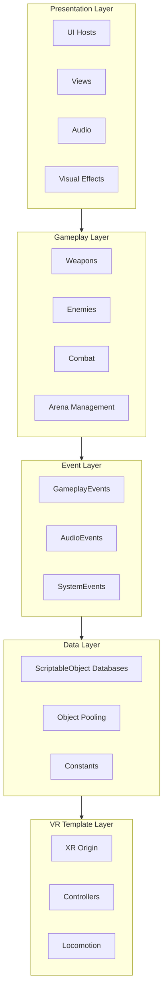
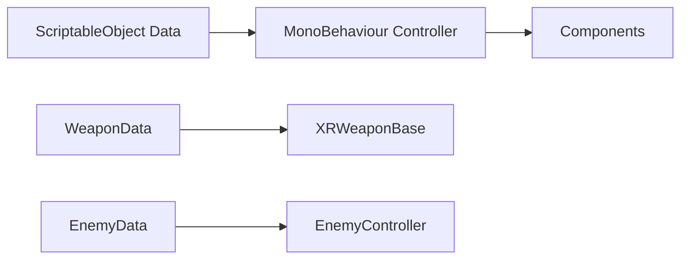
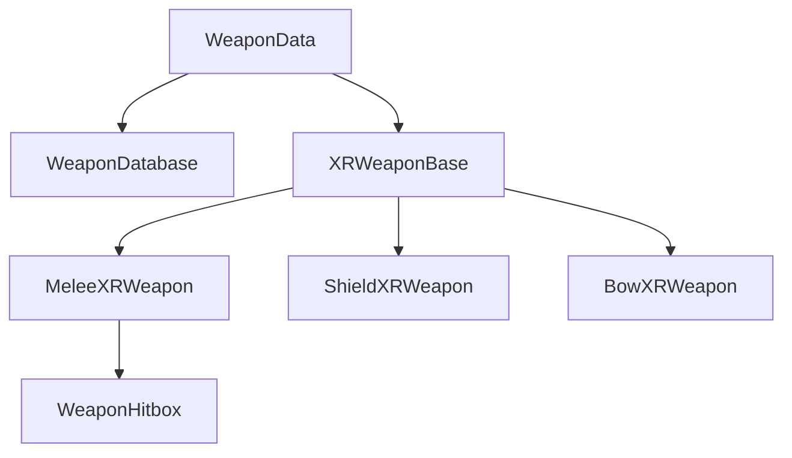
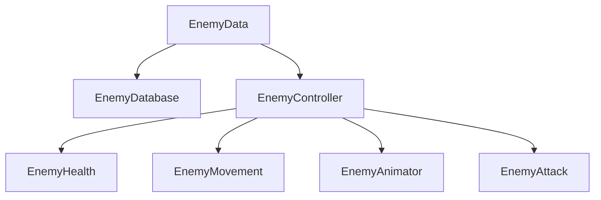
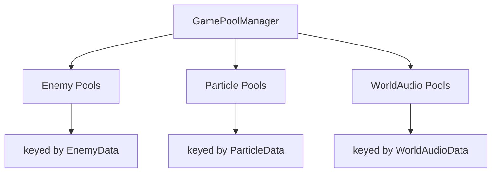

# Architecture Overview

This document describes the high-level architecture of the Monsta Choppa VR project. The system is built on Unity's XR Interaction Toolkit with custom layers for gameplay, data management, and UI.

> **Source**: [`Assets/Scripts/`](https://github.com/SBUplakankus/monsta-choppa-vr/tree/main/Assets/Scripts/)

---

## Core Design Principles

| Principle | Implementation |
|:----------|:---------------|
| Decoupled Systems | Event channels for communication, no direct references |
| Data-Driven Design | ScriptableObjects define all game content |
| VR Performance | Object pooling, priority updates, minimal allocations |
| Extensibility | Generic base classes, factory patterns |

---

## System Layers



---

## Data-Driven ScriptableObject Pattern

The project uses a consistent pattern where ScriptableObjects define configuration and MonoBehaviours handle runtime logic.

### Pattern Flow



### Benefits

| Benefit | Explanation |
|:--------|:------------|
| Designer-friendly | Configure in Inspector without code changes |
| Runtime immutable | Data assets are read-only, no accidental modifications |
| Easy balancing | Tweak stats by editing assets, not code |
| Pooling compatible | Same data drives multiple pooled instances |

---

## Key System Relationships

### Weapon System



### Enemy System



### Object Pooling

> **Source**: [`GamePoolManager.cs`](https://github.com/SBUplakankus/monsta-choppa-vr/blob/main/Assets/Scripts/Pooling/GamePoolManager.cs)



**Usage:**
```csharp
// Spawn
var enemy = GamePoolManager.Instance.GetEnemyPrefab(enemyData, position, rotation);

// Return
GamePoolManager.Instance.ReturnEnemyPrefab(enemyController);
```

---

## Static Access Layer

Global access to databases and events through static classes:

```csharp
// GameDatabases - centralized database access
GameDatabases.WeaponDatabase.TryGet("sword_fire", out var weapon);
GameDatabases.EnemyDatabase.Get("goblin_melee");

// Event Registries - centralized event access
GameplayEvents.GoldChanged.Raise(newGold);
GameplayEvents.EnemySpawned.Subscribe(HandleEnemySpawn);
AudioEvents.SfxRequested.Raise("hit_sound");
```

---

## Best Practices

| Rule | Reason |
|:-----|:-------|
| Always unsubscribe in OnDisable | Prevents memory leaks and null references |
| Never modify ScriptableObjects at runtime | Breaks data consistency |
| Use TryGet for database lookups | Handles missing entries gracefully |
| Pool all instantiated objects | Avoids GC spikes in VR |
| Keep Update logic minimal | VR requires consistent 72+ FPS |

---

## File Organization

```
Assets/Scripts/
├── Attributes/            # FloatAttribute, IntAttribute
├── Audio/                 # Audio controllers
├── Characters/            # Base and Enemy components
│   ├── Base/             # HealthComponent, AnimatorComponent
│   └── Enemies/          # EnemyController, EnemyHealth, etc.
├── Constants/            # GameConstants, AudioKeys, etc.
├── Data/                 # ScriptableObject data classes
│   ├── Core/             # EnemyData, ParticleData
│   ├── Progression/      # MetaProgressionData
│   └── Weapons/          # WeaponData, WeaponModifierData
├── Databases/            # DatabaseBase<T>, GameDatabases
├── Events/               # Event channels and registries
│   ├── Channels/         # EventChannel<T>
│   └── Registries/       # GameplayEvents, AudioEvents
├── Factories/            # UIToolkitFactory
├── Interfaces/           # IDamageable, IUpdateable
├── Pooling/              # GamePoolManager
├── Saves/                # SaveFileManagerBase
├── Systems/              # Arena, Hub systems
│   └── Arena/            # WaveSpawner, EnemyManager
├── UI/                   # Views, Hosts, Controllers
│   ├── Views/            # BasePanelView
│   └── Hosts/            # BasePanelHost
└── Weapons/              # Weapon components
```
