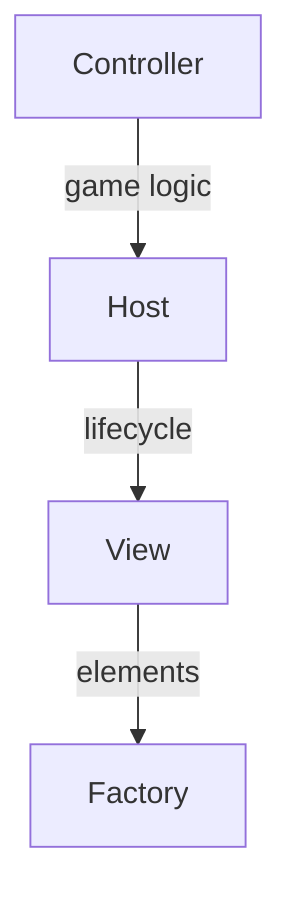

# UI Toolkit Best Practices

Memory-safe patterns for creating UI panels in VR using Unity's UI Toolkit.

> See [User Interface](../systems/user-interface.md) for full architecture details.

---

## Architecture Summary



---

## Memory Leak Prevention

### Common Leak Sources

| Source | Problem | Solution |
|:-------|:--------|:---------|
| Lambda event handlers | Cannot unsubscribe | Use method references |
| Missing unsubscribe | Handler keeps reference | Always unsubscribe in OnDisable |
| View not disposed | Elements remain in tree | Call Dispose before regenerate |
| Data bindings | Source holds reference | Clear dataSource in Dispose |

### Correct Event Pattern

```csharp
private EventCallback<ChangeEvent<float>> _sliderCallback;

void Bind()
{
    _sliderCallback = evt => OnValueChanged(evt.newValue);
    slider.RegisterValueChangedCallback(_sliderCallback);
}

void Unbind()
{
    slider.UnregisterValueChangedCallback(_sliderCallback);
}
```

---

## Cleanup Checklist

In Host.Dispose() or OnDisable():

1. Unsubscribe from View events
2. Unsubscribe from external events (Event Channels)
3. Unregister UI callbacks
4. Dispose the View
5. Null out references

```csharp
protected override void Dispose()
{
    // External events
    GameplayEvents.GoldChanged.Unsubscribe(HandleGoldChanged);
    
    // View events
    if (_view != null)
        _view.OnButtonClicked -= HandleButton;
    
    // UI callbacks
    _unbindAll?.Invoke();
    
    // View
    _view?.Dispose();
    _view = null;
}
```

---

## Unbind Pattern

Compose unbind actions for clean disposal:

```csharp
private Action _unbindAll;

void BindControls()
{
    _unbindAll = () => { };
    _unbindAll += BindSlider(view.Volume, volumeAttribute);
    _unbindAll += BindToggle(view.Mute, muteAttribute);
}

static Action BindSlider(Slider slider, FloatAttribute attr)
{
    EventCallback<ChangeEvent<float>> cb = e => attr.Value = e.newValue;
    slider.RegisterValueChangedCallback(cb);
    return () => slider.UnregisterValueChangedCallback(cb);
}

void Dispose()
{
    _unbindAll?.Invoke();
    _unbindAll = null;
}
```

---

## View Disposal

Always dispose before regenerating:

```csharp
public override void Generate()
{
    Dispose();
    
    _view = new MyPanelView(root, styleSheet);
    BindEvents();
    Show();
}
```

BasePanelView.Dispose():

```csharp
public virtual void Dispose()
{
    Container?.Clear();
    Container?.RemoveFromHierarchy();
    Container = null;
}
```

---

## VR-Specific UI

### Hit Targets

- Minimum button size: 64x64 pixels
- Slider handle: 48x48 minimum
- Generous padding between controls

### Text Readability

- Headers: 24-32px
- Body: 16-20px
- Never smaller than 12px
- High contrast colors

### World Space Setup

- Scale: 0.001 (1 pixel = 1mm)
- Distance: 1-2 meters from player
- Avoid rapid animations
- Test on actual headset

---

## Common Mistakes

| Mistake | Fix |
|:--------|:----|
| View regenerated without Dispose | Always Dispose first |
| Double event subscription | Unsubscribe before subscribe |
| External events not cleaned | Unsubscribe in OnDisable |
| Controller references View elements | Only communicate through Host |
| Null check missing in callback | Always check _view != null |

---

## Quick Reference

```csharp
private void OnEnable()
{
    GameplayEvents.GoldChanged.Subscribe(HandleGold);
}

private void OnDisable()
{
    GameplayEvents.GoldChanged.Unsubscribe(HandleGold);
}

private void HandleGold(int value)
{
    if (_view?.GoldLabel != null)
        _view.GoldLabel.text = value.ToString();
}
```
