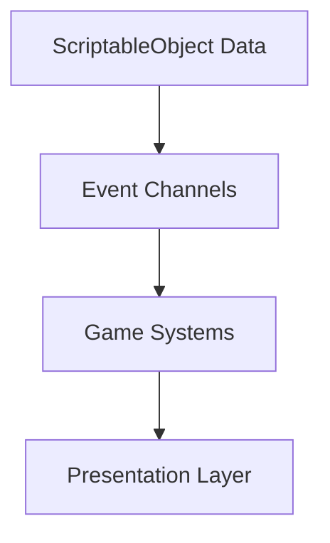
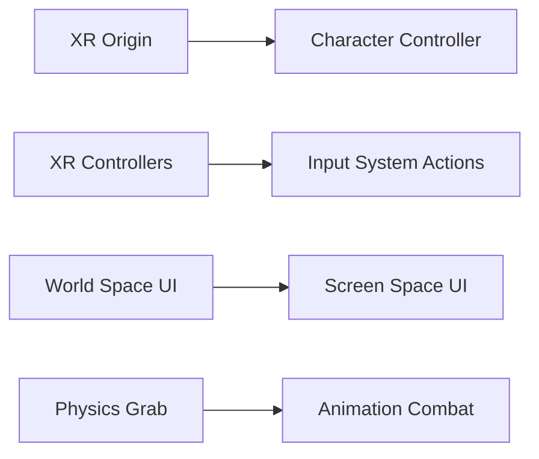

# VR to PC Transition Guide

This document outlines the complete transition plan for converting **Monsta Choppa** from a VR game built on Unity's XR Interaction Toolkit to a first-person or third-person Windows PC game.

---

## Table of Contents

1. [Executive Summary](#executive-summary)
2. [Time Estimates](#time-estimates)
3. [Architecture Overview](#architecture-overview)
4. [Major System Transitions](#major-system-transitions)
   - [Player Controller](#1-player-controller)
   - [Input System](#2-input-system)
   - [Camera System](#3-camera-system)
   - [UI System](#4-ui-system)
   - [Weapon System](#5-weapon-system)
   - [Combat System](#6-combat-system)
5. [Systems to Remove](#systems-to-remove)
6. [Systems to Keep](#systems-to-keep)
7. [Performance Considerations](#performance-considerations)
8. [First-Person vs Third-Person](#first-person-vs-third-person)
9. [Implementation Roadmap](#implementation-roadmap)
10. [Useful References](#useful-references)

---

## Executive Summary

### Why Transition?

| VR Development Constraint | PC Freedom |
|:--------------------------|:-----------|
| 72+ FPS mandatory (motion sickness) | 60 FPS typical target |
| ~13.9ms frame budget | ~16.7ms frame budget at 60 FPS |
| 300k triangle budget | 1M+ triangles easily achievable |
| 100 draw call limit | 1000+ draw calls acceptable |
| Stereo rendering overhead | Single camera view |
| Limited Quest 2/3 hardware | Full desktop GPU power |
| 6-8 max active enemies | 20+ enemies easily supported |

### Key Transition Areas

1. **Player Controller** - Replace XR Rig with FPS/TPS character controller
2. **Input System** - Transition from VR controllers to keyboard/mouse/gamepad
3. **UI System** - Convert from World Space to Screen Space
4. **Weapon System** - Replace physics grab with animation-based combat
5. **Camera System** - Add player-controlled camera

---

## Time Estimates

### Overall Project Timeline

| Scenario | Estimate | Notes |
|:---------|:---------|:------|
| **Minimal Viable Port** | 4-6 weeks | Basic playable conversion |
| **Polished PC Experience** | 8-12 weeks | Full PC-optimized gameplay |
| **Complete Overhaul** | 12-16 weeks | Taking advantage of PC power |

### Per-System Breakdown

| System | Complexity | Estimate | Dependencies |
|:-------|:-----------|:---------|:-------------|
| **Player Controller** | High | 2-3 weeks | Input System |
| **Input System** | Medium | 1 week | None |
| **Camera System** | Medium | 1 week | Player Controller |
| **UI Transition** | High | 2-3 weeks | None (parallel work) |
| **Weapon System** | High | 2-3 weeks | Player Controller, Input |
| **Combat Polish** | Medium | 1-2 weeks | All above |
| **Performance Tuning** | Low | 3-5 days | All above |
| **Testing & Polish** | Medium | 1-2 weeks | All above |

---

## Architecture Overview

### What Stays the Same

The existing architecture is well-designed and should be preserved:



- ✅ **ScriptableObject databases** - WeaponData, EnemyData still work perfectly
- ✅ **Event channel system** - Decoupled communication remains ideal
- ✅ **Object pooling** - Still beneficial (just less critical)
- ✅ **UI Toolkit Factory-View-Host** - Architecture translates directly
- ✅ **Enemy system** - NavMesh AI works unchanged
- ✅ **Save system** - No changes needed

### What Changes



---

## Major System Transitions

### 1. Player Controller

#### Current VR Implementation

| Component | Purpose |
|:----------|:--------|
| `XR Origin` | Tracks headset/controller positions |
| `TeleportationProvider` | VR locomotion |
| `Continuous Move Provider` | Smooth VR movement |
| `Snap Turn Provider` | VR rotation |
| `XR Controller` | Hand tracking |

**Files to Replace:**
- `Assets/Scripts/Player/XRComponentController.cs`
- `Assets/Scripts/Player/WristProximityDetector.cs`
- `Assets/Scripts/Player/PlayerHapticFeedback.cs`

#### Target PC Implementation

**Option A: First-Person Controller**

```csharp
[RequireComponent(typeof(CharacterController))]
public class FPSPlayerController : MonoBehaviour
{
    [Header("Movement")]
    [SerializeField] private float walkSpeed = 5f;
    [SerializeField] private float runSpeed = 8f;
    [SerializeField] private float jumpForce = 5f;
    [SerializeField] private float gravity = -9.81f;
    
    [Header("Look")]
    [SerializeField] private float mouseSensitivity = 2f;
    [SerializeField] private Transform cameraTransform;
    [SerializeField] private float maxLookAngle = 85f;
    
    private CharacterController _controller;
    private Vector3 _velocity;
    private float _xRotation;
    
    private void Update()
    {
        HandleMovement();
        HandleLook();
    }
    
    private void HandleMovement()
    {
        var input = new Vector2(
            Input.GetAxisRaw("Horizontal"),
            Input.GetAxisRaw("Vertical")
        );
        
        var speed = Input.GetKey(KeyCode.LeftShift) ? runSpeed : walkSpeed;
        var move = transform.right * input.x + transform.forward * input.y;
        _controller.Move(move * speed * Time.deltaTime);
        
        // Gravity and jumping
        if (_controller.isGrounded && _velocity.y < 0)
            _velocity.y = -2f;
            
        if (Input.GetButtonDown("Jump") && _controller.isGrounded)
            _velocity.y = Mathf.Sqrt(jumpForce * -2f * gravity);
            
        _velocity.y += gravity * Time.deltaTime;
        _controller.Move(_velocity * Time.deltaTime);
    }
    
    private void HandleLook()
    {
        var mouseX = Input.GetAxis("Mouse X") * mouseSensitivity;
        var mouseY = Input.GetAxis("Mouse Y") * mouseSensitivity;
        
        _xRotation -= mouseY;
        _xRotation = Mathf.Clamp(_xRotation, -maxLookAngle, maxLookAngle);
        
        cameraTransform.localRotation = Quaternion.Euler(_xRotation, 0, 0);
        transform.Rotate(Vector3.up * mouseX);
    }
}
```

**Option B: Third-Person Controller**

```csharp
public class TPSPlayerController : MonoBehaviour
{
    [Header("Movement")]
    [SerializeField] private float walkSpeed = 5f;
    [SerializeField] private float runSpeed = 8f;
    [SerializeField] private float rotationSpeed = 10f;
    
    [Header("Camera")]
    [SerializeField] private Transform cameraTarget;
    [SerializeField] private float cameraDistance = 5f;
    
    private CharacterController _controller;
    private Transform _mainCamera;
    
    private void Update()
    {
        HandleMovement();
    }
    
    private void HandleMovement()
    {
        var input = new Vector2(
            Input.GetAxisRaw("Horizontal"),
            Input.GetAxisRaw("Vertical")
        );
        
        if (input.magnitude < 0.1f) return;
        
        // Move relative to camera direction
        var camForward = _mainCamera.forward;
        camForward.y = 0;
        camForward.Normalize();
        
        var moveDirection = camForward * input.y + _mainCamera.right * input.x;
        moveDirection.Normalize();
        
        // Rotate character towards movement direction
        var targetRotation = Quaternion.LookRotation(moveDirection);
        transform.rotation = Quaternion.Slerp(
            transform.rotation, 
            targetRotation, 
            rotationSpeed * Time.deltaTime
        );
        
        // Move character
        var speed = Input.GetKey(KeyCode.LeftShift) ? runSpeed : walkSpeed;
        _controller.Move(moveDirection * speed * Time.deltaTime);
    }
}
```

#### Recommended Resources

| Resource | Link | Purpose |
|:---------|:-----|:--------|
| Unity Starter Assets | [Unity Asset Store](https://assetstore.unity.com/packages/essentials/starter-assets-first-person-character-controller-196525) | Free FPS/TPS controller templates |
| Cinemachine | [Unity Documentation](https://docs.unity3d.com/Packages/com.unity.cinemachine@2.9/manual/index.html) | Camera management |
| Character Controller Pro | [Asset Store](https://assetstore.unity.com/packages/tools/physics/character-controller-pro-159150) | Advanced movement solution |

---

### 2. Input System

#### Current VR Implementation

VR input relies on:
- `XRController` components
- `InputActionAssets` for XR actions
- Controller-specific mappings (grip, trigger, thumbstick)

#### Target PC Implementation

**New Input Action Map Structure:**

```
ActionMaps/
├── Player
│   ├── Move (Vector2) - WASD / Left Stick
│   ├── Look (Vector2) - Mouse Delta / Right Stick
│   ├── Jump (Button) - Space / A Button
│   ├── Sprint (Button) - Left Shift / Left Stick Click
│   ├── Attack (Button) - Left Mouse / Right Trigger
│   ├── SecondaryAttack (Button) - Right Mouse / Left Trigger
│   ├── Block (Button) - Right Mouse / Left Bumper
│   ├── Interact (Button) - E / X Button
│   └── Dodge (Button) - Left Ctrl / B Button
├── UI
│   ├── Navigate (Vector2)
│   ├── Submit (Button)
│   ├── Cancel (Button)
│   └── Pause (Button) - Escape / Start
└── Weapons
    ├── WeaponSlot1 (Button) - 1 / D-Pad Up
    ├── WeaponSlot2 (Button) - 2 / D-Pad Right
    ├── WeaponSlot3 (Button) - 3 / D-Pad Down
    ├── WeaponSlot4 (Button) - 4 / D-Pad Left
    └── WeaponWheel (Button) - Tab / Left Bumper (Hold)
```

**Implementation:**

```csharp
public class PCInputHandler : MonoBehaviour
{
    private PlayerInput _playerInput;
    private InputAction _moveAction;
    private InputAction _lookAction;
    private InputAction _attackAction;
    
    public Vector2 MoveInput => _moveAction.ReadValue<Vector2>();
    public Vector2 LookInput => _lookAction.ReadValue<Vector2>();
    
    public event Action OnAttackPressed;
    public event Action OnAttackReleased;
    
    private void Awake()
    {
        _playerInput = GetComponent<PlayerInput>();
        _moveAction = _playerInput.actions["Move"];
        _lookAction = _playerInput.actions["Look"];
        _attackAction = _playerInput.actions["Attack"];
    }
    
    private void OnEnable()
    {
        _attackAction.performed += _ => OnAttackPressed?.Invoke();
        _attackAction.canceled += _ => OnAttackReleased?.Invoke();
    }
}
```

#### Resources

| Resource | Link |
|:---------|:-----|
| Unity Input System Manual | [docs.unity3d.com](https://docs.unity3d.com/Packages/com.unity.inputsystem@1.7/manual/index.html) |
| Input System Samples | [GitHub](https://github.com/Unity-Technologies/InputSystem) |
| Rewired (Alternative) | [Asset Store](https://assetstore.unity.com/packages/tools/utilities/rewired-21676) |

---

### 3. Camera System

#### VR Camera (Current)

- Camera attached to XR Origin, tracks headset
- Cannot be moved programmatically (causes sickness)
- Fixed FOV determined by headset

#### PC Camera Options

**First-Person:**

```csharp
public class FPSCamera : MonoBehaviour
{
    [SerializeField] private float sensitivity = 2f;
    [SerializeField] private float fov = 90f;
    
    private float _xRotation;
    private Camera _camera;
    
    private void Start()
    {
        _camera = GetComponent<Camera>();
        _camera.fieldOfView = fov;
        Cursor.lockState = CursorLockMode.Locked;
    }
    
    private void Update()
    {
        var mouseX = Input.GetAxis("Mouse X") * sensitivity;
        var mouseY = Input.GetAxis("Mouse Y") * sensitivity;
        
        _xRotation -= mouseY;
        _xRotation = Mathf.Clamp(_xRotation, -90f, 90f);
        
        transform.localRotation = Quaternion.Euler(_xRotation, 0, 0);
        transform.parent.Rotate(Vector3.up * mouseX);
    }
}
```

**Third-Person with Cinemachine:**

```csharp
// Setup in Inspector:
// 1. Create Cinemachine Virtual Camera
// 2. Set Body to "3rd Person Follow"
// 3. Set Aim to "Composer"
// 4. Assign player as Follow and LookAt target

[RequireComponent(typeof(CinemachineVirtualCamera))]
public class TPSCameraController : MonoBehaviour
{
    [SerializeField] private float minDistance = 2f;
    [SerializeField] private float maxDistance = 8f;
    [SerializeField] private float scrollSensitivity = 2f;
    
    private Cinemachine3rdPersonFollow _thirdPersonFollow;
    private float _currentDistance = 5f;
    
    private void Update()
    {
        var scroll = Input.GetAxis("Mouse ScrollWheel");
        _currentDistance -= scroll * scrollSensitivity;
        _currentDistance = Mathf.Clamp(_currentDistance, minDistance, maxDistance);
        _thirdPersonFollow.CameraDistance = _currentDistance;
    }
}
```

#### Camera Settings to Configure

| Setting | VR Value | PC FPS Value | PC TPS Value |
|:--------|:---------|:-------------|:-------------|
| FOV | Fixed (~90°) | 90-110° | 60-80° |
| Near Clip | 0.01 | 0.1 | 0.3 |
| Far Clip | 1000 | 1000+ | 1000+ |
| Post-Processing | Limited | Full | Full |
| Motion Blur | Never | Optional | Recommended |
| Depth of Field | Never | Optional | Optional |

---

### 4. UI System

This is identified as one of the **two biggest transitions** in the project.

#### Current VR UI Architecture

| Aspect | VR Implementation |
|:-------|:------------------|
| **Canvas Mode** | World Space |
| **Distance** | 1-2 meters from player |
| **Interaction** | XR Ray Interactor / Poke |
| **Input** | Controller pointing/pressing |
| **Panels** | Physical objects in 3D space |
| **Fonts** | Large (minimum 16px at VR distances) |

**Current UI Documents location:** `Assets/UI/`

**UI Scripts location:** `Assets/Scripts/UI/`

#### Target PC UI Architecture

| Aspect | PC Implementation |
|:-------|:------------------|
| **Canvas Mode** | Screen Space - Overlay |
| **Resolution** | Scale with screen size |
| **Interaction** | Mouse cursor / Gamepad navigation |
| **Input** | Point and click / Controller navigation |
| **Panels** | 2D overlays |
| **Fonts** | Standard sizes (12-16px body) |

#### Migration Steps

**Step 1: Create New Canvas Setup**

```csharp
public class ScreenSpaceUIManager : MonoBehaviour
{
    [SerializeField] private UIDocument mainUIDocument;
    
    private void Awake()
    {
        // UI Toolkit automatically handles screen space
        // No Canvas conversion needed - just update positioning
        ConfigureUIDocument();
    }
    
    private void ConfigureUIDocument()
    {
        // UI Toolkit uses USS for styling
        // Update styles for screen-space rather than world-space
        var root = mainUIDocument.rootVisualElement;
        root.style.position = Position.Absolute;
        root.style.width = Length.Percent(100);
        root.style.height = Length.Percent(100);
    }
}
```

**Step 2: Update USS Styles**

```css
/* Before: VR World Space */
.panel-body {
    font-size: 24px;      /* Large for VR readability */
    padding: 40px;        /* Extra padding for VR */
    min-width: 400px;     /* Fixed pixel widths */
}

/* After: PC Screen Space */
.panel-body {
    font-size: 14px;           /* Standard PC size */
    padding: 20px;             /* Normal padding */
    min-width: 300px;          /* Responsive sizes */
    max-width: 50%;            /* Percentage-based */
}
```

**Step 3: Update Input Handling**

```csharp
public class PCUIInputHandler : MonoBehaviour
{
    private void OnEnable()
    {
        // Enable cursor for UI interaction
        Cursor.lockState = CursorLockMode.None;
        Cursor.visible = true;
    }
    
    private void OnDisable()
    {
        // Lock cursor for gameplay
        Cursor.lockState = CursorLockMode.Locked;
        Cursor.visible = false;
    }
}
```

**Step 4: Update Factory Methods**

The `UIToolkitFactory` class (`Assets/Scripts/Factories/UIToolkitFactory.cs`) can remain largely unchanged. Update default sizes:

```csharp
public static class UIToolkitFactory
{
    // Update default values for PC
    private const int DefaultButtonWidth = 200;  // Was larger for VR
    private const int DefaultButtonHeight = 40;  // Was larger for VR
    private const int DefaultFontSize = 14;      // Was 16-24 for VR
    
    // Most factory methods remain unchanged
    public static Button CreateButton(string textKey, Action onClick)
    {
        var button = new Button(onClick);
        // ... existing code works for both
        return button;
    }
}
```

#### UI Elements to Update

| Panel | Changes Required |
|:------|:-----------------|
| **Start Menu** | Convert positioning, reduce font sizes |
| **Settings** | Add mouse sensitivity, remove VR comfort options |
| **Pause Menu** | Create new (wasn't implemented for VR) |
| **HUD** | Position in screen corners, add crosshair |
| **Enemy Health Bars** | Keep world space (billboarded) |
| **Damage Numbers** | Keep world space |

#### New UI Elements to Create

| Element | Description |
|:--------|:------------|
| **Crosshair** | Center screen targeting reticle |
| **Minimap** | Optional screen-corner navigation |
| **Hotbar** | Weapon/item quick slots |
| **Mouse Sensitivity** | Settings option |
| **Graphics Quality** | More options (PC has range) |

---

### 5. Weapon System

This is the other **major transition area** identified.

#### Current VR Weapon Implementation

| Component | VR Purpose |
|:----------|:-----------|
| `XRGrabInteractable` | Physical weapon picking |
| `XRWeaponBase` | Base class with grab events |
| `WeaponHitbox` | Physics collision detection |
| `MeleeXRWeapon` | Velocity-based damage |
| `BowXRWeapon` | Physical string pulling |
| `ShieldXRWeapon` | Physical blocking |

**Key VR Mechanics to Replace:**
- Physics-based grabbing
- Velocity-calculated damage
- Physical aiming (bow, staff)
- Shield angle blocking

#### Target PC Weapon Implementation

**New Base Class:**

```csharp
public abstract class PCWeaponBase : MonoBehaviour
{
    [SerializeField] protected WeaponData data;
    [SerializeField] protected Animator weaponAnimator;
    [SerializeField] protected Transform attackOrigin;
    
    protected bool IsAttacking;
    protected float LastAttackTime;
    
    public WeaponData Data => data;
    public bool CanAttack => Time.time >= LastAttackTime + data.AttackCooldown;
    
    // Called by input handler
    public virtual void PrimaryAttack()
    {
        if (!CanAttack) return;
        
        LastAttackTime = Time.time;
        IsAttacking = true;
        weaponAnimator.SetTrigger("Attack");
    }
    
    // Called by animation event
    public virtual void OnAttackHit()
    {
        PerformHitDetection();
    }
    
    protected abstract void PerformHitDetection();
    
    // Called by animation event
    public virtual void OnAttackEnd()
    {
        IsAttacking = false;
    }
}
```

**Melee Implementation:**

```csharp
public class PCMeleeWeapon : PCWeaponBase
{
    [SerializeField] private float attackRadius = 2f;
    [SerializeField] private float attackAngle = 90f;
    [SerializeField] private LayerMask enemyLayer;
    
    private readonly Collider[] _hitBuffer = new Collider[8];
    
    protected override void PerformHitDetection()
    {
        // Sphere overlap at attack origin
        var hitCount = Physics.OverlapSphereNonAlloc(
            attackOrigin.position, 
            attackRadius, 
            _hitBuffer, 
            enemyLayer
        );
        
        for (int i = 0; i < hitCount; i++)
        {
            var hitCollider = _hitBuffer[i];
            
            // Check if within attack cone
            var directionToTarget = (hitCollider.transform.position - transform.position).normalized;
            var angle = Vector3.Angle(transform.forward, directionToTarget);
            
            if (angle > attackAngle / 2) continue;
            
            // Apply damage
            if (hitCollider.TryGetComponent<IDamageable>(out var damageable))
            {
                damageable.TakeDamage(data.TotalDamage);
                SpawnHitEffects(hitCollider.ClosestPoint(attackOrigin.position));
            }
        }
    }
    
    private void SpawnHitEffects(Vector3 hitPoint)
    {
        if (data.HitVFX != null)
            GamePoolManager.Instance?.GetParticlePrefab(data.HitVFX, hitPoint, Quaternion.identity);
        if (data.HitSfx != null)
            GamePoolManager.Instance?.GetWorldAudioPrefab(data.HitSfx, hitPoint);
    }
}
```

**Ranged Implementation:**

```csharp
public class PCRangedWeapon : PCWeaponBase
{
    [SerializeField] private Transform firePoint;
    [SerializeField] private float projectileSpeed = 20f;
    [SerializeField] private ProjectileData projectileData;
    
    protected override void PerformHitDetection()
    {
        // Spawn projectile from pool
        var projectile = GamePoolManager.Instance.GetProjectile(
            projectileData, 
            firePoint.position, 
            firePoint.rotation
        );
        
        // Set projectile direction based on crosshair/aim
        var aimDirection = GetAimDirection();
        projectile.Initialize(aimDirection, projectileSpeed, data.TotalDamage);
    }
    
    private Vector3 GetAimDirection()
    {
        // Raycast from camera center to find aim point
        var camera = Camera.main;
        var ray = camera.ViewportPointToRay(new Vector3(0.5f, 0.5f, 0));
        
        if (Physics.Raycast(ray, out var hit, 1000f))
            return (hit.point - firePoint.position).normalized;
        
        return camera.transform.forward;
    }
}
```

#### Weapon Data Compatibility

The existing `WeaponData` ScriptableObjects remain compatible:

| Field | VR Use | PC Use | Changes |
|:------|:-------|:-------|:--------|
| `baseDamage` | Used | Used | None |
| `attackCooldown` | Used | Used | None |
| `range` | Attack range | Attack range | None |
| `hitSfx` | Pooled audio | Pooled audio | None |
| `hitVFX` | Pooled particles | Pooled particles | None |
| `gripPositionOffset` | XR grab position | Remove | **Remove field** |
| `gripRotationOffset` | XR grab rotation | Remove | **Remove field** |
| `hapticStrength` | Controller vibration | Optional gamepad | Repurpose |

---

### 6. Combat System

#### Targeting System (New for PC)

PC requires an explicit targeting system:

```csharp
public class TargetingSystem : MonoBehaviour
{
    [SerializeField] private float maxTargetDistance = 20f;
    [SerializeField] private LayerMask targetableLayers;
    [SerializeField] private float softLockAngle = 15f;
    
    private Camera _mainCamera;
    private Transform _currentTarget;
    
    public Transform CurrentTarget => _currentTarget;
    public bool HasTarget => _currentTarget != null;
    
    private void Update()
    {
        UpdateTarget();
    }
    
    private void UpdateTarget()
    {
        // Raycast from crosshair
        var ray = _mainCamera.ViewportPointToRay(new Vector3(0.5f, 0.5f, 0));
        
        if (Physics.Raycast(ray, out var hit, maxTargetDistance, targetableLayers))
        {
            _currentTarget = hit.transform;
        }
        else
        {
            // Check for soft lock (nearest enemy within angle)
            _currentTarget = FindNearestTargetInCone();
        }
    }
    
    private Transform FindNearestTargetInCone()
    {
        var enemies = EnemyManager.Instance.ActiveEnemies;
        Transform nearest = null;
        float nearestAngle = softLockAngle;
        
        foreach (var enemy in enemies)
        {
            var direction = (enemy.transform.position - _mainCamera.transform.position).normalized;
            var angle = Vector3.Angle(_mainCamera.transform.forward, direction);
            
            if (angle < nearestAngle)
            {
                nearestAngle = angle;
                nearest = enemy.transform;
            }
        }
        
        return nearest;
    }
}
```

#### Lock-On System (Optional for TPS)

```csharp
public class LockOnSystem : MonoBehaviour
{
    [SerializeField] private float lockOnRange = 15f;
    [SerializeField] private KeyCode lockOnKey = KeyCode.Q;
    
    private bool _isLockedOn;
    private Transform _lockedTarget;
    
    private void Update()
    {
        if (Input.GetKeyDown(lockOnKey))
            ToggleLockOn();
            
        if (_isLockedOn && _lockedTarget != null)
            RotateTowardsTarget();
    }
    
    private void ToggleLockOn()
    {
        if (_isLockedOn)
        {
            _isLockedOn = false;
            _lockedTarget = null;
            return;
        }
        
        // Find nearest enemy
        _lockedTarget = FindNearestEnemy();
        _isLockedOn = _lockedTarget != null;
    }
    
    private void RotateTowardsTarget()
    {
        var direction = (_lockedTarget.position - transform.position).normalized;
        direction.y = 0;
        var targetRotation = Quaternion.LookRotation(direction);
        transform.rotation = Quaternion.Slerp(transform.rotation, targetRotation, 10f * Time.deltaTime);
    }
}
```

---

## Systems to Remove

These VR-specific systems can be completely removed:

| System | Files | Reason |
|:-------|:------|:-------|
| **XR Rig** | `Assets/XR/`, `Assets/XRI/` | Replaced by PC controller |
| **Teleportation** | Locomotion providers | PC uses continuous movement |
| **Snap/Smooth Turn** | Turn providers | Mouse/stick handles rotation |
| **Haptic Feedback** | `PlayerHapticFeedback.cs` | Gamepad rumble is simpler |
| **Comfort Settings** | `ComfortSettings.cs` | No VR sickness concerns |
| **Tunneling Vignette** | Vignette controller | Not needed |
| **Seated Mode** | Height calibration | Not needed |
| **SpaceWarp** | `SpaceWarpManager.cs` | Quest-specific optimization |
| **Wrist Proximity** | `WristProximityDetector.cs` | No wrists in PC |
| **XR Grab** | `XRGrabInteractable` components | Animation-based weapons |

### XR Packages to Remove

```json
// Packages/manifest.json - Remove these:
{
    "com.unity.xr.interaction.toolkit": "x.x.x",
    "com.unity.xr.management": "x.x.x",
    "com.unity.xr.openxr": "x.x.x",
    "com.unity.xr.hands": "x.x.x"
}
```

---

## Systems to Keep

These systems work unchanged or with minimal modification:

| System | Files | Notes |
|:-------|:------|:------|
| **Event Channels** | `Assets/Scripts/Events/` | No changes needed |
| **Databases** | `Assets/Scripts/Databases/` | No changes needed |
| **Object Pooling** | `GamePoolManager.cs` | Keep for performance |
| **Enemy System** | `Assets/Scripts/Characters/Enemies/` | Works unchanged |
| **Save System** | `Assets/Scripts/Saves/` | No changes needed |
| **Audio System** | `Assets/Scripts/Audio/` | No changes needed |
| **Constants** | `Assets/Scripts/Constants/` | Minor updates |
| **UI Factory** | `UIToolkitFactory.cs` | Update default sizes |
| **Arena System** | `Assets/Scripts/Systems/Arena/` | No changes needed |
| **Update Manager** | `GameUpdateManager.cs` | Intervals can be relaxed |

---

## Performance Considerations

### Relaxed Constraints

| Metric | VR Budget | PC Budget | Improvement |
|:-------|:----------|:----------|:------------|
| Frame Rate | 72-120 FPS | 60 FPS | 17-50% easier |
| Frame Time | 8.3-13.9ms | 16.7ms | 2x headroom |
| Draw Calls | 100-150 | 1000+ | 10x increase |
| Triangles | 300-500k | 2M+ | 4-6x increase |
| Active Enemies | 6-8 | 20+ | 3x increase |
| Real-time Lights | 1-2 | 4+ | 2-4x increase |
| Shadow Quality | Low/None | High | Full shadows |
| Post-Processing | Limited | Full | All effects |

### What This Enables

1. **More Enemies** - Increase `maxEnemies` in WaveSpawner from 6 to 20+
2. **Better Graphics** - Enable shadows, higher quality textures, more complex shaders
3. **Post-Processing** - Bloom, ambient occlusion, color grading, motion blur
4. **Physics** - More complex collision, ragdolls, destruction
5. **AI Complexity** - More sophisticated state machines, group tactics

### Settings to Update

```csharp
// GameConstants.cs - Updated for PC
public static class GameConstants
{
    // Enemies
    public const int MaxActiveEnemies = 20;          // Was 6-8
    public const float EnemyUpdateInterval = 0.1f;   // Was 0.2-0.4s
    
    // Combat
    public const float DefaultMeleeAttackRange = 3f; // Was 2f
    public const int MaxProjectiles = 50;            // Was 20
    
    // VFX
    public const int MaxActiveVFX = 50;              // Was 15-20
    public const int MaxAudioSources = 32;           // Was 16
}
```

---

## First-Person vs Third-Person

### Comparison

| Factor | First-Person | Third-Person |
|:-------|:-------------|:-------------|
| **Development Time** | Faster | Slower |
| **Character Animation** | Minimal (arms only) | Full body required |
| **Camera Complexity** | Simpler | Cinemachine needed |
| **Spatial Awareness** | Limited | Better |
| **Combat Feel** | Intimate, intense | Tactical, strategic |
| **Art Requirements** | Less character focus | Full character model |
| **Existing Art** | VR hands may work | Need PC character |
| **Combat Style** | Action-focused | Souls-like possible |

### Recommendation

For the fastest transition with existing assets:

**Recommended: First-Person**

Reasons:
1. No character model needed (VR had no visible body)
2. Simpler camera setup
3. Combat can remain action-focused
4. Faster development time
5. Can add TPS later as enhancement

If choosing Third-Person:
- Budget 2-3 extra weeks for camera and animation
- Will need character model with full animation set
- Consider using asset store character initially

---

## Implementation Roadmap

### Phase 1: Foundation (Week 1-2)

| Task | Priority | Estimate |
|:-----|:---------|:---------|
| Remove XR packages | Critical | 2h |
| Create PC Input Actions | Critical | 4h |
| Implement FPS/TPS Controller | Critical | 16h |
| Implement Camera System | Critical | 8h |
| Test movement and controls | Critical | 4h |

**Milestone:** Player can move, look, and navigate the Hub scene

### Phase 2: Combat Core (Week 3-4)

| Task | Priority | Estimate |
|:-----|:---------|:---------|
| Create PCWeaponBase | Critical | 8h |
| Implement melee weapons | Critical | 12h |
| Implement ranged weapons | High | 8h |
| Create targeting system | High | 8h |
| Add crosshair UI | High | 4h |
| Test combat loop | Critical | 8h |

**Milestone:** Player can attack enemies, enemies can be killed

### Phase 3: UI Transition (Week 3-4, Parallel)

| Task | Priority | Estimate |
|:-----|:---------|:---------|
| Update USS stylesheets | High | 8h |
| Convert Start Menu | High | 4h |
| Create Pause Menu | Critical | 8h |
| Update Settings Panel | High | 8h |
| Create HUD layout | High | 8h |
| Add keyboard/mouse navigation | High | 4h |

**Milestone:** All UI works with mouse/keyboard and gamepad

### Phase 4: Polish (Week 5-6)

| Task | Priority | Estimate |
|:-----|:---------|:---------|
| Combat animations | High | 16h |
| Screen effects (hit, low health) | Medium | 8h |
| Audio adjustments | Medium | 4h |
| Increase enemy counts | Medium | 4h |
| Graphics quality options | Medium | 8h |
| Gamepad support polish | Medium | 8h |
| Bug fixing | Critical | 16h |

**Milestone:** Game is playable and polished

### Phase 5: Testing (Week 7-8)

| Task | Priority | Estimate |
|:-----|:---------|:---------|
| Full playthrough testing | Critical | 16h |
| Performance profiling | High | 8h |
| Balance adjustments | Medium | 8h |
| Final bug fixes | Critical | 16h |
| Build and packaging | High | 4h |

**Milestone:** Game is ready for release

---

## Useful References

### Unity Documentation

| Topic | Link |
|:------|:-----|
| Input System | [docs.unity3d.com/Packages/com.unity.inputsystem](https://docs.unity3d.com/Packages/com.unity.inputsystem@1.7/manual/index.html) |
| Character Controller | [docs.unity3d.com/Manual/class-CharacterController](https://docs.unity3d.com/Manual/class-CharacterController.html) |
| Cinemachine | [docs.unity3d.com/Packages/com.unity.cinemachine](https://docs.unity3d.com/Packages/com.unity.cinemachine@2.9/manual/index.html) |
| UI Toolkit | [docs.unity3d.com/Manual/UIElements](https://docs.unity3d.com/Manual/UIElements.html) |
| Animation System | [docs.unity3d.com/Manual/AnimationOverview](https://docs.unity3d.com/Manual/AnimationOverview.html) |

### Tutorials

| Topic | Link |
|:------|:-----|
| FPS Controller Tutorial | [youtube.com/watch?v=_QajrabyTJc](https://www.youtube.com/watch?v=_QajrabyTJc) (Brackeys) |
| Third Person Controller | [youtube.com/watch?v=UCwwn2q4Vys](https://www.youtube.com/watch?v=UCwwn2q4Vys) (Brackeys) |
| Cinemachine TPS Camera | [youtube.com/watch?v=jPU2ri4ZwxM](https://www.youtube.com/watch?v=jPU2ri4ZwxM) |
| Input System Setup | [youtube.com/watch?v=Yjee_e4fICc](https://www.youtube.com/watch?v=Yjee_e4fICc) |
| Melee Combat System | [youtube.com/watch?v=sPiVz1k-fEs](https://www.youtube.com/watch?v=sPiVz1k-fEs) |

### Asset Store Recommendations

| Asset | Purpose | Link |
|:------|:--------|:-----|
| Starter Assets - FPS | Free controller template | [assetstore.unity.com/packages/essentials/starter-assets-first-person-character-controller-196525](https://assetstore.unity.com/packages/essentials/starter-assets-first-person-character-controller-196525) |
| Starter Assets - TPS | Free controller template | [assetstore.unity.com/packages/essentials/starter-assets-third-person-character-controller-196526](https://assetstore.unity.com/packages/essentials/starter-assets-third-person-character-controller-196526) |
| Character Controller Pro | Advanced movement | [assetstore.unity.com/packages/tools/physics/character-controller-pro-159150](https://assetstore.unity.com/packages/tools/physics/character-controller-pro-159150) |
| DOTween Pro | Animation tweening | [assetstore.unity.com/packages/tools/animation/dotween-hotween-v2-27676](https://assetstore.unity.com/packages/tools/animation/dotween-hotween-v2-27676) |

### GitHub Repositories

| Repository | Purpose |
|:-----------|:--------|
| [Unity Starter Assets](https://github.com/Unity-Technologies/StarterAssets) | Official controller templates |
| [Input System Samples](https://github.com/Unity-Technologies/InputSystem) | Input system examples |

---

## Summary Checklist

### Before Starting

- [ ] Back up current VR project
- [ ] Create new branch for PC version
- [ ] Document current working state

### Core Transition

- [ ] Remove XR packages
- [ ] Implement PC input system
- [ ] Create player controller (FPS or TPS)
- [ ] Implement camera system
- [ ] Convert weapons to animation-based
- [ ] Add targeting/crosshair system

### UI Migration

- [ ] Update USS styles for screen space
- [ ] Convert all panels to screen-space layout
- [ ] Create pause menu
- [ ] Add PC-specific settings
- [ ] Implement HUD

### Polish

- [ ] Increase performance budgets
- [ ] Add post-processing effects
- [ ] Polish combat feel
- [ ] Add keyboard/gamepad UI navigation
- [ ] Full testing pass

---

## Conclusion

Transitioning from VR to PC is a significant undertaking but the existing architecture is well-suited for the change. The ScriptableObject-driven design, event channel system, and object pooling all transfer directly.

**Estimated Total Time: 6-8 weeks** for a polished first-person PC game.

The main challenges are:
1. Replacing XR-specific weapon interactions with animation-based combat
2. Converting World Space UI to Screen Space
3. Implementing a solid PC character controller

The main opportunities are:
1. Vastly increased performance budgets
2. More enemies, better graphics, complex effects
3. Larger potential audience (no VR headset required)
4. Simpler development and testing workflow

Good luck with the transition!
