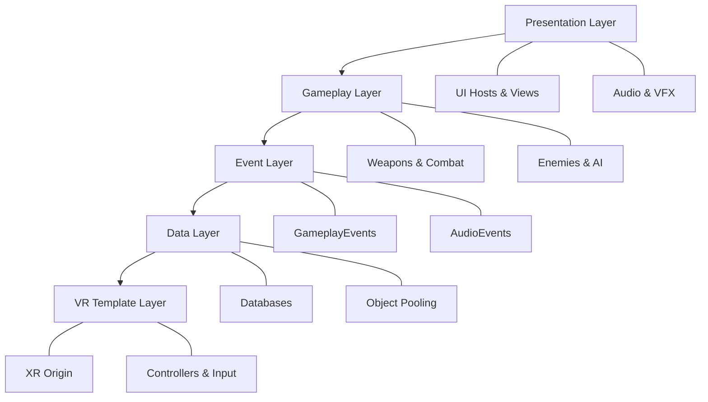

# Monsta Choppa VR

A VR roguelike arena combat game built with Unity's XR Interaction Toolkit. Fight waves of enemies, earn gold and experience, upgrade equipment, and progress through increasingly difficult challenges.

---

## Project Status

!!! warning "Project Shelved"
    This portfolio project was shelved in January 2026. I started a new position working with Meta's native SDK rather than OpenXR, making context-switching between the two SDKs impractical for continued development.
        
    These Documents were also generated by Claude Opus 4.5 based off of my existing MD Files and the Code I made in the project.
    I don't usually do this but I wanted to clean up the documents before shelving and don't have the time to do it properly myself.   

    This project was worked on from December 15th 2025 to January 31st 2026.

    See [Project Status](future/project-status.md) for what was completed and what was planned next.

---

## Technical Highlights

-   :material-sword:{ .lg .middle } **Combat System**

    ---

    Physics-based VR melee combat with velocity-based damage calculation, haptic feedback, and multiple weapon archetypes.

    [:octicons-arrow-right-24: Weapons](systems/weapons.md)

-   :material-robot:{ .lg .middle } **Enemy System**

    ---

    Component-based enemy architecture with NavMesh navigation, object pooling, and data-driven wave spawning.

    [:octicons-arrow-right-24: Enemies](systems/enemies.md)

-   :material-glasses:{ .lg .middle } **VR Performance**

    ---

    Optimized for Quest 2/3 with 72+ FPS targets, priority-based update management, and Application SpaceWarp support.

    [:octicons-arrow-right-24: Performance](vr/performance.md)

-   :material-puzzle:{ .lg .middle } **Architecture**

    ---

    ScriptableObject-driven design with decoupled event channels, generic database patterns, and factory systems.

    [:octicons-arrow-right-24: Architecture](architecture/overview.md)

---

## System Architecture

The project uses a layered architecture separating presentation, gameplay, events, and data concerns.

---

## Core Design Patterns

| Pattern | Implementation |
|:--------|:---------------|
| ScriptableObject Database | Generic `DatabaseBase<T>` with O(1) lookups |
| Event Bus | Type-safe ScriptableObject event channels |
| Object Pool | Unity ObjectPool with priority routing |
| Factory | UIToolkitFactory for consistent UI creation |
| Component | Modular enemy and weapon components |

---

## Dependencies

| Asset | Purpose |
|:------|:--------|
| PrimeTween | Allocation-free animation |
| ESave | Save file serialization |
| XR Interaction Toolkit | VR input and interaction |
| Synty Dungeon Realms | Environment art |

---

## Documentation

| Section | Description |
|:--------|:------------|
| [Architecture](architecture/overview.md) | System design, event channels, database patterns |
| [Game Systems](systems/weapons.md) | Weapons, enemies, UI, save data |
| [VR Development](vr/performance.md) | Performance optimization, comfort, SpaceWarp |
| [Future Plans](future/roadmap.md) | Roadmap and project status |
