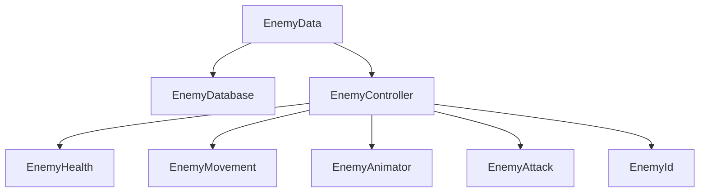

# Enemy System

Modular enemy system with component-based architecture, object pooling, and data-driven configuration.

> **Source**: [`Assets/Scripts/Characters/Enemies/`](https://github.com/SBUplakankus/monsta-choppa-vr/tree/main/Assets/Scripts/Characters/Enemies/)

---

## Architecture



---

## EnemyData

ScriptableObject defining enemy configuration.

> **Source**: [`EnemyData.cs`](https://github.com/SBUplakankus/monsta-choppa-vr/blob/main/Assets/Scripts/Data/Core/EnemyData.cs)

```csharp
[CreateAssetMenu(fileName = "EnemyData", menuName = "Scriptable Objects/Data/Core/Enemy")]
public class EnemyData : ScriptableObject
{
    [Header("Identity")]
    [SerializeField] private string enemyId;

    [Header("Stats")]
    [SerializeField] private int maxHealth = 100;
    [SerializeField] private float moveSpeed = 3.5f;

    [Header("Presentation")]
    [SerializeField] private GameObject prefab;
    [SerializeField] private WorldAudioData[] ambientSfx;
    [SerializeField] private WorldAudioData[] hitSfx;
    [SerializeField] private WorldAudioData[] deathSfx;
    [SerializeField] private ParticleData deathVFX;

    [Header("Combat")] 
    [SerializeField] private WeaponData weapon;
    
    // Properties
    public string EnemyId => enemyId;
    public int MaxHealth => maxHealth;
    public float MoveSpeed => moveSpeed;
    public GameObject Prefab => prefab;
    public WeaponData Weapon => weapon;
    public WorldAudioData HitSfx => GetHitSfx();  // Returns random SFX
    public WorldAudioData DeathSfx => GetDeathSfx();
    public ParticleData DeathVFX => deathVFX;
}
```
```

---

## EnemyController

Main coordinator that manages all enemy components.

> **Source**: [`EnemyController.cs`](https://github.com/SBUplakankus/monsta-choppa-vr/blob/main/Assets/Scripts/Characters/Enemies/EnemyController.cs)

```csharp
public class EnemyController : MonoBehaviour
{
    [SerializeField] private EnemyData enemyData;

    private EnemyMovement _enemyMovement;
    private EnemyAnimator _enemyAnimator;
    private EnemyHealth _enemyHealth;
    private EnemyAttack _enemyAttack;
    private EnemyId _enemyId;

    public EnemyData Data { get => enemyData; set => enemyData = value; }
    public Action OnDeath { get; set; }
    public EnemyAnimator Animator => _enemyAnimator;
    public EnemyMovement Movement => _enemyMovement;
    
    public void OnSpawn(EnemyData data)
    {
        enemyData = data;
        _enemyId.ID = enemyData.EnemyId;
        _enemyHealth.OnSpawn(enemyData.MaxHealth, HandleEnemyDeath);
        _enemyHealth.DeathVFX = enemyData.DeathVFX;
        _enemyAnimator.OnSpawn();
        _enemyMovement.OnSpawn(enemyData.MoveSpeed, _enemyAnimator);
        _enemyAttack?.InitAttack(enemyData.Weapon, _enemyAnimator, _enemyMovement);
        GameplayEvents.EnemySpawned.Raise(this);
    }
    
    public void OnDespawn()
    {
        _enemyAnimator.OnDespawn();
        _enemyMovement.OnDespawn();
        _enemyAttack?.ResetAttack();
        _enemyHealth.OnDespawn(HandleEnemyDeath);
        GameplayEvents.EnemyDespawned.Raise(this);
    }
    
    private void HandleEnemyDeath()
    {
        _enemyMovement.SetDead();
        _enemyAttack.ResetAttack();
        GamePoolManager.Instance.ReturnEnemyPrefab(this);
        GamePoolManager.Instance.GetWorldAudioPrefab(enemyData?.DeathSfx, transform.position);
        OnDeath?.Invoke();
    }
    
    public void HighPriorityUpdate()
    {
        _enemyMovement?.UpdateAI();
        if (_enemyMovement && _enemyMovement.IsInAttackRange)
            TryAttack();
    }
}
```
```

---

## EnemyHealth

Health component implementing IDamageable with VR-optimized effects.

> **Source**: [`EnemyHealth.cs`](https://github.com/SBUplakankus/monsta-choppa-vr/blob/main/Assets/Scripts/Characters/Enemies/EnemyHealth.cs)

```csharp
public class EnemyHealth : HealthComponent
{
    [SerializeField] private EnemyHealthBar healthBar;
    [SerializeField] private ParticleData hitVFX;
    
    private EnemyAnimator _animator;
    
    public ParticleData DeathVFX { get; set; }
    
    private void OnEnable()
    {
        OnDeath += HandleDeath;
        OnDamageTaken += HandleDamageTaken;
        OnDamageTakenWithDirection += HandleDirectionalDamage;
    }
    
    private void HandleDamageTaken()
    {
        healthBar?.UpdateHealthBarValue(HealthBarValue);
    }
    
    private void HandleDirectionalDamage(Vector3 hitDirection)
    {
        _animator?.PlayHitReaction(hitDirection);
        
        if (hitVFX != null)
        {
            var hitPosition = transform.position + Vector3.up;
            GamePoolManager.Instance?.GetParticlePrefab(hitVFX, hitPosition, 
                Quaternion.LookRotation(-hitDirection));
        }
    }
    
    private void HandleDeath()
    {
        if (DeathVFX != null)
            GamePoolManager.Instance?.GetParticlePrefab(DeathVFX, transform.position, 
                transform.rotation);
    }
}
```
```

---

## EnemyMovement

NavMesh-based navigation with AI state machine.

> **Source**: [`EnemyMovement.cs`](https://github.com/SBUplakankus/monsta-choppa-vr/blob/main/Assets/Scripts/Characters/Enemies/EnemyMovement.cs)

```csharp
public enum EnemyAIState { Idle, Chasing, Attacking, Dead }

[RequireComponent(typeof(NavMeshAgent), typeof(Rigidbody))]
public class EnemyMovement : MonoBehaviour
{
    [SerializeField] private float attackRange = GameConstants.DefaultMeleeAttackRange;
    [SerializeField] private float stoppingDistance = 1.5f;
    [SerializeField] private float pathUpdateInterval = 0.2f;

    private NavMeshAgent _navMeshAgent;
    private EnemyAIState _currentState = EnemyAIState.Idle;
    private Transform _target;
    
    public EnemyAIState CurrentState => _currentState;
    public bool IsInAttackRange => _target && 
        Vector3.Distance(transform.position, _target.position) <= attackRange;
    
    public void OnSpawn(float speed, EnemyAnimator animator)
    {
        _navMeshAgent.enabled = true;
        _navMeshAgent.speed = speed;
        _currentState = EnemyAIState.Idle;
        FindTarget();
    }
    
    public void UpdateAI()
    {
        if (_currentState == EnemyAIState.Dead) return;
        
        if (IsInAttackRange)
        {
            SetState(EnemyAIState.Attacking);
            StopMovement();
            RotateTowardsTarget();
        }
        else
        {
            SetState(EnemyAIState.Chasing);
            ChaseTarget();
        }
    }
    
    public void SetDead()
    {
        SetState(EnemyAIState.Dead);
        StopMovement();
    }
}
```
```

---

## EnemyAnimator

Animation state management using layered approach for combat and locomotion.

> **Source**: [`EnemyAnimator.cs`](https://github.com/SBUplakankus/monsta-choppa-vr/blob/main/Assets/Scripts/Characters/Enemies/EnemyAnimator.cs)

```csharp
public class EnemyAnimator : AnimatorComponent
{
    [SerializeField] private int upperBodyLayerIndex = 1;
    
    public bool IsAttacking => Animator && Animator.GetBool(IsAttackingHash);
    
    public void OnSpawn()
    {
        Animator.enabled = true;
        Animator.Rebind();
        // Set up layer weights for Mixamo combat animations
        if (Animator.layerCount > upperBodyLayerIndex)
            Animator.SetLayerWeight(upperBodyLayerIndex, 1f);
    }
    
    public void UpdateMovementSpeed(float normalizedSpeed)
    {
        SetSpeed(normalizedSpeed);
        SetBool(IsMovingHash, normalizedSpeed > 0.01f);
    }
    
    public void PlayLightAttack()
    {
        Animator.SetInteger(LightAttackIndexHash, Random.Range(0, 3));
        Animator.SetBool(IsAttackingHash, true);
        Animator.SetTrigger(LightAttackHash);
    }
    
    public void PlayHitReaction(Vector3 hitDirection)
    {
        var localDir = transform.InverseTransformDirection(hitDirection);
        
        if (localDir.x < -0.3f)
            Animator.SetTrigger(HitLeftHash);
        else if (localDir.x > 0.3f)
            Animator.SetTrigger(HitRightHash);
        else
            Animator.SetTrigger(HitFrontHash);
    }
}
```
```

---

## Pooling Integration

Enemies are spawned and returned via GamePoolManager.

> **Source**: [`GamePoolManager.cs`](https://github.com/SBUplakankus/monsta-choppa-vr/blob/main/Assets/Scripts/Pooling/GamePoolManager.cs)

```csharp
// Spawn enemy
var enemyData = GameDatabases.EnemyDatabase.Get(enemyId);
var instance = GamePoolManager.Instance.GetEnemyPrefab(enemyData, spawnPoint.position, spawnPoint.rotation);

// Return enemy (called on death via EnemyController)
GamePoolManager.Instance.ReturnEnemyPrefab(enemyController);
```

---

## Event Integration

Enemies communicate through event channels.

```csharp
// Raised when enemy spawns (in EnemyController.OnSpawn)
GameplayEvents.EnemySpawned.Raise(this);

// Raised when enemy despawns (in EnemyController.OnDespawn)
GameplayEvents.EnemyDespawned.Raise(this);
```

---

## Wave Spawning

WaveSpawner creates enemies during arena combat.

> **Source**: [`WaveSpawner.cs`](https://github.com/SBUplakankus/monsta-choppa-vr/blob/main/Assets/Scripts/Systems/Arena/WaveSpawner.cs)

```csharp
[RequireComponent(typeof(EnemyManager))]
public class WaveSpawner : MonoBehaviour
{
    [SerializeField] private Transform[] spawnPoints;
    [SerializeField] private Transform bossSpawnPoint;
    [SerializeField] private int maxEnemies = 6;

    public event Action OnWaveEnemiesDefeated;
    public event Action OnBossDefeated;
    
    public void SpawnWave(WaveData waveData)
    {
        _waveType = WaveType.Main;
        _enemiesRemaining = waveData.EnemyCount;
        StartCoroutine(SpawnEnemies(waveData));
    }
    
    private IEnumerator SpawnEnemies(WaveData waveData)
    {
        foreach (var enemyData in waveData.Wave)
        {
            for (var i = 0; i < enemyData.spawnAmount; i++)
            {
                while (_enemyManager.ActiveEnemiesCount >= maxEnemies)
                    yield return null;
                
                var spawnPoint = GetRandomSpawnPoint();
                _gamePoolManager.GetEnemyPrefab(enemyData.enemy, 
                    spawnPoint.position, spawnPoint.rotation);
                
                yield return new WaitForSeconds(enemyData.spawnInterval);
            }
        }
    }
}
```

---

## Creating New Enemies

1. Create EnemyData asset via Create menu
2. Configure stats, audio, effects
3. Create enemy prefab with:
   - EnemyController
   - EnemyHealth
   - EnemyMovement (with NavMeshAgent)
   - EnemyAnimator (with Animator)
   - EnemyAttack
   - EnemyId
   - Collider for damage detection
4. Assign prefab to EnemyData
5. Add to EnemyDatabase
6. Add to wave configurations
