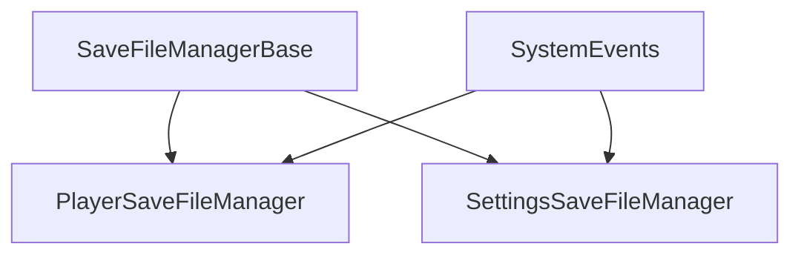

# Save Data System

Player persistence using ESave for JSON-based save files with event-driven architecture.

> **Source**: [`Assets/Scripts/Saves/`](../../Assets/Scripts/Saves/)

---

## Architecture



---

## SaveFileManagerBase

Abstract base class for save file managers.

> **Source**: [`SaveFileManagerBase.cs`](../../Assets/Scripts/Saves/SaveFileManagerBase.cs)

```csharp
[RequireComponent(typeof(SaveFileSetup))]
public abstract class SaveFileManagerBase : MonoBehaviour
{
    private SaveFileSetup _saveFileSetup;
    protected SaveFile SaveFile;
    
    protected abstract void HandleSaveRequested();
    protected abstract void HandleSaveCompleted();
    protected abstract void HandleLoadRequested();
    protected abstract void HandleLoadCompleted();
    
    protected void GetSaveFile()
    { 
        _saveFileSetup = GetComponent<SaveFileSetup>();
        SaveFile = _saveFileSetup.GetSaveFile();
    }
}
```

---

## PlayerSaveFileManager

Manages player progression persistence.

> **Source**: [`PlayerSaveFileManager.cs`](../../Assets/Scripts/Saves/PlayerSaveFileManager.cs)

```csharp
public class PlayerSaveFileManager : SaveFileManagerBase
{
    [SerializeField] private MetaProgressionData metaProgressionData;
    
    private void OnEnable()
    {
        SystemEvents.PlayerSaveRequested.Subscribe(HandleSaveRequested);
        SystemEvents.PlayerLoadRequested.Subscribe(HandleLoadRequested);
    }
    
    private void OnDisable()
    {
        SystemEvents.PlayerSaveRequested.Unsubscribe(HandleSaveRequested);
        SystemEvents.PlayerLoadRequested.Unsubscribe(HandleLoadRequested);
    }
    
    protected override void HandleSaveRequested()
    {
        SaveFile.AddOrUpdateData(GameConstants.MetaProgressionKey, metaProgressionData);
        HandleSaveCompleted();
    }
    
    protected override void HandleLoadRequested()
    {
        if(SaveFile.HasData(GameConstants.MetaProgressionKey))
            metaProgressionData = SaveFile.GetData<MetaProgressionData>(
                GameConstants.MetaProgressionKey);
        
        HandleLoadCompleted();
    }
}
```
```

---

## MetaProgressionData

ScriptableObject storing player progression multipliers.

> **Source**: [`MetaProgressionData.cs`](../../Assets/Scripts/Data/Progression/MetaProgressionData.cs)

```csharp
[CreateAssetMenu(menuName = "Scriptable Objects/Data/Progression/Meta Progression")]
public class MetaProgressionData : ScriptableObject
{
    [Header("Meta Progression Attributes")] 
    [SerializeField] private FloatAttribute expGain;
    [SerializeField] private FloatAttribute goldGain;
    [SerializeField] private FloatAttribute health;
    [SerializeField] private FloatAttribute armour;
    
    public float ExpGain => expGain.Value;
    public float GoldGain => goldGain.Value;
    public int Health => (int)health.Value;
    public float Armour => armour.Value;
}
```

---

## Save Keys

All save keys are defined in GameConstants.

> **Source**: [`GameConstants.cs`](../../Assets/Scripts/Constants/GameConstants.cs)

```csharp
public static class GameConstants
{
    // Save Keys
    public const string MetaProgressionKey = "MetaProgression";
    public const string AudioSettingsKey = "AudioSettings";
    public const string VideoSettingsKey = "VideoSettings";
    public const string LocalizationSettingsKey = "LocalizationSettings";
    
    // Attribute Keys
    public const string PlayerGoldKey = "PlayerGold";
    public const string PlayerExperienceKey = "PlayerExperience";
    public const string PlayerLevelKey = "PlayerLevel";
}
```
```

---

## Save Triggers

### Manual Save

```csharp
SystemEvents.PlayerSaveRequested.Raise();
```

### Automatic Save Points

Save occurs on:

- Arena completion (victory or defeat)
- Returning to hub
- Purchasing upgrades
- Application pause (headset removed)

```csharp
private void OnApplicationPause(bool paused)
{
    if (paused)
    {
        SystemEvents.PlayerSaveRequested.Raise();
    }
}
```

---

## ESave API

| Method | Purpose |
|:-------|:--------|
| AddOrUpdateData(key, value) | Store data by key |
| GetData<T\>(key) | Retrieve typed data |
| HasData(key) | Check if key exists |
| Save() | Write to disk |

**File Locations:**

- Windows: `%USERPROFILE%/AppData/LocalLow/[Company]/[Product]/`
- Android: `/data/data/[package]/files/`

---

## Best Practices

| Practice | Reason |
|:---------|:-------|
| Use constants for keys | Prevents typos, enables refactoring |
| Validate loaded data | Handle missing or corrupted saves |
| Save on significant events | Don't lose player progress |
| Separate settings from progression | Settings apply globally, progression per-save |
