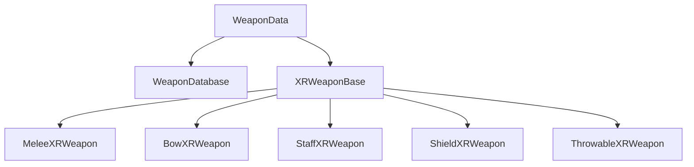

# Weapon System

Data-driven weapon system for VR combat with XR Interaction Toolkit integration, modular modifiers, and object pooling.

> **Source**: [`Assets/Scripts/Weapons/`](../../Assets/Scripts/Weapons/) and [`Assets/Scripts/Data/Weapons/`](../../Assets/Scripts/Data/Weapons/)

---

## Architecture



---

## WeaponData

ScriptableObject defining all weapon properties.

> **Source**: [`WeaponData.cs`](../../Assets/Scripts/Data/Weapons/WeaponData.cs)

```csharp
[CreateAssetMenu(fileName = "WeaponData", menuName = "Scriptable Objects/Data/Weapons/Weapon")]
public class WeaponData : ScriptableObject
{
    [Header("Identity")]
    [SerializeField] private string weaponID;
    [SerializeField] private string displayName;
    [SerializeField] private WeaponCategory category;
    [SerializeField] private WeaponRarity rarity;
    [SerializeField] private GameObject weaponPrefab;
    [SerializeField] private Sprite icon;
    
    [Header("Base Stats")]
    [SerializeField] private int baseDamage = 10;
    [SerializeField] private float attackCooldown = 1f;
    [SerializeField] private float range = 2;
    [SerializeField] private int staminaCost = 10;
    [SerializeField] private DamageType damageType;
    
    [Header("VR Settings")]
    [SerializeField] private Vector3 gripPositionOffset;
    [SerializeField] private Vector3 gripRotationOffset;
    [SerializeField] private float hapticStrength = 0.5f;
    [SerializeField] private float hapticDuration = 0.1f;
    
    [Header("Visual / Audio")]
    [SerializeField] private WorldAudioData[] hitSfx;
    [SerializeField] private ParticleData hitVFX;
    [SerializeField] private GameObject trailEffect;
    [SerializeField] private Color trailColor = Color.white;
    
    [Header("Modifiers")]
    [SerializeField] private List<WeaponModifierData> activeModifiers = new();
    
    [Header("Economy")]
    [SerializeField] private int purchasePrice = 100;
    [SerializeField] private int sellPrice = 50;
    [SerializeField] private bool isPurchasable = true;
    
    // Properties expose serialized fields
    public string WeaponID => weaponID;
    public int BaseDamage => baseDamage;
    public float AttackCooldown => attackCooldown;
    // ... other properties
    
    public int TotalDamage
    {
        get
        {
            int total = baseDamage;
            float multiplier = 1f;
            
            if (activeModifiers != null)
            {
                foreach (var mod in activeModifiers)
                {
                    if (mod == null) continue;
                    total += mod.damageBonus;
                    multiplier += mod.damageMultiplier;
                }
            }
            return Mathf.RoundToInt(total * multiplier);
        }
    }
}
```
```

---

## WeaponModifierData

Stackable modifiers that enhance weapons.

```csharp
[CreateAssetMenu(menuName = "Scriptable Objects/Weapons/Weapon Modifier")]
public class WeaponModifierData : ScriptableObject
{
    [Header("Identity")]
    public string modifierId;
    public string modifierName;
    
    [Header("Damage")]
    public DamageType addedDamageType;
    public int damageBonus;
    public float damageMultiplier;
    
    [Header("Speed")]
    public float speedBonus;
    public float cooldownReduction;
    
    [Header("Visual")]
    public GameObject visualEffect;
    public Color trailColor;
    public Color glowColor;
    public float glowIntensity;
    
    [Header("Hit Effects")]
    public ParticleData onHitVFX;
    public WorldAudioData onHitSfx;
}
```

---

## XRWeaponBase

Abstract base class for all VR weapons.

> **Source**: [`XRWeaponBase.cs`](../../Assets/Scripts/Weapons/XRWeaponBase.cs)

```csharp
[RequireComponent(typeof(XRGrabInteractable))]
public abstract class XRWeaponBase : MonoBehaviour
{
    [SerializeField] protected WeaponData data;
    [SerializeField] protected bool enableHaptics = true;
    
    private XRGrabInteractable _grab;
    private XRBaseInteractor _currentInteractor;
    protected bool IsHeld;
    private float _lastAttackTime;
    
    public WeaponData Data => data;
    public bool IsActive => IsHeld;
    public bool CanAttack => Time.time >= _lastAttackTime + data.AttackCooldown;
    
    protected virtual void OnGrab(SelectEnterEventArgs args)
    {
        IsHeld = true;
        _currentInteractor = args.interactorObject as XRBaseInteractor;
        OnEquipped();
    }
    
    protected virtual void OnRelease(SelectExitEventArgs args)
    {
        IsHeld = false;
        _currentInteractor = null;
        OnUnequipped();
    }
    
    public void ProcessHit(IDamageable target, Vector3 hitPoint, 
                           Quaternion hitRotation, float damageMultiplier = 1f)
    {
        if (!CanAttack) return;
        
        _lastAttackTime = Time.time;
        
        var finalDamage = Mathf.RoundToInt(data.TotalDamage * damageMultiplier);
        finalDamage = Mathf.Max(1, finalDamage);
        target.TakeDamage(finalDamage);
        
        // Spawn VFX and audio via pool
        if (data.HitVFX != null)
            GamePoolManager.Instance?.GetParticlePrefab(data.HitVFX, hitPoint, hitRotation);
        if (data.HitSfx != null)
            GamePoolManager.Instance?.GetWorldAudioPrefab(data.HitSfx, hitPoint);
        
        TriggerHapticFeedback();
    }
    
    public abstract void PrimaryAction();
    public abstract void SecondaryAction();
    protected virtual void OnEquipped() { }
    protected virtual void OnUnequipped() { }
}
```
```

---

## Weapon Types

### MeleeXRWeapon

Close-range weapons using physics-based hit detection.

- Uses WeaponHitbox for collision detection
- Damage scales with swing velocity
- Haptic feedback on hit

### BowXRWeapon

Ranged weapon with projectile spawning.

- Pull string to draw
- Release to fire arrow projectile
- Projectiles pooled via GamePoolManager

### StaffXRWeapon

Magic weapon with spell casting.

- Primary: Projectile spell
- Secondary: Area effect

### ShieldXRWeapon

Defensive weapon with blocking and bashing.

> **Source**: [`ShieldXRWeapon.cs`](../../Assets/Scripts/Weapons/ShieldXRWeapon.cs)

```csharp
public class ShieldXRWeapon : XRWeaponBase
{
    [Header("Shield Settings")]
    [SerializeField] private float blockAngle = 60f;
    [SerializeField] private float blockDamageReduction = 0.75f;
    [SerializeField] private float perfectBlockWindow = 0.2f;
    
    [Header("Shield Bash")]
    [SerializeField] private float bashDamage = 10f;
    [SerializeField] private float bashCooldown = 1f;
    [SerializeField] private float bashForce = 500f;
    [SerializeField] private float bashRadius = 0.5f;
    
    // Pre-allocated buffer for non-allocating physics
    private readonly Collider[] _bashBuffer = new Collider[4];
    
    public bool CanBlockAttack(Vector3 attackDirection)
    {
        if (!_isBlocking) return false;
        var angle = Vector3.Angle(-attackDirection, transform.forward);
        return angle <= blockAngle;
    }
    
    public void ShieldBash()
    {
        if (!CanBash) return;
        
        var bashPoint = transform.position + transform.forward * 0.5f;
        var hitCount = Physics.OverlapSphereNonAlloc(bashPoint, bashRadius, _bashBuffer);
        
        for (int i = 0; i < hitCount; i++)
        {
            if (_bashBuffer[i].TryGetComponent<IDamageable>(out var target))
                target.TakeDamage(Mathf.RoundToInt(bashDamage));
        }
    }
}
```
```

### ThrowableXRWeapon

Throwable weapons that return to pool on impact.

- Thrown on release
- Returns to pool after hit or timeout
- Can be recalled (boomerang behavior)

---

## WeaponHitbox

Component for melee damage detection with velocity-based multipliers.

> **Source**: [`WeaponHitbox.cs`](../../Assets/Scripts/Weapons/WeaponHitbox.cs)

```csharp
public class WeaponHitbox : MonoBehaviour
{
    [SerializeField] private XRWeaponBase weapon;
    [SerializeField] private float hitCooldown = 0.2f;
    
    private float _lastHitTime;
    private Collider _lastHitCollider;
    
    private void OnTriggerEnter(Collider other)
    {
        ProcessHit(other);
    }
    
    private void ProcessHit(Collider other)
    {
        if (!weapon || !weapon.IsActive || !weapon.CanAttack)
            return;
        
        if (!other.TryGetComponent<IDamageable>(out var target))
            return;
        
        var hitPoint = other.ClosestPoint(transform.position);
        var hitDirection = CalculateHitDirection(other.transform);
        
        // Get velocity-based damage multiplier for melee weapons
        var damageMultiplier = 1f;
        if (weapon is MeleeXRWeapon melee)
            damageMultiplier = melee.VelocityDamageMultiplier;
        
        weapon.ProcessHit(target, hitPoint, Quaternion.LookRotation(hitDirection), damageMultiplier);
        
        _lastHitTime = Time.time;
        _lastHitCollider = other;
    }
}
```

---

## Enums

```csharp
public enum WeaponCategory
{
    Sword,
    Bow,
    Staff,
    Axe,
    Dagger,
    Shield,
    Throwable
}

public enum WeaponRarity
{
    Common,
    Uncommon,
    Rare,
    Epic,
    Legendary
}

public enum DamageType
{
    Physical,
    Fire,
    Frost,
    Lightning,
    Arcane,
    Poison
}
```

---

## Pooling Integration

Weapons spawn effects through GamePoolManager.

```csharp
// Spawn hit VFX
GamePoolManager.Instance.GetParticlePrefab(data.hitVFX, hitPoint, hitRotation);

// Spawn hit audio
var sfx = data.hitSfx[Random.Range(0, data.hitSfx.Length)];
GamePoolManager.Instance.GetWorldAudioPrefab(sfx, hitPoint);
```

---

## Holster System

WeaponHolsterController manages equipped weapons.

```csharp
public class WeaponHolsterController : MonoBehaviour
{
    [SerializeField] private Transform leftHolster;
    [SerializeField] private Transform rightHolster;
    [SerializeField] private Transform backHolster;
    
    public void EquipWeapon(WeaponData weapon, HolsterSlot slot);
    public void UnequipWeapon(HolsterSlot slot);
    public WeaponData GetEquippedWeapon(HolsterSlot slot);
}
```

---

## Creating New Weapons

1. Create WeaponData asset via Create menu
2. Configure stats, VR settings, effects
3. Create weapon prefab with:
   - XRGrabInteractable
   - Rigidbody
   - Weapon component (MeleeXRWeapon, etc.)
   - WeaponHitbox on striking surface
4. Assign prefab to WeaponData
5. Add to WeaponDatabase
